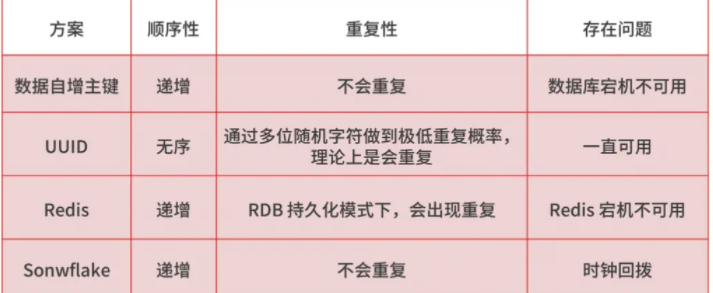

# High Availability

## 基本概念

### 名词解释

#### 服务雪崩：

因服务提供者的不可用 到中服务调用者的不可用，并将不可用逐渐放大的过程，服务的雪崩效应。

例子：

秒杀商品并发大，导致 积分服务挂掉，导致大量线程在积分服务上游，从而导致线程池满，导致拖垮。

商品服务是共享，导致其他服务不可用。

解决方式： 

* 熔断机制进行服务降级。让非关键服务仍然可用。

* 通过线程池和消息队列机制实现**异步化**：允许服务快速失败，当一个服务因过慢导致阻塞时，被影响的服务可以在超时后快速失败，不影响整个调用链路。

#### 服务限流：

在高并发的请求下，为了保护系统，可用对访问服务的请求进行数量上限制，防止系统被大量请求压垮。

#### 服务熔断：

终止交易： 当A服务调用B不可用时，上游为了保证自己不受影响，切断与B的通讯，以防服务雪崩。

#### 服务降级：

执行B计划： 提前预想另外一种兜底措施，进行后期补救（比如 记录日志），直到B恢复后再进行通讯

### 怎么确保消息100%不丢失？

目的：系统解耦，高可用   ，流量控制，秒杀等流量突增，削峰填谷

**哪些环节可能丢失？**

**消息生产阶段：**  从消息被生产出来，然后提交给 MQ 的过程中，只要能正常收到 MQ Broker 的 ack 确认响应，就表示发送成功，所以只要处理好返回值和异常，这个阶段是不会出现消息丢失的。

**消息存储阶段：**  这个阶段一般会直接交给 MQ 消息中间件来保证，但是你要了解它的原理，比如 Broker 会做副本，保证一条消息至少同步两个节点再返回 ack。

**消息消费阶段：**  消费端从 Broker 上拉取消息，只要消费端在收到消息后，不立即发送消费确认给 Broker，而是等到执行完业务逻辑后，再发送消费确认，也能保证消息的不丢失。

**如何知道消息丢失**？

**总体方案：**怎么样消息检测：消息生产端，给每个发出的消息都指定一个全局唯一 ID，或者附加一个连续递增的版本号，然后在消费端做对应的版本校验

**落地实现--拦截器机制**：在生产端发送消息之前，通过拦截器将消息版本号注入消息中，然后在消费端收到消息后，再通过拦截器检测版本号的连续性或消费状态

### 怎么解决消息被重复消费的问题？

消息消费的过程中，如果出现失败的情况，通过补偿的机制发送方会执行重试，重试的过程就有可能产生重复的消息。

最简单的实现方案，就是在数据库中建一张消息日志表， 这个表有两个字段：消息 ID 和消息执行状态。这样，我们消费消息的逻辑可以变为：在消息日志表中增加一条消息记录，然后再根据消息记录，异步操作更新用户京豆余额。

### 如何处理消息挤压问题？

线上突发问题，要临时扩容，增加消费端的数量，与此同时，降级一些非核心的业务

其次，才是排查解决异常问题，如通过监控，日志等手段分析是否消费端的业务逻辑代码出现了问题，优化消费端的业务处理逻辑。

水平扩容来提供消费端的并发处理能力，由于Kafka 约定一个分区只能被一个消费者消费，扩容消费者的实例数的同时，必须同步扩容主题 Topic 的分区数量，确保消费者的实例数和分区数相等

### 全局唯一 ID

分布式系统中，全局唯一 ID 生成的实现方法有数据库自增主键、UUID、Redis，Twitter-Snowflake 算法，我总结了几种方案的特点

- 如何选择消息中间件？
- 消息中间件中的队列模型与发布订阅模型的区别？
- 为什么消息队列能实现高吞吐？
- 序列化、传输协议，以及内存管理等问题

