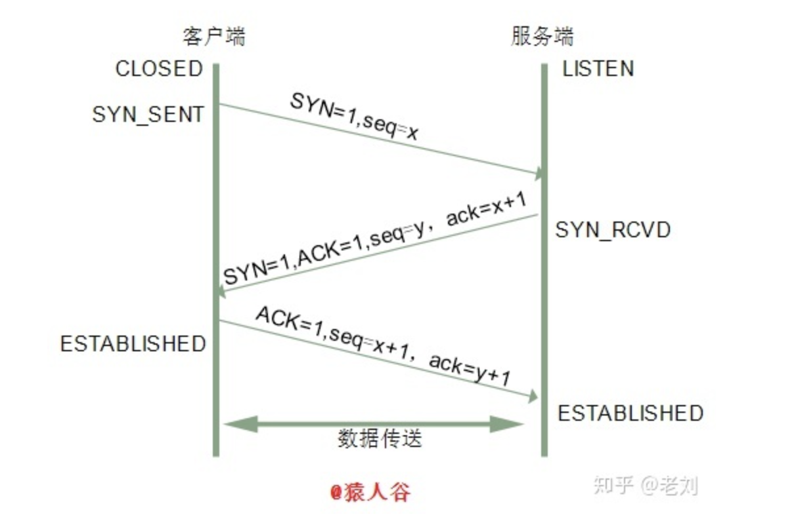
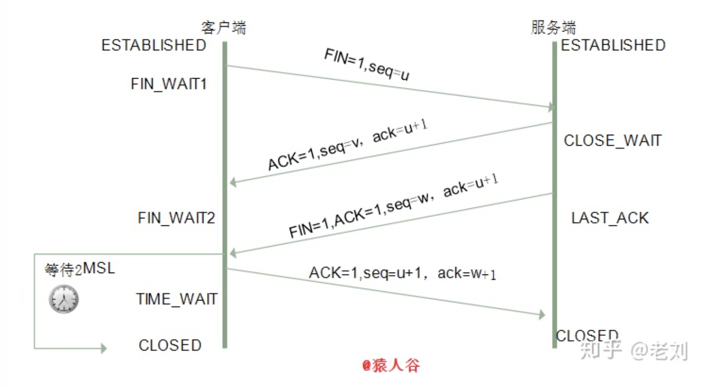
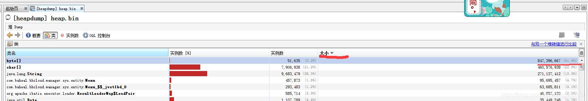
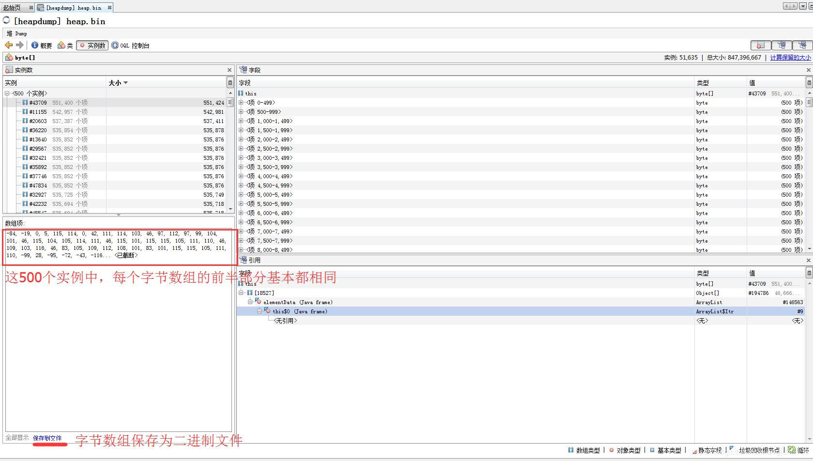

 # 应试题目

[TOC]

## 算法

1. 算法: 平衡二叉树和b树/b+树对比，在线编程是翻转二叉树

2. 链表是否存在环

3. 手写算法实现两个大数的和

4. 解释快排过程，手写一个leetcode（链表相加）

5. 无序数组找第K大（答快排），有没有比快排更快（思路）；

6. 链表找环以及怎么找第一个环入口（思路）；

7. 二叉排序树找第K大节点，不用其他容器（手写）

8. 10亿个数中如何高效地找到最大的一个数以及最大的第 K 个数 困难 [参考1](https://github.com/weitingyuk/LeetCode-Notes-Waiting/blob/main/2021-02-17/TopK.md)

   参考： 算法专题/TopK/README.md

9. 

https://blog.csdn.net/zyq522376829/article/details/47686867


1、


## JAVA

### 数据结构

1. hashmap: 扰动函数 解决hash冲突其他方法 转红黑树

   A：

2. HashMap:数据结构是怎样的，怎么解决冲突，为什么是2的n次方，多线程下回发生什么问题，链条形成红黑树之后，大小怎么比较

   A:

3. CurrrentHashMap；如何实现线程安全


### JVM

分别是：1：寄存器。2：本地方法区。3：方法区。4：栈。5：堆。

#### 栈：

函数中定义的基本类型变量，对象的引用变量都在函数的栈内存中分配。
栈内存特点，数数据一执行完毕，变量会立即释放，节约内存空间。
栈内存中的数据，没有默认初始化值，需要手动设置。

#### 堆：

堆内存用来存放new创建的对象和数组。
堆内存中所有的实体都有内存地址值。
堆内存中的实体是用来封装数据的，这些数据都有默认初始化值。
堆内存中的实体不再被指向时，JVM启动垃圾回收机制，自动清除，这也是JAVA优于C++的表现之一（C++中需要程序员手动清除）。


1. #### JVM内存泄漏怎么排查

   

2. ##### 

   

3. ##### 自己定义一个和JDK完全一样的String类，能正常使用吗？

   [参考](https://blog.csdn.net/sky__fall/article/details/109698544)

   能：通过 -Xbootclasspath 参数来指定 Bootstrap ClassLoader加载目录，通过Bootstrap ClassLoader 来加载我们自己写的java.lang.System/String 类

   

   这里可以延伸一个概念，在JVM中表示两个class对象是否为同一个类对象存在两个必要条件

   - 类的完整类名必须一致，包括包名。
   - 加载这个类的ClassLoader(指ClassLoader**实例对象**)必须相同。

   

   ClassLoader.java的655行抛出了一个SecurityException异常，看下这段代码：

   很明显，在name不为null的情况下，会检查name是否以"java."开头，那如果name为null呢？

   依然抛出异常，不过这次不再是preDefineClass抛出的了，而是一个native方法：

   Bootstrap ClassLoader的介绍吗？我们可以通过 -Xbootclasspath 参数来指定 Bootstrap加载目录

   ```
    java -Xbootclasspath/p:/Users/lvbing/classloader/java-advanced-1.0-SNAPSHOT.jar -verbose > test.txt
   ```

   
   
   > 双亲委托机制的优点：用户自定义的类加载器不可能加载本应该由父加载器的可靠类
   >
   > 类加载器的三个机制：
   >
   > * 委托性（双亲委托模型），
   > * 可见性（子类能看到父类加载器的类，父类加载器看不到子类加载器加载过的类）
   > * 单一性（仅加载一个类一次）
   
   
   
4. 双亲委派模型的破坏者-线程上下文类加载器
  
      我们可以通过java.lang.Thread类中的getContextClassLoader()和 setContextClassLoader(ClassLoader cl)方法来获取和设置线程的上下文类加载器。如果没有手动设置上下文类加载器，线程将继承其父线程的上下文类加载器，初始线程的上下文类加载器是系统类加载器（AppClassLoader）,在线程中运行的代码可以通过此类加载器来加载类和资源，
   
   rt.jar核心包是有Bootstrap类加载器加载的，其内包含SPI核心接口类，由于SPI中的类经常需要调用外部实现类的方法，而jdbc.jar包含外部实现类(jdbc.jar存在于classpath路径)无法通过Bootstrap类加载器加载，因此只能委派线程上下文类加载器把jdbc.jar中的实现类加载到内存以便SPI相关类使用。显然这种线程上下文类加载器的加载方式破坏了“双亲委派模型”，它在执行过程中抛弃双亲委派加载链模式，使程序可以逆向使用类加载器，当然这也使得Java类加载器变得更加灵活。
   
   ```
   public class DriverManager {
       /**
        * Load the initial JDBC drivers by checking the System property
        * jdbc.properties and then use the {@code ServiceLoader} mechanism
        */
       static {
           loadInitialDrivers();
           println("JDBC DriverManager initialized");
       }
       
       private static void loadInitialDrivers() {
           ...
           
           AccessController.doPrivileged(new PrivilegedAction<Void>() {
               public Void run() {
   
                   ServiceLoader<Driver> loadedDrivers = ServiceLoader.load(Driver.class);
                   ...
               }
           });
           ...
       }
   
   # 在DriverManager类初始化时执行了loadInitialDrivers()方法,在该方法中通过ServiceLoader.load(Driver.class);去加载外部实现的驱动类。load() 方法实现如下：
   public static <S> ServiceLoader<S> load(Class<S> service) {
           ClassLoader cl = Thread.currentThread().getContextClassLoader();
           return ServiceLoader.load(service, cl);
       }
   
   ```
   
    实际上核心包的SPI类对外部实现类的加载都是基于线程上下文类加载器执行的，通过这种方式实现了Java核心代码内部去调用外部实现类。我们知道线程上下文类加载器默认情况下就是AppClassLoader，那为什么不直接通过getSystemClassLoader()获取类加载器来加载classpath路径下的类的呢？
   
   其实是可行的，但这种直接使用getSystemClassLoader()方法获取AppClassLoader加载类有一个缺点，那就是代码部署到不同服务时会出现问题，如把代码部署到Java Web应用服务或者EJB之类的服务将会出问题，因为这些服务使用的线程上下文类加载器并非AppClassLoader，而是Java Web应用服自家的类加载器，类加载器不同。，所以我们应用该少用getSystemClassLoader()。总之不同的服务使用的可能默认ClassLoader是不同的，但使用线程上下文类加载器总能获取到与当前程序执行相同的ClassLoader，从而避免不必要的问题。
   
5. 

6. 

### 集合类


|            | 线程安全性                                       | 默认容量 | 扩容                                 |      |
| ---------- | ------------------------------------------------ | -------- | ------------------------------------ | ---- |
| ArrayList  | 不安全，并发时使用Collections.synchronizedList() | 10       | 1.5倍，不能设定容量增量              |      |
| LinkedList | 不安全，并发时使用Collections.synchronizedList() |          |                                      |      |
| Vector     | 线程安全，使用方法有synchronized, 效率低         | 10       | 2倍，设定容量增量capacityIncrement>0 |      |
|            |                                                  |          |                                      |      |


|                   |      |      |      |      |
| ----------------- | ---- | ---- | ---- | ---- |
| HashMap           |      |      |      |      |
| HashTable         |      |      |      |      |
| LinkedHashMap     |      |      |      |      |
| ConcurrentHashMap |      |      |      |      |
| WeakHashMap       |      |      |      |      |


#### HashMap

- HashMap的底层数据结构？


- HashMap的存取原理？
- Java7和Java8的区别？


- 为啥会线程不安全？
- 有什么线程安全的类代替么?
- 默认初始化大小是多少？为啥是这么多？为啥大小都是2的幂？
- HashMap的扩容方式？负载因子是多少？为什是这么多？
- HashMap的主要参数都有哪些？
- HashMap是怎么处理hash碰撞的？
- hash的计算规则？


"哈希表的存储效率一般不超过50%"的原因:

Hash Table 常用于频繁进行 key/value 模式的查找中。(查找模式，如匹配查找)

哈希表最大的优点在于查找速度快，但存储时可能发生collision(冲突)。

哈希表大多使用open addressing(开放定址法)来解决collision，此时search的时间复杂度计算公式为：

**1/( 1 - n/m )**

其中，n与m分别表示存储的记录数与哈希表的长度，即装填因子( **load factor** )

故，若哈希表半满，即 n/m >= 1/2，则每次的search次数可能会 >= 2

因此，为了保证Hash Table在 key/value 查找模式中的优势，一般，其存储效率不会超过50%。


1. put方法：计算key的hashCode(),然后对该哈希码值**进行哈希**，然后把哈希值和（数组长度-1） 进行按位与操作，得到存储的数组下标，

2. 如果该位置没有链表节点，直接放入，
3. 如果有节点，就对链表进行遍历查询是否有hash、key和要放入对节点相同的节点，如果有，就替换该节点的value，如果没有就创建节点，并插入到链表表头（头插法）

> 再哈希的目的是减少哈希冲突，使得元素均匀分布在数组上，提高存取效率
>
> 数组的长度为什么是2的n次方？h & (table.legth-1) 获取对象的保存位，HashMap底层数组长度总是2的n次方，2的n次方的二进制每位都是1，&比%效率高。长度为n次幂，不同的key算的存储下标相同的几率较小

2、get方法： hashmap允许value为null  

3、扩容机制：加载因子 0.75  默认16，一旦超过12 就扩展一倍  

 4、多线程put后，get操作导致死循环，cpu100%的现象， 因为：多线程同时put时，如果同时触发resize操作，会导致扩容后的HashMap 中的链表出现循环节点， 多线程put操作，导致元素丢失，也是扩容时

LinkedHashMap: 保证存入顺序和取出顺序一致


#### HashTable

原理和HashMap一致，区别是：

HashTable是线程安全的，方法是Synchronized的，效率低，当一个线程访问HashTable 的同步方法，其他线程进入堵塞或者轮训，线程1 put操作，线程2 也不能get 获取元素。

HashMap的key和value都可以为null（键只有一个，value可以有多个null）, **HashTable 的key 和value 都不允许有null**；判断是否包含某个键：hashMap不能用get方法判断，hashTable可以

HashMap中数组默认是16，一定是2的倍数，扩容后之前的2倍； HashTable默认大小是11，扩容后是之前数组长度的2倍+1

哈希值的使用不同，HashMap重新计算hash值，使用&代替求模；HashTable直接使用对象的hashcode值求模(除留余数法)：hashcode & 0x7FF FFFF% tab.length

迭代器不一样，hashMap： iterator 迭代器   hashTable：enumIterator,  concurrentModifiation异常

> Prosperities类使用HashMTable


#### TreeMap:

TreeMap 基于红黑树实现，HashMap基于哈希表实现，

HashMap适用于Map中插入、删除和查找，TreeMap 保存记录根据键排序，适用于按自然排序或自定义顺序遍历key

HashMap比Treemap快一点， TreeMap 不允许键为null


#### CUrrentHashMap

不允许用null作为键和值；

使用分段锁技术，将数据分为一段一段的存储，然后每一段分配一把锁，读操作大部分时候不需要锁，只有在size等操作才需要锁整个hash表。

并发级别（concurretLevel）默认16， 每一段容量默认16，

使用segment来分段和管理锁：segment继承ReentranLock, 

节点next为final，只允许从头部开始，value设为volatile，避免加锁：此字段写入操作优先于读操作，始终能拿到最新值

get操作：如果读取到value为null， 说明发生重排序，加锁后重新读取，其余场景都不需要加锁： **null的原因是HashEntry的默认值**，因为value不是final，可能读取到空值

put操作： 先判断是否需要对segment里的HashEntry数组进行扩容，第二步定位添加元素对位置，然后放在HashEntry数组里

扩容：首先创建两倍于原容量的数组，然后将原数组里的元素进行再hash后插入到新的数组

remove： 根据散列码找到具体的链表，遍历链表找到要删除的节点，然后把待删除节点之后的节点保留到新链表，待删除节点之前的克隆到新链表（注意会反转）


#### WeakMap 

其中的key采用弱引用的方式，只要其中的key不被外部引用，对应的键值就可以被垃圾回收器回收

HashMap是强引用，只有当key删除后，才可以被回收


HashSet 与TreeSet

线程不安全，

TreeSet 底层是二叉树


## 数据库

1. 数据库: myisam和innodb对比，聚簇和非聚簇索引，索引结构，数据库隔离级别 可重复读过程 会问得比较细 乐观锁 悲观锁
2. Redis aof与rdb，主从同步，zset
3. MySQL索引，一级索引、二级索引、联合索引、索引下推、覆盖索引
4. 什么情况下不走索引，说出原理就行
5. 基本就是mysql索引优化,b+树，redis数据结构（跳表），
6. mysql事务级别及怎么实现、事务特性及原子性底层怎么实现、为什么用B+而不是B树
7. zookeeper一致性协议、怎么选举，节点投票自己会如何

## 操作系统

1. 进程与线程区别，进程调度算法，进程通信方式，协程，缺页中断 进程切换过程


## 网络

1. 网络:time_wait状态 ssl/tls过程 select/poll/epoll tcp拥塞控制

   

2. 网络 TCP、UDP，TCP 除了三次握手之外，还有哪些机制来保证可靠性

   

   

3. HTTP和HTTPS协议，加密是对称加密还是非对称加密

4. tcp三次握手四次挥手，

   参考：[面试官，不要再问我三次握手和四次挥手](https://zhuanlan.zhihu.com/p/86426969)

   三次握手的主要作用就是为了确认双方的接收能力和发送能力是否正常，
   
   三次握手的其中一个重要功能是客户端和服务端交换 ISN(Initial Sequence Number)
   
   > 同步标记SYN=1   对应的是ACK=1
   > 序号seq=x, 对应的是ack=x+1, 

   

   如果两次握手为什么不行：（无法确认客户端的接收能力）
   >客户端因为请求报文丢失而未收到确认，再重传一次连接请求，
   > 如果第二个请求完成释放连接，第一个请求滞后到达服务器端，那么服务器端就会向客户端发出确认报文    段，同意建立连接，此时客户端忽略服务端发来的确认，也不发送数据，则服务端一致等待客户端发送数据，    浪费资源
   

1.2 什么是半连接队列？

​	服务器第一次收到客户端的 SYN 之后，就会处于 SYN_RCVD 状态，此时双方还没有完全建立其连接，服务器会把此种状态下请求连接放在一个队列里，我们把这种队列称之为半连接队列。

当然还有一个全连接队列，就是已经完成三次握手，建立起连接的就会放在全连接队列中。如果队列满了就有可能会出现丢包现象。

SYN-ACK 重传次数的问题：

服务器发送完SYN-ACK包，如果未收到客户确认包，服务器进行首次重传，等待一段时间仍未收到客户确认包，进行第二次重传。如果重传次数超过系统规定的最大重传次数，系统将该连接信息从半连接队列中删除。

注意，每次重传等待的时间不一定相同，一般会是指数增长，例如间隔时间为 1s，2s，4s，8s…

**1.3 ISN(Initial Sequence Number)是固定的吗？**

当一端为建立连接而发送它的SYN时，它为连接选择一个初始序号。ISN随时间而变化，因此每个连接都将具有不同的ISN。ISN可以看作是一个32比特的计数器，每4ms加1 。这样选择序号的目的在于防止在网络中被延迟的分组在以后又被传送，而导致某个连接的一方对它做错误的解释。

三次握手的其中一个重要功能是客户端和服务端交换 ISN(Initial Sequence Number)，以便让对方知道接下来接收数据的时候如何按序列号组装数据。如果 ISN 是固定的，攻击者很容易猜出后续的确认号，因此 ISN 是动态生成的。

**1.4 三次握手过程中可以携带数据吗？**

其实第三次握手的时候，是可以携带数据的。但是，第一次、第二次握手不可以携带数据

假如第一次握手可以携带数据的话，服务器花费很多时间、内存空间来接收这些报文。简单的原因就是会让服务器更加容易受到攻击了

**1.5 SYN攻击是什么？**

服务器端的资源分配是在二次握手时分配的，而客户端的资源是在完成三次握手时分配的，所以服务器容易受到SYN洪泛攻击。

SYN攻击就是Client在短时间内伪造大量不存在的IP地址，并向Server不断地发送SYN包，Server则回复确认包，并等待Client确认，**由于源地址不存在，因此Server需要不断重发直至超时**，这些伪造的SYN包将长时间占用未连接队列，导致正常的SYN请求因为队列满而被丢弃，从而引起网络拥塞甚至系统瘫痪。SYN 攻击是一种典型的 DoS/DDoS 攻击。

检测 SYN 攻击非常的方便，当你在服务器上看到大量的半连接状态时，特别是源IP地址是随机的，基本上可以断定这是一次SYN攻击。在 Linux/Unix 上可以使用系统自带的 netstats 命令来检测 SYN 攻击。

```java
   netstat -n -p TCP | grep SYN_RECV
```

常见的防御 SYN 攻击的方法有如下几种：

- 缩短超时（SYN Timeout）时间
   - 增加最大半连接数
   - 过滤网关防护
   - SYN cookies技术
   
5. 四次挥手
  
      ​    建立一个连接需要三次握手，而终止一个连接要经过四次挥手（也有将四次挥手叫做四次握手的）。这由TCP的半关闭（half-close）造成的。所谓的半关闭（服务器端二次挥手后的状态），其实就是TCP提供了连接的一端在结束它的发送后还能接收来自另一端数据的能力。
   
      > 连接释放报文段 FIN=1 客户端：FIN_WAIT1  服务器端： CLOSE_WAIT

               第三次挥手：如果服务端也想断开连接了，和客户端的第一次挥手一样，发给 FIN 报文，且指定一个序列号。此时服务端处于 LAST_ACK (最后确认)的状态。 
   
   **5.1 挥手为什么需要四次？**

因为当服务端收到客户端的SYN连接请求报文后，可以直接发送SYN+ACK报文。其中ACK报文是用来应答的，SYN报文是用来同步的。但是关闭连接时，**当服务端收到FIN报文时，很可能并不会立即关闭SOCKET**，所以只能先回复一个ACK报文，告诉客户端，“你发的FIN报文我收到了”。只有等到我服务端所有的报文都发送完了，我才能发送FIN报文，因此不能一起发送。故需要四次挥手。

​    **5.2 2MSL等待状态**

TIME_WAIT状态也成为2MSL等待状态。每个具体TCP实现必须选择一个报文段最大生存时间MSL（Maximum Segment Lifetime），

这个时间是有限的，因为TCP报文段以IP数据报在网络内传输，而IP数据报则有限制其生存时间的TTL字段。

对一个具体实现所给定的MSL值，处理的原则是：当TCP执行一个主动关闭，并发回最后一个ACK，该连接必须在TIME_WAIT状态停留的时间为2倍的MSL。这样可**让TCP再次发送最后的ACK以防这个ACK丢失（**另一端超时并重发最后的FIN）。

这种2MSL等待的另一个结果是这个TCP连接在2MSL等待期间，定义这个连接的插口（客户的IP地址和端口号，服务器的IP地址和端口号）不能再被使用。这个连接只能在2MSL结束后才能再被使用。


**5.3 四次挥手释放连接时，等待2MSL的意义?**

> 1、保证客户端发送的最后一个ACK报文段能够到达服务端。
>
> 2、防止“已失效的连接请求报文段”出现在本连接中。
>
> 客户端在发送完最后一个ACK报文段后，再经过2MSL，就可以使本连接持续的时间内所产生的所有报文段都从网络中消失，使下一个新的连接中不会出现这种旧的连接请求报文段。

MSL是Maximum Segment Lifetime的英文缩写，可译为“最长报文段寿命”，它是任何报文在网络上存在的最长时间，超过这个时间报文将被丢弃。

为了保证客户端发送的最后一个ACK报文段能够到达服务器。因为**最后一个ACK有可能丢失**，从而导致处在LAST-ACK状态的服务器收不到对FIN-ACK的确认报文。服务器会超时重传这个FIN-ACK，接着客户端再重传一次确认，重新启动时间等待计时器（**重复第三次挥手和第四次挥手**）。最后客户端和服务器都能正常的关闭。假设客户端不等待2MSL，而是在发送完ACK之后直接释放关闭，一但这个ACK丢失的话，服务器就无法正常的进入关闭连接状态。

**5.4 为什么TIME_WAIT状态需要经过2MSL才能返回到CLOSE状态？**

理论上，四个报文都发送完毕，就可以直接进入CLOSE状态了，但是可能网络是不可靠的，有可能最后一个ACK丢失。所以TIME_WAIT状态就是用来重发可能丢失的ACK报文。

6. timewait排查及解决，redis分布式锁相关，lru

   

   

## 开放题

1. #### CPU100% 怎么排查？ 要答出用户态和内核态函数分析工具

   参考：[java进程 cpu100%问题排查](https://blog.csdn.net/wangjun5159/article/details/90414097)

   > DEF:  为什么100%：每个线程一个时间片，在时间片内线程一直占有，则是100%，除非密集型CPU的运算，其他类型的任务都会小于时间片的时间内结束。

   > WHY:可能的原因：while死循环一直占有CPU; 请求tps过载时 触发流控 导致服务无法重新启动

   排查过程：

   * 找到占用CPU的进程：top，
   * 如果是java进程，继续查看是哪个线程占用CPU
   * 根据线程id从线程中找到线程栈

   ##### 步骤1: 找到线程

   `-H`表示以**线程**的维度 展示 ，默认以**进程**维度展示。

   一共4个占用cpu的线程id 2944-2947,需要将线程id从十进制转为十六进制，因为java线程栈文件中的线程id是十六进制。十进制 转十六进制的命令是

   ```sh
   echo "obase=16;number" | bc
   
   ```

   ##### 步骤2:导出栈

   ```
   jstack pid >pid.tdump
   ```

   gc线程忙碌表示内存不够用了，要进行内存回收，第一反应是java内存回收不了，导致一直gc。

   步骤3:到处堆

   ```
   jstat -gcutil pid 
   jmap -dump:live,format=b,file=pid.hprof pid
   
   ```

   ##### 步骤4:jvisualvm分析快照

   使用`JAVA_HOME/bin/jvisualvm.exe`，载入快照（文件----->载入—>文件类型（堆））

   

   

   我们发现字节数组的值都很规律，前半部分的字节数组基本都相同，我就想能不能把字节数组转为字符串，这样就能 知道字节数组是什么内容了，恰好左下角有个将字节数组另存为二进制文件的选项。

   

   将二进制文件转为字符串，发现这些字节数组是当前用户的信息，如下

   ```java
     File file = new File("C:\\Users\\DELL\\Desktop\\heap.bin");
           final FileInputStream fileInputStream = new FileInputStream(file);
           byte[] buffer = new byte[300];
           int len = -1;
           while((len=fileInputStream.read(buffer))!=-1){
               System.out.println(new String(buffer,0,len , "utf8"));
           }
   ```

   

2. 应用启动需要4G内存，现在物理内存只剩1G，应用能启动起来吗？


3. 设计秒杀系统


## 项目

说下项目（说了挺久，包括上下游，自己负责的），问项目难点、怎么解决

本地缓存怎么做的，遇到数据不存在怎么处理

微服务怎么做的，通信协议

并行优化怎么做的，怎么拿到并行后的数据（面试官不是java的，所以没问线程池相关）

线上表数据多少，量级再大怎么处理（即怎么分表，分表后怎么查）
