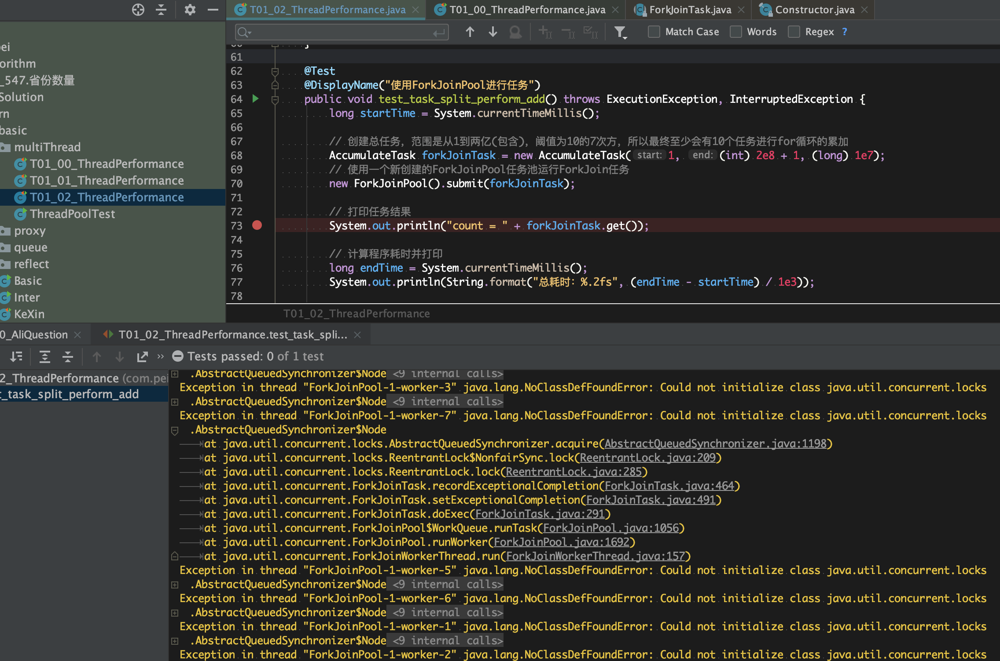

[TOC]

## 多线程学习提纲

作者：兜里有辣条
链接：https://zhuanlan.zhihu.com/p/70325764

​		背景：为什么学？

Q：多线程编程或者说范围更大的并发编程是一种非常复杂且容易出错的编程方式，但是我们为什么还要冒着风险艰辛地学习各种多线程编程技术、解决各种并发问题呢？

A：因为并发是整个分布式集群的基础，通过分布式集群不仅可以大大降低同等负载能力的价格，还能使整体可扩展到的负载能力上限大大提升。

大多数抽象并发问题的构思与解决都是基于多线程模型来进行的。而且这些并发问题的本质都是相同的，不管是线程并发、进程并发还是服务器级别的并发都具有类似的特点、面临相似的问题。

接下来，我们会在这篇文章中系统地了解Java多线程编程知识体系，从最基础的基本概念、线程的使用开始讲起，一路覆盖多线程的正确性与运行效率相关议题，帮助大家从0到入门再到熟练掌握各种多线程编程技巧。在这之后，文章会渐趋复杂，我们会深入地讨论死锁的解决、事件驱动模型、同步机制的底层实现、线程池源代码解析等高级议题，帮助读者知其然更知其所以然，再也无惧于多线程相关的问题。

### 多线程基础

#### 1、并发的概念

#### 2、编程基础

#### 3、线程池使用

### 面临的问题

#### 1、正确性

[多线程中那些看不见的陷阱](https://zhuanlan.zhihu.com/p/61904135)

#### 2、效率问题

[多线程程序加速指南](https://zhuanlan.zhihu.com/p/70324710)  

> 存在 com.pei.learn.basic.multiThread.T01_00_ThreadPerformance 未解决
>
> Exception in thread "ForkJoinPool-1-worker-1" java.lang.NoClassDefFoundError: Could not initialize class java.util.concurrent.locks.AbstractQueuedSynchronizer$Node

#### 3、死锁问题

1. 互斥。资源被竞争性地访问，这里的资源可以理解为锁；
2. 持有并等待。线程持有已经分配给他们的资源，同时等待其他的资源；
3. 不抢占。线程已经获取到的资源不会被其他线程强制抢占；
4. 环路等待。线程之间存在资源的环形依赖链，每个线程都依赖于链条中的下一个线程释放必要的资源，而链条的末尾又依赖了链条头部的线程，进入了一个循环等待的状态。

##### 4、解决死锁：

参考：[解决死锁的100种方法](https://zhuanlan.zhihu.com/p/63207814)

###### 破坏环路等待条件

实践中最有效也是最常用的一种死锁阻止技术就是**锁排序**，通过对加锁的操作进行排序我们就能够破坏**环路等待条件**。

###### **破坏持有并等待条件**

我们可以一次性原子性地获取所有需要的锁，比如通过一个专门的全局锁作为**加锁令牌**控制加锁操作

###### 破坏不抢占条件

让线程在获取后续的锁失败时主动放弃自己已经持有的锁并在之后重试整个任务，如果几个互相存在竞争的线程不断地放弃、重试、放弃，那么就会导致活锁问题（livelock），解决方式是给任务重试添加一个**随机的延迟时间**，这样就能大大降低任务冲突的概率了。在一些接口请求框架中也使用了这种技巧来分散服务高峰期的请求重试操作，防止服务陷入阻塞、崩溃、阻塞的恶性循环。

###### 破坏互斥条件

通过CAS提供的原子性支持，我们可以实现各种无锁数据结构，不仅避免了互斥锁所带来的开销和复杂性，也由此避开了我们一直在讨论的死锁问题。

###### 其他解决死锁的方法 —— 探测并恢复

关系型数据库中使用的就是这种方法，数据库会周期性地使用探测器创建**资源图**，然后检查其中是否存在循环。如果探测到了循环（死锁），那么数据库就会根据估算的执行成本高低杀死可以解决死锁问题的尽可能成本最小的线程。

### 高级主题

#### 1、编程实战——堵塞队列

> 《[从0到1实现自己的阻塞队列](https://zhuanlan.zhihu.com/p/64156753)》的脚步，一起从0到1再到N，完成一个完整的JDK级别的阻塞队列实现。

#### 2、线程池运行模型源码解析

[Java线程池从使用到阅读源码(3/10)](https://zhuanlan.zhihu.com/p/59644911)

#### 3、同步机制的底层实现

[Java同步机制的底层实现](https://zhuanlan.zhihu.com/p/67035482)

###  总结

到这里，我们就完成了整个Java多线程知识体系之旅。在这个过程中，我们首先了解了并发的基本概念和Java多线程编程的基本方法，然后出现了**线程池**这个优秀的管家为我们打理好了任务执行与线程调度的所有麻烦事。之后我们系统地了解并解决了多线程中的三类主要问题：正确性问题、效率问题和死锁问题。在掌握了这么多Java多线程编程的知识与技巧之后，我们就通过实现一个阻塞队列来了一次大练兵，不仅能检验我们的多线程编程技能，同时也加深了我们对这些知识的理解。最后，我们进入了多线程知识的深水区，通过JDK与Netty的成熟源代码研究了三个更底层的高级主题：事件驱动模型、线程池运行模型、同步机制的底层实现。

