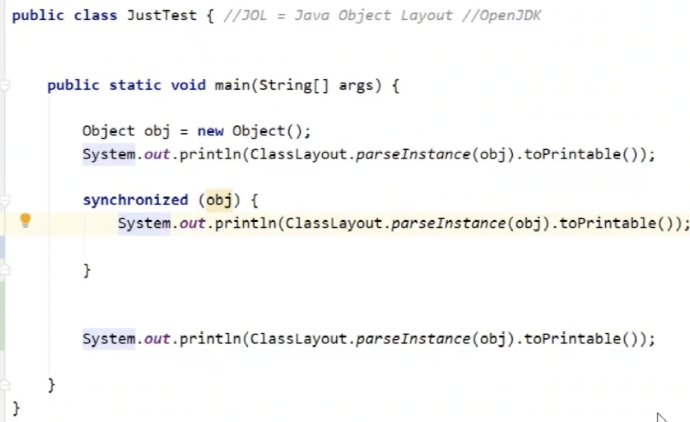
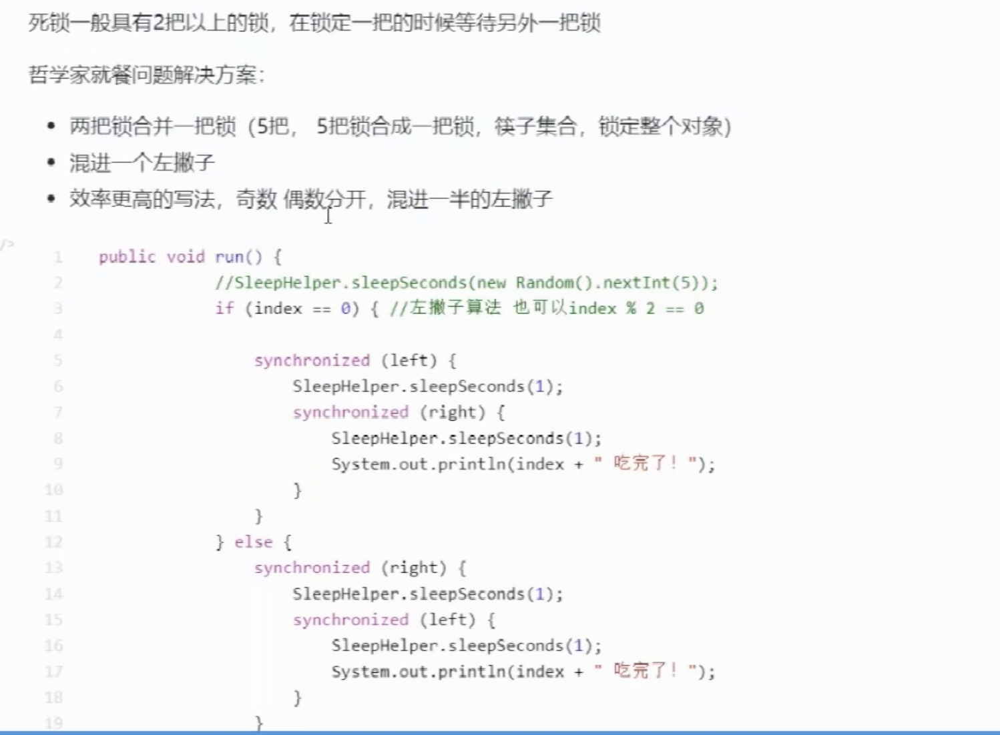
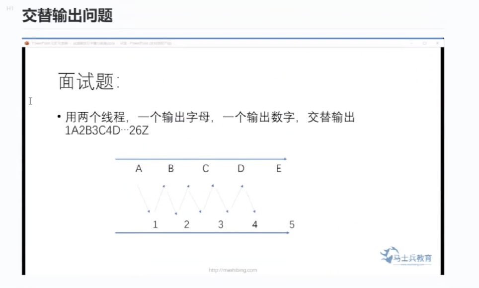
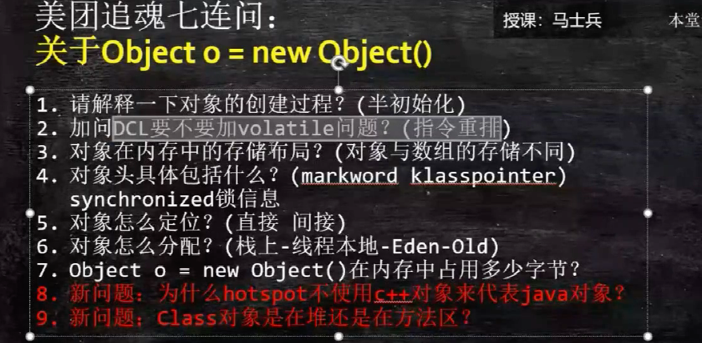
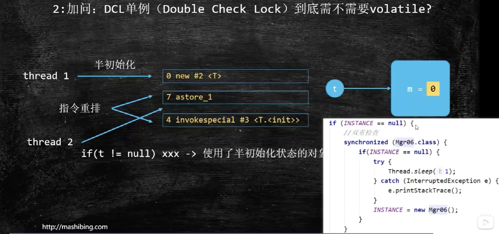
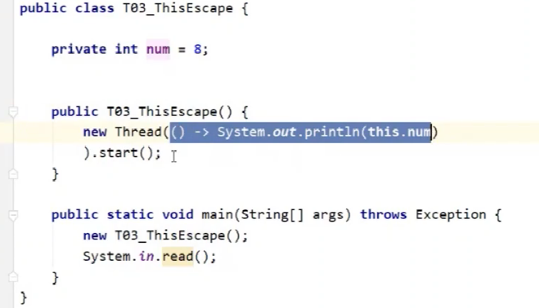
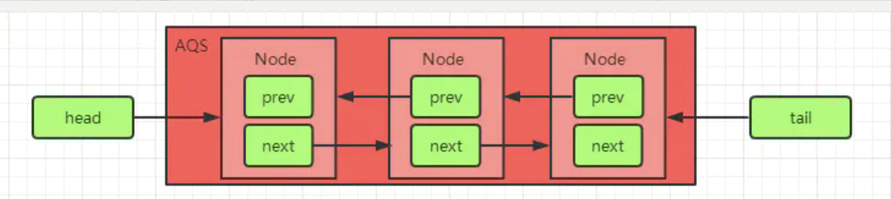

### 面试题：

```java
public class T00_00_ShowMeDifference {
}

final class Accumulator {
    // 线程不安全
    private double result = 0.0D;

    public void addAll(double[] values) {
        for (double value : values) {
            result += value;
        }
    }
}

final class Accumulator2 {
    // 线程不安全
    private double result = 0.0D;

    public void addAll(double[] values) {
        double sum = 0.0D;
        for (double value : values) {
            sum += value;
        }
        result += sum;
    }
}
```

>com.pei.learn.lock.T00_00_ShowMeDifference
>
>都是线程不安全的
>
>第二种写法比第一种写法出现不一致性的概率要小，因为我们在方法完成之前，读取不到中间状态的脏数据，
>
>尽量少暴露线程计算过程的中间状态，能用范围小的变量，不用范围大的变量





### 哲学家问题




com.pei.learn.lock.deadlock.T01_00_Philosopher


### 交替输出问题




> com.pei.learn.lock.T01_01_Lock_ReentrantLock

AQS== CAS +CLA队列


环形数组： Disruptor  RingBuffer


### 乱序与重排





乱序：

```java
class T {
  int m =8;
}
T t = new T();
// 对应的字节码
public static main([Ljava/lang/String;)V
   L0
    LINENUMBER 6 L0
    NEW java/lang/Object   // 初始化 m = 0
    DUP
    INVOKESPECIAL java/lang/Object.<init> ()V   // 实例化 m=8
    ASTORE 1   //给t 建立关联
   L1
    LINENUMBER 7 L1
    RETURN
    
```




> 需要，*发生指令重排， 实例化和赋值，顺序改变类， 第二个线程看你实用半初始化状态的对象，导致失败

指令重排 是指在单线程下发生。 

可见性、有序性、原子性




> num 可能为0； 因为执行的时候可能还没实例化
>
> 不要在构造方法中启动线程。 只正确处理成员变量


## 【并发编程系列5】JUC必知ReentrantLock和AQS同步队列实现原理分析

https://www.jianshu.com/p/830f6ca18d41

### AQS的两种功能

从使用层面来说，AQS 的功能分为两种：独占和共享。

- 独占锁：每次只有一个线程持有锁，如：ReentrantLock 就是以独占方式实现的互斥锁
- 共享锁：允许多个线程同时获取锁 ,并发访问共享资源 ， 如：ReentrantReadWriteLock

### AQS 的内部实现

AQS依赖内部的一个FIFO双向队列来完成同步状态的管理，当前线程获取锁失败时，AQS会将当前线程以及等待状态等信息构造成为一个节点（Node对象）并将其加入AQS中，同时会阻塞当前线程，当锁被释放时，会把首节点中的线程唤醒，使其再次尝试获取同步状态。AQS中有一个头(head)节点和一个尾(tail)节点，中间每个节点(Node)都有一个prev和next指针指向前一个节点和后一个节点，如下图：




