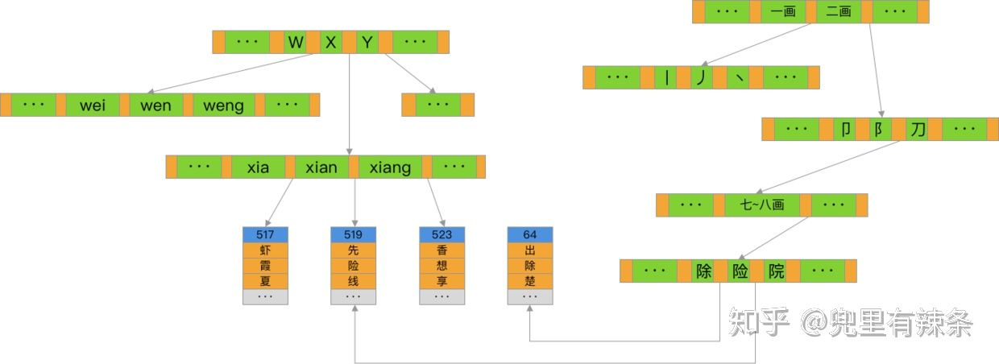

###### 

[TOC]


https://www.cnblogs.com/qdhxhz/p/10787130.html


# MYSQL

## 介绍

以RBDM存储为主，NoSql存储为辅

选中关系型数据库：

1、数据量：适合中等数据量，一般业界时2T以下的数据

2、事务：需要跨表跨行的事务支持 ACID事务查询

3、可靠性：要求可靠准确，如银行系统

3、一致性：要求数据强一致性

5、读写访问特点：适合需要频繁的增删改查操作，适合需要join表关联查询


选中NoSQL: 典型代表  

数据量： 超过2T的数据库尝试NoSQL

事务：不需要事务控制和表关联查询

数据一致性：对于数据强一致性要求低，只要最终一致性

读写访问特点：一次写入多次读取，数据很少变更

数据特征： 支持音乐、图片、网页、视频、静态文件、json等半结构化、非结构化数据存储

可以运行不支持SQL


#### 关系型数据库TP

OLTP事务型交易数据库 Mysql Oracle PostgreSQL

OLAP分析型数据库仓库：Hive  DWS   ClickHouse  TiDB  运营BI 数据分析统计


淘宝  OcisionDB（收费）,  PostgreSQL

#### 非关系数据库AP

NoSQL : HBase Cassandra   MongoDB  CBC门户论坛，消费汇总 消费明细 、话单存储，


ClickHouse  TP 


容灾数据复制---中继RDS实现强一致（RDS扩展跨region半同步）

目的：在北1增加中继数据库，与北四的RDS 采用半同步复制，

要点：跨region的半同步，Region间时延低，容灾同步从中继库同步，实现北4故障，不影响容灾库与北1中继库的追平  RTO =0


## 数据库索引

这一系列涵盖了数据库索引从理论到实践的一系列知识，一站式解决了从理解到融会贯通的全过程，相信每一篇文章都可以给你带来更深入的体验。

### 数据库索引是什么？

​		数据库索引就是一种加快海量数据查询的关键技术。

​		联合索引： 最左前缀匹配

​		聚集索引：数据会根据索引中的顺序进行排列和组织的，而**非聚集索引**就是其他的一般索引。`InnoDB`存储引擎中，主键索引就是聚集索引，`MyISAM`没有。 非聚集索引叶子节点上的指针会直接**指向聚集索引的叶子节点**，

而从非聚集索引的叶子节点链接到聚集索引的叶子节点查询实际数据的过程就叫做——**回表**。



​	全覆盖索引：不需要再回表查询的情况中，这个索引就被称为这个SQL语句的**全覆盖索引**。

​				非聚集索引的叶子节点上保存的“指针”就是聚集索引中所有字段的值，要获取一条实际数据，就需要通过这几个聚集索引字段的值重新在聚集索引上执行一遍查询操作。


### 索引基础


### 索引实战


### 索引原理

计算机中的存储结构分为好几个部分，从上到下大致可以分为寄存器、高速缓存、主存储器、辅助存储器。

把数据从外存读到内存所使用的单位一般被称为“页”，常见的页大小一般为4KB=4096字

数据库索引使用**节点大小恰好等于操作系统一页大小的B+树**来实现是效率最高的选择。


## 编程规范

###### 1、减少与数据库交互次数，禁止在循环中访问数据库，应采用批量SQL


###### 2、对JPA生成的SQL语句进行Explain 执行计划，避免全表扫描

尽量避免extra列出现Using File Sort、 Using Temporary

type列 避免使用ALL


###### 3、如果已有70个字读哪，后续不允许再增加，建议考虑使用扩展表实现业务扩展


###### 4、保存事务短小，事务占有时间越短越好

大事务会长时间锁表，严重堵塞其他SQL的执行，与事务无关操作放到事务外面

@发送事件 不要混合业务处理逻辑、接口调用、入库操作


###### 5、SELECT 不要使用 * 代替所有列，应该是显式指明查询列

一方面按需获取节省系统资源，兼容性角度可以减少表变化带来的影响

Mysql:  Order by 有两种算法，

一种是直接取出所有需要返回字段（select 后面的字段），存入内存，然后排序（仅有需要排序的字段） 

一种馅取出需要排序的字段，再排序，再回表取出其他字段，相当于所有数据都有两次磁盘IO

如果后面的字段长度总和超过1024节节（参数max_length_for_sort_data的默认值）或者字段中包含blob、text字段，都会使用第二中算法，所以order by 的查询不允许使用select *;

join 语句使用select * 可能导致只需要访问索引，即可完成的查询需要回表取数，所以禁止使用


###### 6、对一些或者很少变化的业务数据，可以考虑缓存redis或者本店内存，减少DB访问


###### 7、含有多表关联JOIN的SQL语句，必须明确指定各表的连接条件，以避免产生笛卡尔积。

###### 8、对于数据量较多的表查询需要注意SQL性能。查询大表时，缺省要有where条件，必须控制返回结果条数，分页分批次获取数据

 防止忘记写查询条件

###### 9、减少不必要的大字段访问，如果确定不需要的text blobs 等大字段，则不用放入sql语句，禁止对varchar(2000)、text、Blob之类的大字段进行order by、distinct、group by、 union等引起排序的操作


###### 10、禁止大事务插入大量数据，大事务插入大量数据可能超过最大包限制，导致事务提交失败，插入数据失败

数据库默认允许的包大小32M (MAX_allowed_packet), 建议精简行数 数据包内容大小，大事务分为小事务，分批插入数据


###### 11、禁止无索引的大表查询，慢SQL会导致IO高，导致主备复制同步延迟

反例：事件表 规模5000W+  事件有定时任务会定时检查未处理的任务（status=0），没有索引，每次执行都会全表扫描， 推荐：增加索引，定时清理历史数据


###### 12、数据库的数据割接数据，放在会读升级时间执行，且必须保证兼容性

禁止insert into A values(....), 推荐使用insert into A(...)values(....)

禁止类型大类变化，比如禁止字符串转换为数字类型，禁止类型向下变化：int转为tinyint

禁止减少字段长度

针对大表，增加索引、增加字段、修改字段类型、删除字段、需考虑性能影响

新增非空字段时必须指定defalut默认值


###### 13、数据库的数据删除，如果数据表已废弃，优先使用drop，； 其次如果表数据不需要了，建议使用truncate； 如果使用的是分区表，按分区 truncate partition/ drop partition; 如果用delete，需要考虑表数据量大小，是否待索引，否则会导致主备数据复制同步延迟

案例： 一个事务删除45万数据，在binlog里面记录45万条记录，备库需要执行45万次 没有索引的删除表操作，导致耗费很长时间，推荐在表格上建立索引，如果数据不要了，使用truncate table, 而不是delete；如果表格不要了，使用drop table。

###### 14、禁止同一个线程同时占用多个数据库连接

连接处连接数有最大连接数限制，连接数到上限时会阻塞等待获取连接，如果一个线程获取多个连接，并发场景连接数到上限时可能导致互相无限锁等待

###### 15、线上查询分区大表数据前都要评估SQL性能和查询到数据量，要用explain patitions 执行计划查看sql扫描到分区，避免查询所有的分区。

反例： 异常的sql扫描表的所有分区，跨所有分区的大数据查询会导致tmp空间不足，影响主备数据同步，影响其他数据库操作

###### 16、微服务连接池必须设置最大连接数，避免超过数据库实例的最大连接数


###### 17、表设计时设计的字段禁止使用太多text、blob字段或者长的varchar字段，否则行大小可能超过数据页page存储的8k先追，插入数据库报错Row size too large（> 8126）

innodb每页最大16K，存储两行数据，每个text/bolb 前768个字符存储在page里（其余存在溢出区），所以超过一定数量的话，单行大小超过8k

###### 18、禁止使用慢SQL， 优化查询，减少查询执行成本（逻辑IO，执行需要访问的表数据行数），减少对cpu、内存io的影响

* 谨用或尽量不使用in/exist, no in/not exist ,应该直接使用left join 连接方式替换

```sql
select count(*) from t1 left join t2
on t1.clo = t2.col
where t2.col is null
```


* 嵌套循环连接中非常大的表做内表（被驱动表）时，其连接字段上需建有索引
* 尽量不要使用负向查询，避免全表扫描
* 如果SQL语句针对同一个字段做多个选择（or）条件，建议考虑使用in操作
* 如果sql语句针对不同字段的值or， 考虑用union all 替换： 只要查询条件or前后的两个条件都是索引，索引才会生效，否则索引不生效


## 数据库设计规范


规则：禁止同一个字段在不同表之间用不同的数据类型


###### 规则：任何表必须要设置主键，禁止使用AUTO_INCREMENT的类型，

原因：

* DRS数据迁移要求必须有主键，主键全局唯一id标记

* 自增长字段在备份和加载时容易混乱，在数据库异常重启时可能会导致自增长字段累计的最大值丢失，导致数据主键冲突。
* 自增长值保存在内存中，并没有持久化
* 在mysql重启的场景下，就可能出现自增长主键回跳的情况导致数据主键冲突


建议：避免使用TEXT、BLOB数据类型，如果必须是要，将BLOB或者TEXT列分离到单独的扩展表

建议：表设计时，如果表的数据量比较大，可以预留一些字段，避免后续大表加字段慢，而且预留字段的字段名可以妙极修改

规则： 时间字段建议使用datetime类型，不推荐timestamp类型

* datetime插入和查询原样输入和输出不会做任何改变，而timestamp会根据时区自动做转换，容易误用（插入时转为UTC存储，查询时转为当前时区返回）。
* datetime和时区无关；timestamp 与时区有关，值会随设置的时区变化，存储的范围小（1970-2038）


##### 索引设计规范：

###### 规则：优先在高选择度的列上创建索引

解释： 属性列上的选择度时指该列所包含的不重复的值和数据表中总行数（T）的比值，选择度越大，越适合建索引。否则，和全表扫描的开销没有明显的改善，甚至更大（全表扫描带来的是顺序I/O, 而通过索引过滤后的扫描可能是随机I/O）。 可以通过show index from 表名 查看索引基数cardinality


###### 规则：连接列必须创建索引

解释： 没有索引的话，mysql的连接算法是nested loop 算法，会造成多次扫描被驱动表，对数据库造成的压力和开销是巨大的。


规则：UPDATE、DELETE语句需要根据where条件添加索引，ORDER BY，GROUP BY、DISTINCT 的字段需要添加索引。

建议：对于长度大于50 的VARCHAR字段建立索引，按需求恰当使用前缀索引或其他方法。(新增一个字段)


建议： 合理创建联合索引（避免冗余），(a,b,c)相当于(a)、(a,b)  (a,b,c)


规则： RDS实例的存储空间不超过2T, RDS单实例最大实际占用数据量不能超过1.2T.

单实例数据量超过800G,并且随着时间的推移持续增长，建议提前考虑数据转储或使用分库分表的解决方案


规则：不建议使用存储过程和数据库的定时任务、触发器，建议将这些逻辑都放到业务服务器上处理，避免对数据产生逻辑依赖


建议：对于对象名称（包括库名、表名、字段名、索引名等）必须使用小写字母，并采用下划线_ 连接

Linux 等MYSQL库表大小写敏感，字段名大小写不敏感，可以设置lower_case_table_name=1 不区分大小写

在windows下不区分大小写


规则：注意表字段的类型，避免表字段的隐式转换。

列为varchar  如果where 列=1 ，则会出现转换，列转为int


规则：推荐使用limit N方式实现分页， 少用limit M,N 特别是大表，或者M比较大

Select * from table where id >=23423 limit 11;

随着M的 增大查询性能越慢，考虑以下方式，提高查询速度：

```sql
select * from table where id >=(select id from table limit 10000,1) limit 10;
```


规则： 子查询优化： select包含在子查询，可以把子查询用left join 操作, 连接需要是个外连接，才能得到空值


```sql
select a.account_id,a.balance,
(select c.customer_name from customer as c where customer_id = ac.) as cust_name
from account as a

```


建议：使用INSERT  ... ON DUPLICATE KEY update  (INSTER INGORE) 来避免不必要的查询

建议：减少或避免排序，如group by 语句如果不需要排序，可以增加order by null


规则： 多表写操作事务保证表的操作顺序，避免死锁


规则：使用READ COMMINTED事务隔离级别，减少对数据库锁竞争对影响。


规则:可靠性角度，访问数据库必须使用连接池。

规则： 在业务逻辑允许的情况下，尽量使用union all 来代替union

union all 不去重，少了排序 速度更快。


规则： order by 的字段都是升序或者降序，才能使用索引

正列： order by col1 desc, view desc


