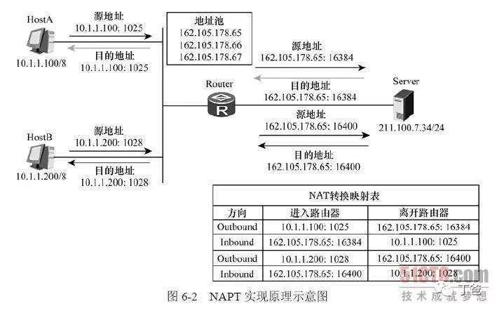

# VPN
Virtual Private Network 提供一种通过**公用网络**安全地对企业**内部专用网络**进行远程访问的连接方式。
基本要素：
1. IP封装
2. 加密的身份认证
3. 数据有效负载加密

接入VPN就是接入了一个专有网络，那么你访问网络的所有流量都通过这个专有网络的出口出去，同时你的IP地址也变成了有这个VPN分配的IP地址。你与VPN之间的链接通信取决于这个VPN的连接协议

# 内网穿透
[TOC]
## 原因
1. IP地址有限且昂贵
2. 并不想将所有服务暴露到公网，NAPT技术，将特定服务通过一定的规则映射到公网IP上
3. 个人（没有服务器）如何发布网站
4. 渗透测试，若某公网服务器只开放80端口，想要提权3389等端口

## 原理
在NAT网关上会有一张**映射表**，表上记录了内网向公网哪个**IP和端口**发起了请求，然后如果内网有主机向公网设备发起了请求，内网主机的请求数据包传输到了NAT网关上，那么NAT网关会**修改**该数据包的源IP地址和源端口为NAT网关自身的IP地址和任意一个不冲突的自身未使用的端口，并且把这个修改记录到那张映射表上。最后把修改之后的数据包发送到请求的目标主机，等目标主机发回了响应包之后，再根据响应包里面的目的IP地址和目的端口去映射表里面找到该转发给哪个内网主机。这样就实现了内网主机在没有公网IP的情况下，通过NAPT技术借助路由器唯一的一个公网IP来访问公网设备。

>NAPT只解决了内网主机在没有公网IP的情况下如何访问公网主机的问题，但是并不能解决公网主机如何主动向内网主机发起请求的问题。

## 私有地址
因特网域名分配组织IANA组织（Internet Assigned Numbers Authority）保留了以下三个IP地址块用于私有网络。

10.0.0.0 - 10.255.255.255 (10/8比特前缀)

172.16.0.0 - 172.31.255.255 (172.16/12比特前缀)

192.168.0.0 - 192.168.255.255 (192.168/16比特前缀)
>1个A类地址块，32个B类地址块和256个C类地址块

## 解决方案
###情况一：有公网IP服务器
“花生壳”，“nat123”等服务来实现
花生壳这种内网穿透服务是借助一个公网IP同时给很多用户提供了服务，这是因为花生壳在流量转发这一层上并不是像我之前所说的原封不动的将报文进行转发，而是在转发之前加了一些控制协议的内容，用于指明该转发到哪个花生壳客户端所在的内网主机上。原封不动的转发方式通常叫做透明传输或者透明代理。

###情况一：有公网IP服务器
>目标：借助公网服务器的网络来发布一个内网服务

假设公网IP为23.23.23.23，内网IP为192.168.1.2。公网主机先监听80端口，监听这个端口是用于向外部提供一个HTTP服务，80是WEB服务器的默认端口。同时其他任意一个端口（这里我们假设为7777），监听这个端口是用于让内网服务器主动连接进来打通一个隧道。接着内网再主动向公网主机的7777发起一个请求，这样内网就成功与公网主机建立了一个连接通道。然后当有任何客户端主动连接公网的80端口时，公网接收到连接请求之后马上把这连接请求通过先前建立好的隧道转发到内网主机，内网主机接收到来自隧道的数据包后再主动连接内网主机自身的80端口，连接成功之后将数据包原封不动地转发数据包给80端口，待HTTP服务器程序处理完这个数据包，生成了响应报文之后再原路转发回去，最终到达公网的80端口，然后返回给最开始请求公网服务器80端口的客户端。

，
 
 

