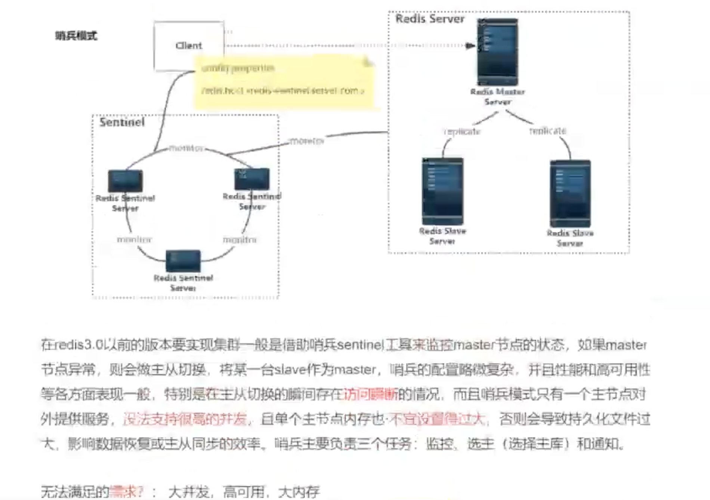
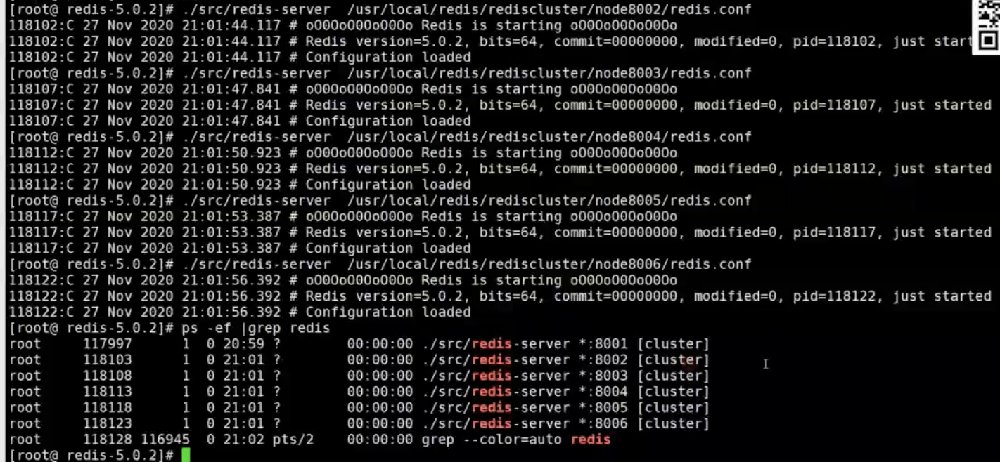
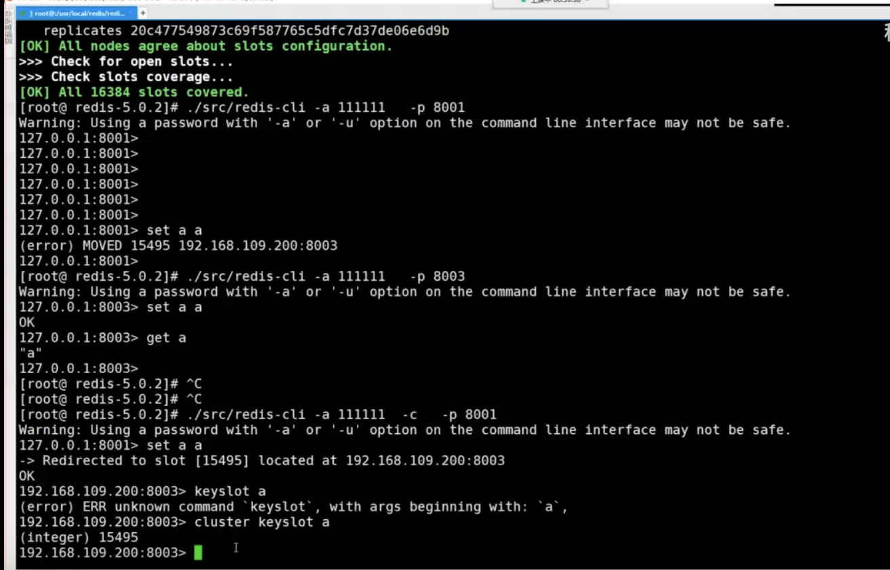
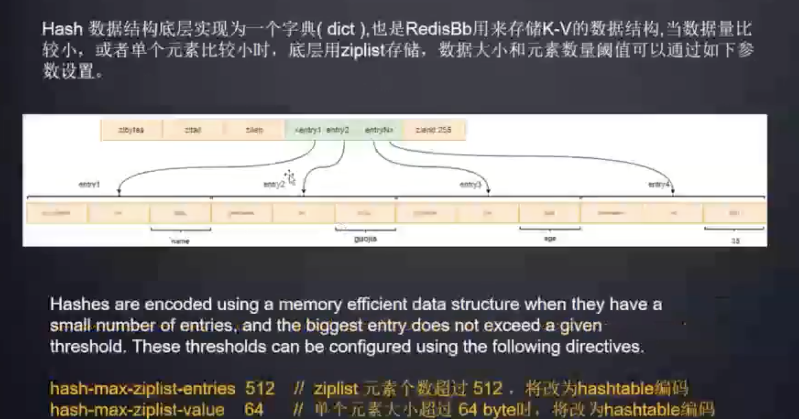
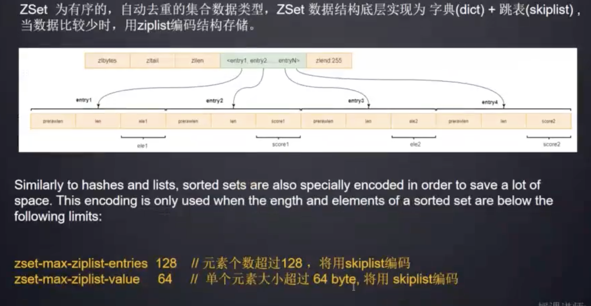
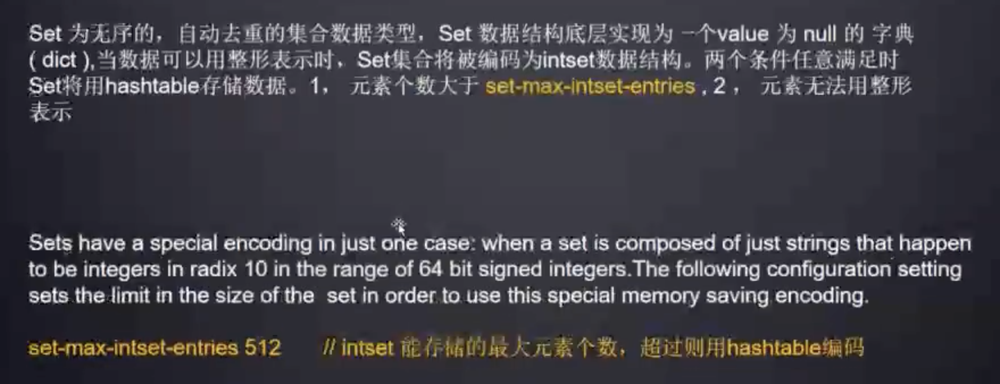

Redis：Remote Dictionary Service 远程字典服务

FAQ:

1、Redis数据倾斜：

###### 1、Redis 集群最大节点个数是多少？

## Redis 面试题

###### 1、Redis 集群最大节点个数是多少？

16384 个。 Redis 集群有 16384 个哈希槽，每个 key 通过 [CRC](https://so.csdn.net/so/search?q=CRC)16 算法计算的结果，对 16384 取模后放到对应的编号在 0-16383 之间的哈希槽，集群的每个节点负责一部分哈希槽

2^14

###### 2、Reids 的特点

Redis 本质上是一个 Key-Value 类型的内存数据库，很像 Memcached，整个

数据库统统加载在内存当中进行操作，定期通过异步操作把数据库数据 flush 到硬盘上进行保存。

因为是纯内存操作，Redis 的性能非常出色，每秒可以处理超过 10 万次读写操

作，是已知性能最快的 Key-Value DB。

Redis 的出色之处不仅仅是性能，Redis 最大的魅力是支持保存多种数据结构，

此外单个 value 的最大限制是 1GB，不像 Memcached 只能保存 1MB 的数据，

因此 Redis 可以用来实现很多有用的功能。

比方说用他的 List 来做 FIFO 双向链表，实现一个轻量级的高性 能消息队列服

务，用他的 Set 可以做高性能的 tag 系统等等。另外 Redis 也可以对存入的 Key

Value 设置 expire 时间，因此也可以被当作一 个功能加强版的 Memcached 来

用。Redis 的主要缺点是数据库容量受到物理内存的限制，不能用作海量数据的高性

能读写，因此 Redis 适合的场景主要局限在较小数据量的高性能操作和运算上。

###### 3、Redis 最适合的场景？

**1、 会话缓存（Session Cache）**

最常用的一种使用 Redis 的情景是会话缓存（session cache）。用 Redis 缓存会

话比其他存储（如 Memcached）的优势在于：Redis 提供持久化。当维护一个

不是严格要求一致性的缓存时，如果用户的购物车信息全部丢失，大部分人都会

不高兴的，现在，他们还会这样吗？ 幸运的是，随着 Redis 这些年的改进，很

容易找到怎么恰当的使用 Redis 来缓存会话的文档。甚至广为人知的商业平台

Magento 也提供 Redis 的插件。 

**2、 全页缓存（FPC）**

除基本的会话 token 之外，Redis 还提供很简便的 FPC 平台。回到一致性问题， 

即使重启了 Redis 实例，因为有磁盘的持久化，用户也不会看到页面加载速度的

下降，这是一个极大改进，类似 PHP 本地 FPC。 再次以 Magento 为例，

Magento 提供一个插件来使用 Redis 作为全页缓存后端。此外，对 WordPress

的用户来说，Pantheon 有一个非常好的插件 wp-Redis，这个插件能帮助你以

最快速度加载你曾浏览过的页面。 

**3、队列**

Reids 在内存存储引擎领域的一大优点是提供 list 和 set 操作，这使得 Redis能作为一个很好的消息队列平台来使用。Redis 作为队列使用的操作，就类似于 

本地程序语言（如 Python）对 list 的 push/pop 操作。 如果你快速的在

Google 中搜索“Redis queues”，你马上就能找到大量的开源项目，这些项目

的目的就是利用 Redis 创建非常好的后端工具，以满足各种队列需求。例如，

Celery 有一个后台就是使用 Redis 作为 broker，你可以从这里去查看。 

**4、排行榜/计数器**

Redis 在内存中对数字进行递增或递减的操作实现的非常好。集合（Set）和有

序集合（Sorted Set）也使得我们在执行这些操作的时候变的非常简单，Redis

只是正好提供了这两种数据结构。所以，我们要从排序集合中获取到排名最靠前

的 10 个用户–我们称之为“user_scores”，我们只需要像下面一样执行即可：

当然，这是假定你是根据你用户的分数做递增的排序。如果你想返回用户及用户

的分数，你需要这样执行： ZRANGE user_scores 0 10 WITHSCORES Agora 

Games 就是一个很好的例子，用 Ruby 实现的，它的排行榜就是使用 Redis 来

存储数据的，你可以在这里看到。

**5、发布/订阅**

最后（但肯定不是最不重要的）是 Redis 的发布/订阅功能。发布/订阅的使用场

景确实非常多。我已看见人们在社交网络连接中使用，还可作为基于发布/订阅

的脚本触发器，甚至用 Redis 的发布/订阅功能来建立聊天系统！ 

###### 4、使用 Redis 有哪些好处？

1、 速度快，因为数据存在内存中，类似于 HashMap，HashMap 的优势就是查找和操作的时间复杂度都是 O(1)。 

2、 支持丰富数据类型，支持 string，list，set，sorted set，hash。 

3、支持事务，操作都是原子性，所谓的原子性就是对数据的更改要么全部执行，

要么全部不执行。 

4、 丰富的特性：可用于缓存，消息，按 key 设置过期时间，过期后将会自动删

除。

5、为什么 edis 需要把所有数据放到内存中？

Redis 为了达到最快的读写速度将数据都读到内存中，并通过异步的方式将数据

写入磁盘。所以 Redis 具有快速和数据持久化的特征。如果不将数据放在内存

中，磁盘 I/O 速度为严重影响 Redis 的性能。在内存越来越便宜的今天，Redis

将会越来越受欢迎。如果设置了最大使用的内存，则数据已有记录数达到内存限

值后不能继续插入新值。 

6、Redis 的内存用完了会发生什么？

如果达到设置的上限，Redis 的写命令会返回错误信息（但是读命令还可以正常

返回。）或者你可以将 Redis 当缓存来使用配置淘汰机制，当 Redis 达到内存上

限时会冲刷掉旧的内容。7、Redis 的回收策略（淘汰策略）

volatile-lru：从已设置过期时间的数据集（ server.db[i].expires）中挑选最近 

最少使用的数据淘汰。

volatile-ttl： 从已设置过期时间的数据集（ server.db[i].expires） 中挑选将要

过期的数据淘汰。

volatile-random： 从已设置过期时间的数据集（ server.db[i].expires） 中任

意选择数据淘汰。

allkeys-lru：从数据集（ server.db[i].dict）中挑选最近最少使用的数据淘汰。

allkeys-random： 从数据集（ server.db[i].dict） 中任意选择数据淘汰。

no-enviction（ 驱逐） ： 禁止驱逐数据。

注意这里的 6 种机制，volatile 和 allkeys 规定了是对已设置过期时间的数据

集淘汰数据还是从全部数据集淘汰数据， 后面的 lru、ttl 以及 random 是三

种不同的淘汰策略， 再加上一种 no-enviction 永不回收的策略。

使用策略规则： 

1、 如果数据呈现幂律分布，也就是一部分数据访问频率高，一部分数据访问频 

率 低， 则使用 allkeys-lru。 

2、 如果数据呈现平等分布， 也就是所有的数据访问频率都相同， 则使用

allkeys-random。8、假如 Redis 里面有 1 亿个 key，其中有 10w 个 key 是以某个固

定的已知的前缀开头的，如果将它们全部找出来？

使用 keys 指令可以扫出指定模式的 key 列表。

对方接着追问：如果这个 Redis 正在给线上的业务提供服务，那使用 keys 指令

会有什么问题？

这个时候你要回答 Redis 关键的一个特性：Redis 的单线程的。keys 指令会导 

致线程阻塞一段时间，线上服务会停顿，直到指令执行完毕，服务才能恢复。这

个时候可以使用 scan 指令，scan 指令可以无阻塞的提取出指定模式的 key 列

表，但是会有一定的重复概率，在客户端做一次去重就可以了，但是整体所花费

的时间会比直接用 keys 指令长。 

###### 9、Memcached 与 Redis 的区别？

1、 Redis 不仅仅支持简单的 k/v 类型的数据，同时还提供 list，set，zset，

hash 等数据结构的存储。而 memcache 只支持简单数据类型，需要客户端自

己处理复杂对象。 

2、 Redis 支持数据的持久化， 可以将内存中的数据保持在磁盘中， 重启的时

候可以再次加载进行使用（ PS： 持久化在 rdb、aof）。10、Redis 常见性能问题和解决方案：

1、 Master 最好不要写内存快照，如果 Master 写内存快照，save 命令调度

rdbSave 函数， 会阻塞主线程的工作， 当快照比较大时对性能影响是非常大

的， 会间断性暂停服务。 

2、 如果数据比较重要， 某个 Slave 开启 AOF 备份数据， 策略设置为每秒

同步一。 

3、 为了主从复制的速度和连接的稳定性， Master 和 Slave 最好在同一个局

域网。 

4、 尽量避免在压力很大的主库上增加从。 

5、 主从复制不要用图状结构， 用单向链表结构更为稳定， 即：Master <-

Slave1<- Slave2 <- Slave3… 这样的结构方便解决单点故障问题，实现 Slave 

对 Master 的替换。如果 Master 挂了， 可以立刻启用 Slave1 做 Master，

其他不变。

### 基本类型：

https://juejin.cn/post/6844903993240453134

#### **String：**

**String** 类型是 **Redis** 中最常使用的类型，内部的实现是通过 **SDS**（Simple Dynamic String ）来存储的。SDS 类似于 **Java** 中的 **ArrayList**，可以通过预分配冗余空间的方式来减少内存的频繁分配。

**String**的实际应用场景比较广泛的有：

- **缓存功能：String**字符串是最常用的数据类型，不仅仅是**Redis**，各个语言都是最基本类型，因此，利用**Redis**作为缓存，配合其它数据库作为存储层，利用**Redis**支持高并发的特点，可以大大加快系统的读写速度、以及降低后端数据库的压力。
- **计数器：**许多系统都会使用**Redis**作为系统的实时计数器，可以快速实现计数和查询的功能。而且最终的数据结果可以按照特定的时间落地到数据库或者其它存储介质当中进行永久保存。
- **共享用户Session：**用户重新刷新一次界面，可能需要访问一下数据进行重新登录，或者访问页面缓存**Cookie**，但是可以利用**Redis**将用户的**Session**集中管理，在这种模式只需要保证**Redis**的高可用，每次用户**Session**的更新和获取都可以快速完成。大大提高效率。

### 高可用

Redis3.0前

在redis3.0以前的版本要实现集群一般是借助哨兵sentinel工具来检控master节点的状态，如果master节点异常，则会做主从切换，将某一台slave作为master，哨兵的配置略微复杂，并且性能和高可用性等各方面表现一般，特别是在主从切换的瞬间存在**访问瞬断**的情况，而且哨兵模式只有一个主节点对外提供服务，**没法支持很高的并发**，且单个主节点内存也**不宜设置得过大**，否则会导致持久化文件过大，影响数据恢复或主从同步的效率。消兵主要负责三个任务:监控、选主(选择主库)和通知。

>  无法满乐的需求?:大并发，高可用，大内存

redis集群是一个由多个主从节点群组成的分布式服务器群，它具有复制、高可用和分片特性。Redis集群不需要sentinel哨兵也能完成节点移除和故障转移的功能。需要将每个节点设置成集群模式，这种集群模式没有中心节点，可水平扩展，据官方文档称可以线性扩展到上万个节点(官方推荐不超过1000个节点)。redis集群的性能和高可用性均优于之前版本的哨兵模式，且集群配置非常简单

高并发:通过横向拓展实现，通过--cluster add-node添加新机器到集群执行reshard命令，重新分配slot，将相对均摊了slot的分布，缓冲了其他机器的并发压力，从而应对百万，甚至上千万的并发。

复制:每个小集群都是一个主从复制的架构，从而保证了主节点挂掉的时候，不至于丢失全部数据当选举产生新的master节点后，继续对外进行服务在主备切换过程中，部分key会有影响，但是其他分片上的key不会有任何影响，从而保证了高可用的场景。

### Redis高可用集群搭建

redis安装
下载地址:http://redis.io/download安装步骤:

#安装gcc
yum install gec

#把下载好的redis-5.0.2.targz放在/usr/local文件夹下，并解压
wget http://downtoad.redis.iofreleases/redis-5.0.2.largz tar xzf redis-5.0.2.targz cd rexfis-5.0.2

#进入到解压好的redis-5.0.2目录下，进行编译与安装
make &make install

#启动并指定配置文件
src/redis-server redis.conf(注意要使用后台启动，所以修改redis.conf里的daemonize改为yes)

#验证启动是否成功 ps -ef | grep redis

进入redis客户编
usrllocalfedisbintredis ali

#退出客户端 quit

退Hredis服务:
(1) pkii redis-server

### redis集群搭建

redis集群需要至少要三个master节点，我们这里搭建三个master节点，并且给每个master再搭建一个 slave节点，总共6个redis节点，这里用一台机器部署6个redis实例，一共三组一主一从集口070日A0群的步骤如下:
第一步，在机器的/usr/local下创建文件夹redis-clusier，然后在其下面分别创建1个文件爽如下

(1)mkdir -p usr/local/radis-cluster

(2) mkdr 8001

mkdir ./node800{1,2,3,4,5,6}

第一步:把之前的redis.conf配置文件copy到8001下，修改如下内容
(1) daemonize yes
(2)port 8001(分别对每个机器的端口号进行设置)
(3)dir /usr/local/redis-cluster/8001/(指定数据文件存放位置，必须要指定不同的目录位置，不然会丢失数据)
[4) cluster-enabled ves(启动集群模式)
(6)cluster-coniig-file nodes-8001.conf(集群节点信息文件，这里800x最好和por对应上，注意这

(5)duster-contig-iile nodes-8001.conf(集群节点信息文件，这里800%最好和port对应上，注意这里不是用户可编毒的文件，而是Red华集节点每次发生更改时自动保留群集配置)(6) dltaternorie-hmeout 5000
O日A
(7)#bind 127.0.0.1(去卓bind绑定访间ip信息)
(8l protected-mode no (关间保扩模式) 
(a) appeodoniy yes
如果要没冒的妈需要潜加如下配营:
(10) requirepass 111111 (投冒redis访问密码1 
(11) mastarautt 111111 (设置集群节点间访问密码，跟上面一致) 

第三步:copy配警好的文件8001到8002 8003 8004 8005 8006

第四步:你改复制后的配置文件redis.conf手2、3、5的品1号，

可中用批量替换  :%s/源字符串/目的字符目/g

vim   :%s/8001/8002/g

第五步：分别启动6个redis实例，然后检查是否启动成功

第六步:用rerlis-cli创建整个redis集群(redis5以前的版本集群是依靠ruby脚本relis-irib.rbao(1)fusr/localredis-5.0.2/sfc/redis-cll -a 111111 --cluster create -clusler-replicas 1 192.168.6.154:8001 192.168 6 157 8002 192 1686 154 8003 192.168.6.154:8004 192.166 6 154 8005 192.168.6.154:8006

代表为每个创建的主服务器节点创建一个从服务器节点 -repllcas1 1其实代表的是副本个数

第七步:验证集群
(1)连接任意一个客户端即可:./redis-cli-c-h-p(-a访问服务端密码，-c表示集群模式，指定ip地址
和端号)如:/usr/local/redis-5.02/srclredis-cli-a 111111 -c -h 192.168.6.139 -0 8001

(2)进行验证:clusterinfo(查看集计信息)、ciusternodes(直看节点列表(3)进行数据操作验证
(4)关闭集群则需要逐个进行关闭，使用命令:
lusr/local/redis/bin/redis-cli-a 111111 -c-h 192.168.6.139-p800* shutdown

忘记了命令可以用redis-cli--clusterhelp查看

3、Java操作redis集群
借助redis的java客户端jedis可以操作以上集群，引用jedis版本的maven坐标如下
cdependency
cgroupid>redis.clients</groupld>
<artfactid>ledis<jartifactlt>
version>3.1.0</version>.
dependencys
Java编写访问redis集群的代码非常简单，如下所示:
import java io.lOException:

### 原理

