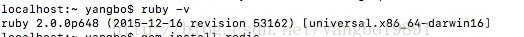

1、下载和安装redis

  这里不做详细介绍，直接去官网下载最新版本的redis即可。

2、创建集群目录

  找到redis的安装目录，在里面创建集群文件夹

  sudo mkdir redis-cluster

  cd 到redis-cluster文件夹里，创建六个节点文件夹：

  mkdir redis01

  mkdir redis02

  mkdir redis03

  mkdir redis04

  mkdir redis05

  mkdir redis06

3、修改配置文件

    找到redis安装目录，vi redis.conf，需要修改下面信息：
    
    port 7001 --端口

  daemonize yes --指定redis是否以后台进程方式启动

  cluster-eanbled yes --集群开启开关

  cluster-config-file nodes.conf --节点配置说明文件，redis自己维护

  cluster-node-timeout 5000 --心跳测试反应时间，超过5s没有反应认为该节点挂掉

  appendonly yes --Redis持久化第二种方式，AOF，默认开启，默认每秒执行一次持久化保存，也可以设置成实时保持，这个比save更安全。

  修改完这个配置文件后，分辨拷贝到六个文件节点文件夹中，redis01-06，同时修改对应端口7001-7006，然后将redis安装包src路径下的redis-server文件分别拷贝到六个节点文件夹中。

4、分别启动redis6个实例

 打开终端，分别执行以下命令:

 cd /usr/local/redis/redis-cluster/redis01/

 sudo redis-server redis.conf

 cd /usr/local/redis/redis-cluster/redis02/

 sudo redis-server redis.conf

  ......

  6个实例都启动完毕，检验一下redis启动情况：

 ps -ef|grep redis

./redis01/redis-server ./redis01/redis.conf

./redis02/redis-server ./redis02/redis.conf

./redis03/redis-server ./redis03/redis.conf

./redis04/redis-server ./redis04/redis.conf

./redis05/redis-server ./redis05/redis.conf

./redis06/redis-server ./redis06/redis.conf

5、升级ruby安装gem

  gem的安装要求ruby的版本在1.8.7以上，先看一下本机的版本

  

  我的版本是2.0.0，复合要求。然后安装：

  gem install redis

6、创建redis集群

    cd 到redis安装目录下的src路径下，找到redis-trib.rb文件，执行一下命令：
    
    ./redis-cli --cluster create --replicas 1 127.0.0.1:7001 127.0.0.1:7002 127.0.0.1:7003 127.0.0.1:7004 127.0.0.1:7005 127.0.0.1:7006
    
    

  至此，redis集群搭建成功！我们来测试一下：

  cd到redis安装目录的src目录，会看到redis-cli 这个文件，然后执行：

  redis-cli -c -p 7001

  set test yeah

  然后会看到7001（主）7004（从）都有这个key，ok，测试通过！