[TOC]

# Spring

方法论：

不要忽略源码中的注释

先梳理脉络，再扣细节

见名知意

大胆猜测，小心验证

善于用小工具，translate  sequenceDiagram

坚持看


#### 1、谈谈对spring IOC的理解

IOC: Inversion of Control，即控制反转，原来使用的时候对象是由使用者控制，有了spring后，可以将整个对象交给容器进行管理（理论思想）

DI: 依赖注入，将对应的属性注入到具体的对象中 @Autowired @Resource，populateBean方法完成属性注入(配置文件的方式) 

容器：存储对象，同时使用Map结构存储对象，在spring中存储对象的时候一般使用三级缓存，

* singletonObjects存储完整对象，
* earlySingletonObjects存放半成品对象
* singletonFactories 用例存储lambda表达式和对象名称的映射

```java
	/** Cache of singleton objects: bean name to bean instance. 一级缓存*/
	private final Map<String, Object> singletonObjects = new ConcurrentHashMap<>(256);

	/** Cache of singleton factories: bean name to ObjectFactory. 三级缓存*/
	private final Map<String, ObjectFactory<?>> singletonFactories = new HashMap<>(16);

	/** Cache of early singleton objects: bean name to bean instance. 二级缓存 */
	private final Map<String, Object> earlySingletonObjects = new HashMap<>(16);
```

每个bean的生命周期，从创建和使用到销毁，各个环节都是由容器来帮忙控制的。
bean的生命周期是
循环依赖问题是怎么产生，及如何解决

这是对IOC的整体理解，各个简单描述下bean的创建和销毁过程，您看一下有什么问题，可以指点我一下

 这个体系还有细节的点， 之前看的太久 记不清楚了，Spring中所有的bean通过反射生成的，constructor newInstance ,在整个流程中还会包含很多扩展点，比如两个非常重要的接口BeanFactoryPostProcessor, BeanPostProcessor 用来实现扩展功能，aop就是在IOC基础之上的一个扩展实现，是通过BeanPostProcessor实现的。


ioc中除了创建对象之外还有一个重要的点就是填充属性，

生命周期的东西


1.1 谈一下spring ioc的底层实现？


#### 2、简单描述bean的生命周期是？

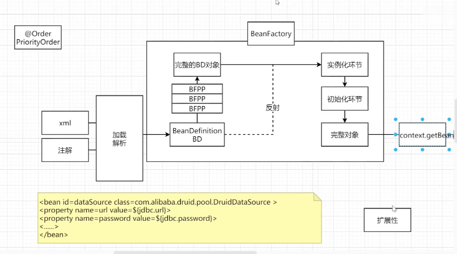


完整对象下面---> 销毁环节


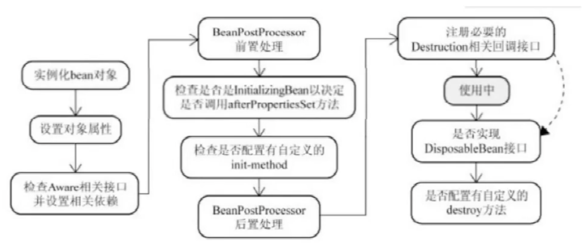

spring容器帮忙我们去管理对象，从对象的产生到销毁的环节，都由容器来控制，主要包含实例化和初始化两个关键环节，在整个过程中还有一些扩展点的存在，下面详细各个环节和步骤：

先通过createBeanFactory创建出一个Bean工厂（DefaultListableBeanFactory）,开始循环创建对象，因为容器中bean默认是单例，优先通过geBean, doGetBean从容器中查找，找不到的话 通过createBean doCreateBean方法，以反射的方式创建对象，


* 实例化bean对象，通过反射的方式来生成，在源码中有一个**createBeanInstance**的方法来专门生成对象
* 当bean对象创建完成之后，对象的属性值都是默认值，所以要开始给bean填充属性，通过populateBean方法来完成对象属性的填充，中间会涉及到循环依赖的问题，后面详说
* 向bean对象中设置容器属性~~（applicationContent\BeanFactory\Environment\ResourceLoader）~~,会调用invokeAwareMethods方法来将容器对象设置到具体的bean对象中

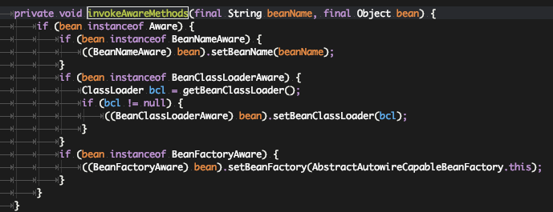

*  调用BeanPostProcessor中的前置处理方法来进行bean对象的扩展工作，使用较多的有ApplicationContentPostProcessor，EmbeddValueResolver等对象
* 调用invokeInitMethods方法来完成初始化方法的调用，在此方法处理过程中，需要判断当前bean对象是否实现了InitializingBean接口，如果实现了调用afterPropertiesSet方法来最后设置bean对象
* 调用BeanProcessor的后置处理方法，完成对Bean对象的后置处理工作，aop就是在此书实现的，实现的接口名字叫做AbstractAutoProxyCreator
* 获取完整对象，通过getBean的方式去进行对象获取和使用
* 当对象使用完成之后，容器在关闭的时候，会销毁对象，首先会判断是否实现DisposableBean接口，然后去调用destroyMethod方法

容器中按照使用者分，可以把bean对象分类，用户自定义对象，

容器对象

1. ApplicationContext
2. BeanFactory
3. BeanName
4. ResourceLoader

```
public interface org.springframework.beans.factory.Aware {

}
```

实例化：反射     

获取Class对象：

```
Constuctor ctor = clazz.getDeclaredConstructor();
Object obj = ctor.newInstance();
```

属性赋值操作：

给自定义属性赋值， populateBean

给容器对象属性赋值， Aware--> invokeAwareMethods()

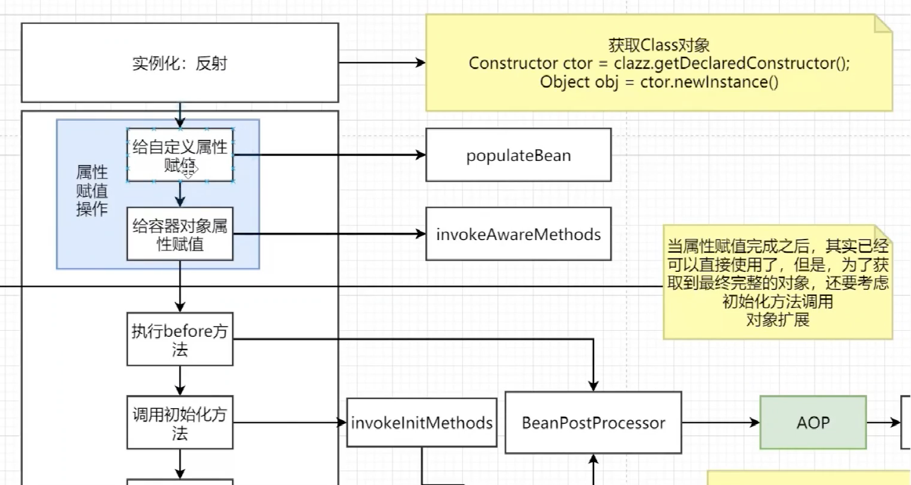

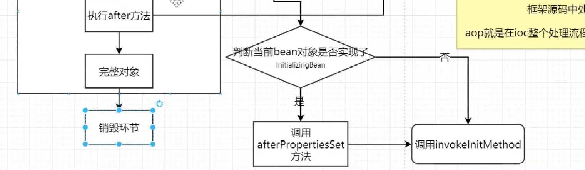


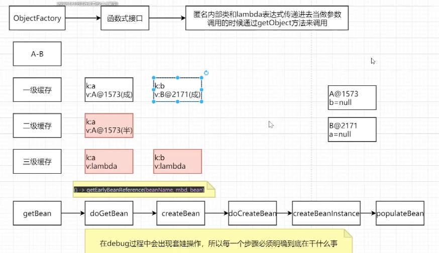


#### 3、BeanFactory和FactoryBean的区别？

BeanFactory和FactoryBean都可以用来创建对象，只不过创建的流程和方式不同，

BeanFactory是访问Spring容器到根接口，当使用BeanFatory的时候，必须遵守bean的生命周期，经过一系列繁杂的步骤才能创建出单例对象，是流水线式的创建过程，

而FactoryBean是用户可以自定义bean对象的创建流程，不需要按照bean的生命周期来创建，在此接口中包含三个方法，

isSingleton: 判断是否是单例模式

getObjectType 获取对象的类型

getObject: 在此方法中可以自己创建对象，使用new 的方式活使用代理的方式，用户按照自己的需要随意去创建对象，很多框架继承的时候都会实现FactoryBean接口，比如Feign


#### 4、spring中用到哪些设计模式

单例模式：spring的bean都是单例模式

工厂模式：BeanFactory

模版方法：postProcessorBeanFactory (web子类扩展实现)  onRefresh


观察者模式： listener 、event、multicast

适配器模式：Adapter

装饰者模式：BeanWrapper

责任链模式：使用aop的时候会有一个责任链模式，DynamicAdaviseInterceptor --intercept--chain

代理模式：aop动态代理

委托着模式：delegate

建造者模式：builder

策略模式： 解析xml文件  XmlBeanDefinition  PropertiesbeanDefinitionReader


#### 5、BeanFactory和ApplicationContext的区别？

BeanFactory是访问Spring容器到根接口，里面只是提供某些基本方法的约束和规范，为了满足更多的需求，ApplicationContext实现了此接口， 并在此接口的基础之上做了某些扩展功能，提供了更多丰富的api调用。一般使用ApplicationContext居多


#### 6、循环依赖问题是怎么产生，及如何解决

三级缓存来解决的，提前暴露对象

什么是循环依赖？ bean都是单例，导致循环依赖(A->B,  B->A)

spring中bean对象的创建都要经历实例化和初始化（属性填充）的过程， 通过将对象的状态分开，存在成品和半成品对象的方式，来分别进行初始化和实例化，成品和半成品在存储的时候需要分不同的缓存来进行存储。

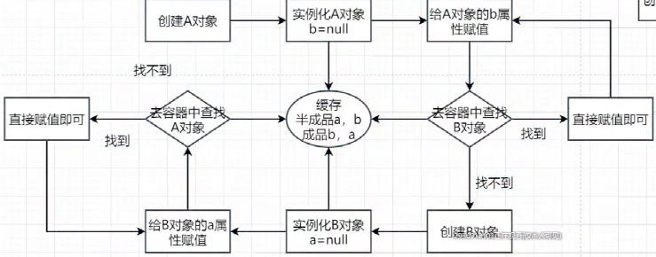

>1、只有一级缓存，能否解决循环依赖问题么？
>
>不能，如果只有一级缓存，那么成品对象和半成品对象会放到一起，而半成品对象是无法暴露给外部使用的（引用为null），所以要分开，一级缓存放成品，二级缓存放半成品。
>
>2、只有二级缓存，能否解决循环依赖问题？
>
>如果整个应用程序不涉及aop的存在，可以解决，否则不能
>
>三级缓存位置：getSingleton, doCreateBean
>
>3、为什么需要三级缓存？
>
>三级缓存的value类型是ObjectFactory 是一个函数式接口，不是直接进行调用的，只有在调用getObject方法时候才会去调用里面存储的lamdba表达式，存在的意义是保证整个容器的运行过程中同名的bean对象只有一个
>
>当创建完成原始对象之后，后续有需要创建代理对象，那么对象在引用的时候应该用哪个？
>
>换句话， 就是一个beanName 对应两个对象（原始对象和代理对象）
>
>在整个容器中，有且只能有一个同名的对象，当需要生成代理对象的时候，就要把代理对象覆盖到原始对象。否则报错：
>
> 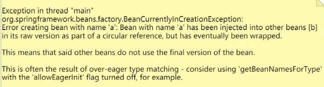
>
>程序是怎么知道在什么时候进行代理对象的创建？
>
>在实际调用的过程中，是没有办法来确定什么时候对象需要被调用，因此当某一个对象被调用的时候，有限判断当前对象是否需要被代理，需要一个类似于回调的接口判断，当需要第一次对外暴露的时候，根据传入的lambda表达式来判断当前对象是否需要创建代理对象，
>
>


6.3 三级缓存的使用方式

getEarlyBeanReference方法的if 判断，如果mbd.isSynthetic属性，一般是指AOP相关的pointCut 配置或Adice

配置才会将synthetic设置为true，  如果需要代理，就返回代理对象，否则就返回原始对象

spring是框架，存储的时候先往三级缓存放一份


```java
addSingletonFactory(beanName, () -> getEarlyBeanReference(beanName, mbd, bean));

	/**
	 * Add the given singleton factory for building the specified singleton
	 * if necessary.
	 * <p>To be called for eager registration of singletons, e.g. to be able to
	 * resolve circular references.
	 * @param beanName the name of the bean
	 * @param singletonFactory the factory for the singleton object
	 */
	protected void addSingletonFactory(String beanName, ObjectFactory<?> singletonFactory) {
		Assert.notNull(singletonFactory, "Singleton factory must not be null");
		synchronized (this.singletonObjects) {
			if (!this.singletonObjects.containsKey(beanName)) {
				this.singletonFactories.put(beanName, singletonFactory);
				this.earlySingletonObjects.remove(beanName);
				this.registeredSingletons.add(beanName);
			}
		}
	}

	/**
	 * Return the (raw) singleton object registered under the given name.
	 * <p>Checks already instantiated singletons and also allows for an early
	 * reference to a currently created singleton (resolving a circular reference).
	 * @param beanName the name of the bean to look for
	 * @param allowEarlyReference whether early references should be created or not
	 * @return the registered singleton object, or {@code null} if none found
	 */
	@Nullable
	protected Object getSingleton(String beanName, boolean allowEarlyReference) {
		Object singletonObject = this.singletonObjects.get(beanName);
		if (singletonObject == null && isSingletonCurrentlyInCreation(beanName)) {
			synchronized (this.singletonObjects) {
				singletonObject = this.earlySingletonObjects.get(beanName);
				if (singletonObject == null && allowEarlyReference) {
					ObjectFactory<?> singletonFactory = this.singletonFactories.get(beanName);
					if (singletonFactory != null) {
            // 调用三级缓存放入的lambda表达式
						singletonObject = singletonFactory.getObject();
						this.earlySingletonObjects.put(beanName, singletonObject);
						this.singletonFactories.remove(beanName);
					}
				}
			}
		}
		return singletonObject;
	}


	/**
	 * Obtain a reference for early access to the specified bean,
	 * typically for the purpose of resolving a circular reference.
	 * @param beanName the name of the bean (for error handling purposes)
	 * @param mbd the merged bean definition for the bean
	 * @param bean the raw bean instance
	 * @return the object to expose as bean reference
	 */
	protected Object getEarlyBeanReference(String beanName, RootBeanDefinition mbd, Object bean) {
		Object exposedObject = bean;
		if (!mbd.isSynthetic() && hasInstantiationAwareBeanPostProcessors()) {
			for (BeanPostProcessor bp : getBeanPostProcessors()) {
				if (bp instanceof SmartInstantiationAwareBeanPostProcessor) {
					SmartInstantiationAwareBeanPostProcessor ibp = (SmartInstantiationAwareBeanPostProcessor) bp;
					exposedObject = ibp.getEarlyBeanReference(exposedObject, beanName);
				}
			}
		}
		return exposedObject;
	}

```

##### 6.4 缓存放置的时间和删除时间？

三级缓存： createBeanInstance之后， addSingletonFactory

二级缓存：第一次从三级缓存确定对象是代理对象还是普通对象时候，同时删除三级缓存  getSingleton

一次缓存：生成完整对象之后放到一级缓存，删除二三级缓存： addSingleton


#### 7.Spring的AOP 的底层实现原理？

动态代理，aop是ioc 的一个扩展功能，现有ioc，再有aop， 只是在ioc的整个流程中新增的一个扩展点：BeanPostProcessor, 

bean的创建过程 中有一个步骤可以对bean进行扩展实现，aop本身就是一个扩展功能，所以在BeanPostProcessor后置处理方法中来实现

1、代理对象的创建过程（advice 切面 切点）

2、通过jdk 或者cglib的方式生成代理对象

3、在执行方法调用的时候，会调用到生成的字节码文件中，直接找到DynamicAdvisedInterceptor类中的 intercept方法，从此方法开始执行

4、根据之前定义好的通知来生成拦截器链

5、从拦截器链中一次获取每一个通知开始执行，在执行过程中，为了方便获取下一个通知，会有一个CglibMethodInvocation对象，找的时候是从-1的位置开始查找 并执行。

```java
	/**
	 * General purpose AOP callback. Used when the target is dynamic or when the
	 * proxy is not frozen.
	 */
	private static class DynamicAdvisedInterceptor implements MethodInterceptor, Serializable {

		private final AdvisedSupport advised;

		public DynamicAdvisedInterceptor(AdvisedSupport advised) {
			this.advised = advised;
		}

		@Override
		@Nullable
		public Object intercept(Object proxy, Method method, Object[] args, MethodProxy methodProxy) throws Throwable {
			Object oldProxy = null;
			boolean setProxyContext = false;
			Object target = null;
			TargetSource targetSource = this.advised.getTargetSource();
			try {
				if (this.advised.exposeProxy) {
					// Make invocation available if necessary.
					oldProxy = AopContext.setCurrentProxy(proxy);
					setProxyContext = true;
				}
				// Get as late as possible to minimize the time we "own" the target, in case it comes from a pool...
				target = targetSource.getTarget();
				Class<?> targetClass = (target != null ? target.getClass() : null);
				List<Object> chain = this.advised.getInterceptorsAndDynamicInterceptionAdvice(method, targetClass);
				Object retVal;
				// Check whether we only have one InvokerInterceptor: that is,
				// no real advice, but just reflective invocation of the target.
				if (chain.isEmpty() && Modifier.isPublic(method.getModifiers())) {
					// We can skip creating a MethodInvocation: just invoke the target directly.
					// Note that the final invoker must be an InvokerInterceptor, so we know
					// it does nothing but a reflective operation on the target, and no hot
					// swapping or fancy proxying.
					Object[] argsToUse = AopProxyUtils.adaptArgumentsIfNecessary(method, args);
					retVal = methodProxy.invoke(target, argsToUse);
				}
				else {
					// We need to create a method invocation...
					retVal = new CglibMethodInvocation(proxy, target, method, args, targetClass, chain, methodProxy).proceed();
				}
				retVal = processReturnType(proxy, target, method, retVal);
				return retVal;
			}
			finally {
				if (target != null && !targetSource.isStatic()) {
					targetSource.releaseTarget(target);
				}
				if (setProxyContext) {
					// Restore old proxy.
					AopContext.setCurrentProxy(oldProxy);
				}
			}
		}
		
}
```


#### 8. Spring 的事务是如何回滚的？

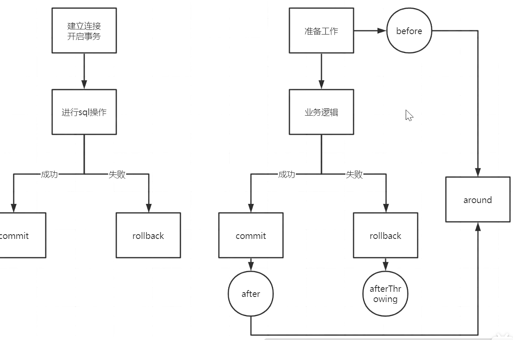


spring的事务管理是如何实现的？

总：spring的事务是由aop来实现的，首先要生成具体的代理对象，然后按照aop的整套流程来执行具体的操作逻辑，正常情况要通过通知来核心功能，但在aop中不是通过通知来实现的，而是通过一个TransactionInterceptor来实现的，然后调用invoke来实现具体的逻辑。

分：1、先做准备工作，解析各个方法上事务相关的属性，根据具体的属性来判断是否开启新事务

2、当需要开启的时候，获取数据库连接，关闭自动提交功能，开启事务

3、执行具体的sql逻辑操作

4、在操作过程中，如果执行失败了，那么会通过completeTransactionAfterThrowing来完成事务的回滚操作，回滚的具体逻辑是通过doRollBack来实现的，实现的时候也是要先获取连接对象，通过连接对象回滚

```java
// org.springframework.transaction.interceptor.TransactionAspectSupport
// completeTransactionAfterThrowing
// org.springframework.jdbc.datasource.DataSourceTransactionManager	
@Override
	protected void doRollback(DefaultTransactionStatus status) {
		DataSourceTransactionObject txObject = (DataSourceTransactionObject) status.getTransaction();
		Connection con = txObject.getConnectionHolder().getConnection();
		if (status.isDebug()) {
			logger.debug("Rolling back JDBC transaction on Connection [" + con + "]");
		}
		try {
			con.rollback();
		}
		catch (SQLException ex) {
			throw new TransactionSystemException("Could not roll back JDBC transaction", ex);
		}
	}
	
```

5、如果执行过程中，没有任何意外情况的发生，那么通过completeTransactionAfterReturning来完成事务的提交操作，提交的具体逻辑是通过doCommit方法来实现的，实现的时候也是要获取连接，通过连接对象来提交

6、当事务执行完毕之后，需要清除相关事务信息cleanupTranactionInfo. eg.连接持有对象ConnectionHolder 中currentConnection,

如果想聊的更细：需要知道TransactionInfo, TransactionStatus

#### 9. 谈一下spring的事务传播特性？

传播特性7种： 

Required   Requires_new   nested

Support    Not_Support  Never 方法不能出现事务

  Mandatory

某一个事务嵌套另一个事务的时候怎么办？

A方法调用B方法， AB方法都有事务，并且传播特性不同， 那么A如果有异常，B怎么办， B如果有异常，A怎么办？

总：事务的传播特性指的是 不同方法的嵌套调用过程中，事务应该如何进行处理，是同一个事务还是不同的事务，当出现异常会回滚还是提交，两个方法之间的相关影响，在日常中使用比较多的是 Required   Requires_new   nested

分：事务的不同分类可以分为三类，支持当前事务，不支持当前事务，嵌套事务

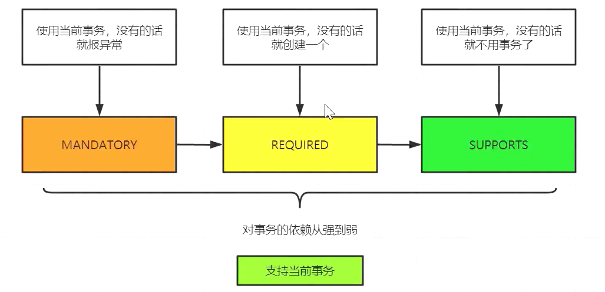

  

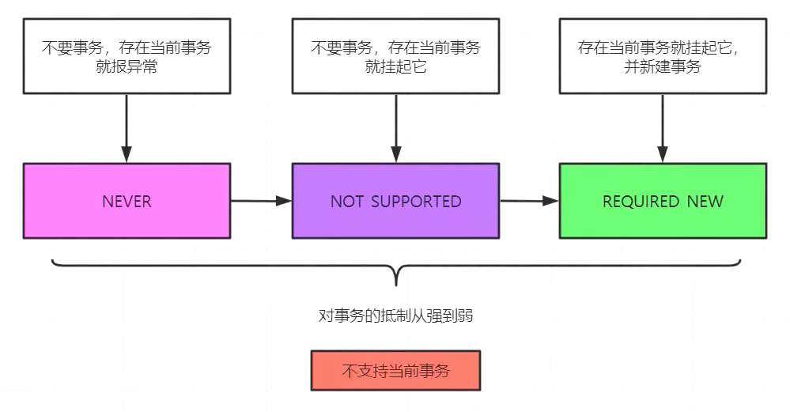

2、如果外层方法是required, 内层方法是 required  requires_new nested

3、如果外层方法是requires_new, 内层方法是 required  requires_new nested

4、如果外层方法是nested, 内层方法是 required  requires_new nested

核心处理逻辑：

1、判断内外方法是否同一事务：

是： 异常统一在外出处理

不是：内层方法有可能影响到外层方法，但是外层方法是不会影响到内层方法

大致可以这么理解，有nested

##### 9.1 required   nested 回滚的区别？

最大问题在于保存点的设置，外层方法的对内层方法的异常情况在进行捕获的时候区别都不同，使用required的时候，会报Transaction rolled back because it has been marked as rollback-only信息，因为内部异常了，设置了回滚标记，外部捕获之后，要进行事务的提交，意味着要回滚，所以会报异常。而nested不会发生这种情况，因为在回滚的时候把回滚标记清楚了，外部捕获异常后去提交，没发现回滚标记，就可以正常提交了。

##### 9.2 requires_new  nested 回滚的区别？

这两种产生的效果是一样的，但是requires_new 会有新的连接生成，而nested使用的是当前事务的连接，而且nested还可以回滚到保持点，requires_new每次都是一个新的事务的回滚，

但nested其实是一个事务，外层事务可以控制内层事务的回滚，内层就算没有异常，外层出现异常，也可以全部回滚。


 

参考：

[【完美作品】阿里金九银十面试问的Spring源码相关的所有问题都在这里了！]: https://www.bilibili.com/video/BV1Pf4y1g7eZ?p=1	"视频"

[^12]: 热死人


