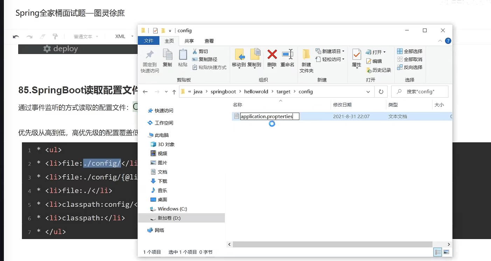
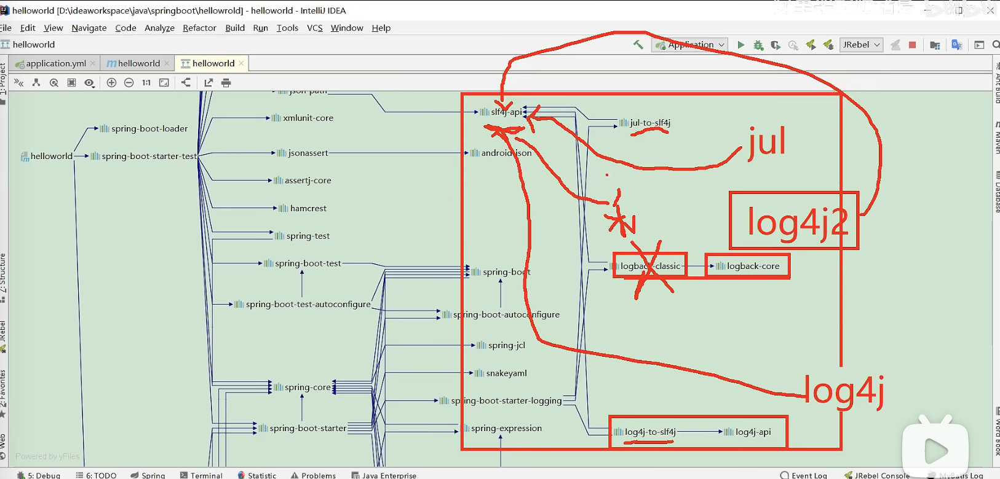
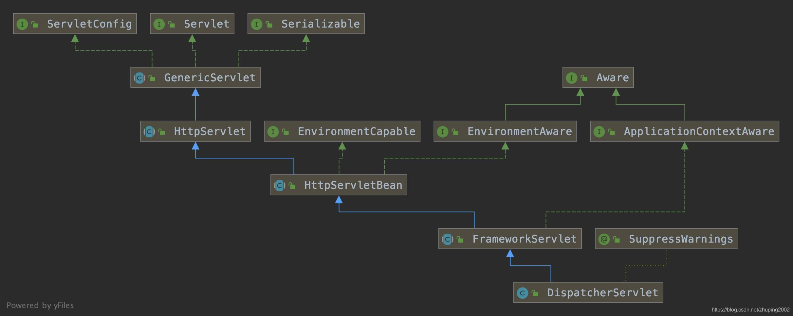
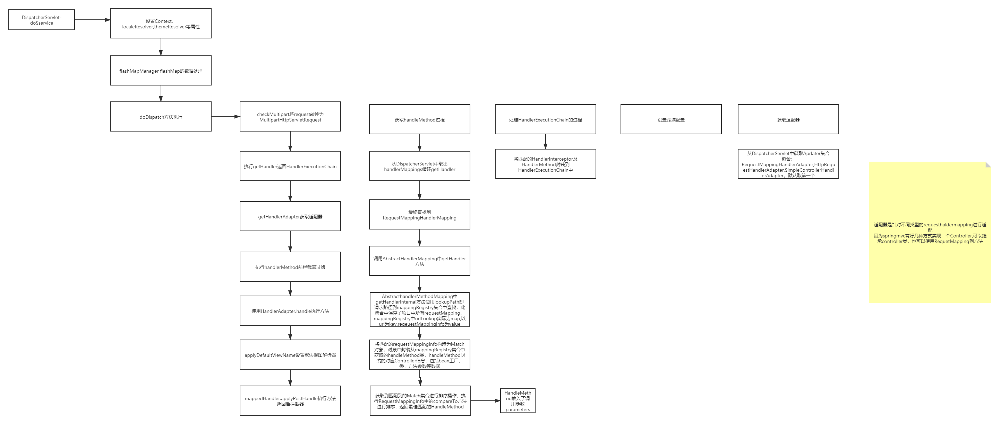
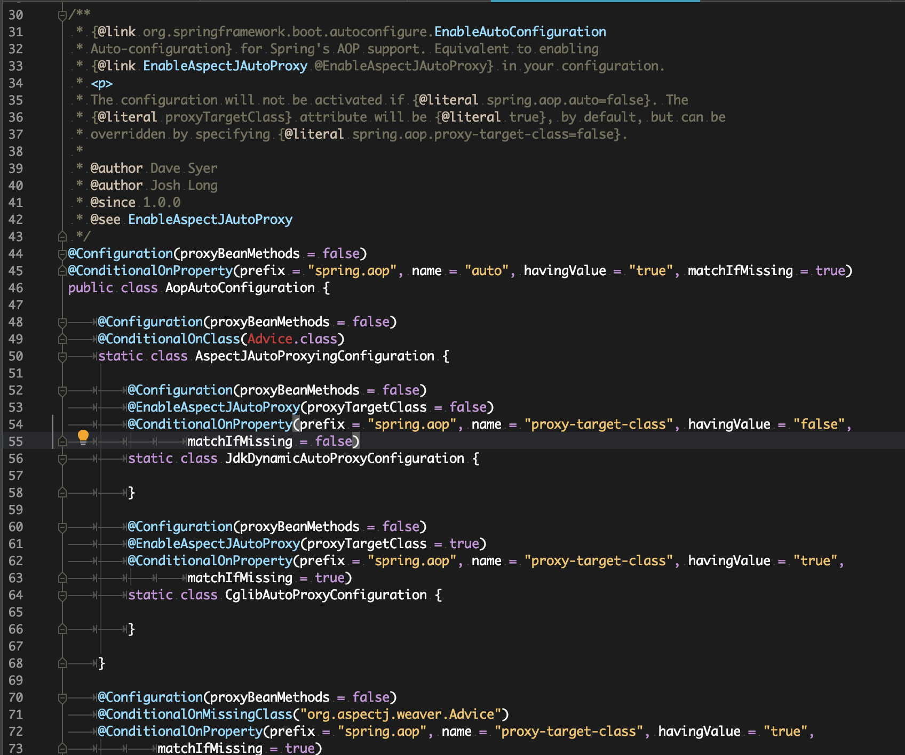
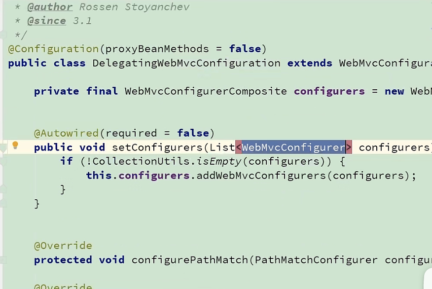

在我们的日常开发工作中，经常会有一些独立于业务之外的配置模块，我们经常将其放到一个特定的包下，然后如果另一个工程需要复用这块功能的时候，需要将代码硬拷贝到另一个工程，重新集成一遍，麻烦至极。如果我们将这些可独立于业务代码之外的功配置模块封装成一个个starter，复用的时候只需要将其在pom中引用依赖即可，SpringBoot为我们完成自动装配，简直不要太爽。

　　SpringBoot提供的starter以`spring-boot-starter-xxx`的方式命名的。官方建议自定义的starter使用`xxx-spring-boot-starter`命名规则。以区分SpringBoot生态提供的starter。


#### [SpringBoot应用篇（一）：自定义starter ](https://www.cnblogs.com/hello-shf/p/10864977.html)

com.pei.spring.autoconfigure.config.GreeterAutoConfiguration

在resource 场景文件夹META-INF 并在其下创建spring.factories 文件

```
org.springframework.boot.autoconfigure.EnableAutoConfiguration=\
  com.pei.spring.autoconfigure.config.GreeterAutoConfiguration
```

自动配置类：

```
@Configuration
@ConditionalOnClass(Greeter.class)
@ConditionalOnProperty(prefix = "igoso.greeter", value = "enable", matchIfMissing = true)
@EnableConfigurationProperties(GreeterProperties.class)
public class GreeterAutoConfiguration {


    @Bean("greeter")
    @ConditionalOnMissingBean
    public Greeter greeter() {
        return new Greeter();
    }
}
```


### SpringBoot读取文件的原理是什么？





### Springboot默认日志框架：




#### 切换日志框架

将logback切换成log4j2
1将logback的场景启动器排除(slf4j只能运行有1个桥接器)

2添加log4j2的场景启动器

3添加log4j2的配置文件

```
<dependency>
    <!--starter-web里面自动添加starter-logging也就是logback的依赖-->
    <groupId>org.springframework.boot</groupId>
    <artifactId>spring-boot-starter-web</artifactId>
    <exclusions>
        <!--排除starter-logging也就是logback的依赖-->
        <exclusion>
            <artifactId>spring-boot-starter-logging</artifactId>
            <groupId>org.springframework.boot</groupId>
        </exclusion>
    </exclusions>
</dependency>

<!--Log4j2的场景启动器-->
<dependency>
    <groupId>org.springframework.boot</groupId>
    <artifactId>spring-boot-starter-log4j2</artifactId>
</dependency>
```


#### [SpringBoot应用篇（二）：SpringSecurity实现带验证码的登录认证 附代码 ](https://www.cnblogs.com/hello-shf/p/10800457.html)


PostProcessor---> 后置处理器增强器--> 增强某些核心功能

BeanFactoryPostProcessor---> BeanFactory--> 访问Spring Bean容器的根接口

BeanPostProcessor -->  Bean   对象


org.springframework.context.support.PostProcessorRegistrationDelegate


### springboot自动装配原理？ spring.factories

启动入口， @SpringBootApplication-->@EnableAutoConfiguration

-->@import(AutoConfigurationImportSelector.class)

process-->getCandidateConfigurations

从spring配置文件里加载 EnableAutoConfiguration --> META-INF-->spring.factories文件：


ConfigurationClassPostProcessor.java

postProcessBeanDefitionRegistry--> 解析工作

processConfigBeanDefinition-->

parse-->

处理@Import 注解，放入集合中

然后 this.deferredImportSelectorHandler.process()

--> handler.processGroupImports()

-->getImports()-->process()

-->getAutoConfigurationEntry()

-->getCandidateConfigurations-->


## spring一次请求的过程学习-springboot

基于Factories机制Springboot自动装配DispatcherServlet是由spring-boot-autoconfigure-2.0.4.RELEASE.jar中的spring.factories中  的org.springframework.boot.autoconfigure.web.servlet.DispatcherServletAutoConfiguration配置


DispatcherServlet作为[spring](https://so.csdn.net/so/search?q=spring&spm=1001.2101.3001.7020)请求总控制入口，DispatcherServlet实现Servelt接口，本质也是一种servlet，由web容器转发请求到servelt中执行service方法，DispatcherServlet继承关系如下：




1. GenericServlet未实现service方法

public abstract void service(ServletRequest var1, ServletResponse var2) throws ServletException, IOException;
2. HttpServlet实现service方法，根据不同的请求方式（get,post等）调用不同的方法，也未做具体实现

3. HttpServletBean为实现service方法

4. FrameworkServlet针对service方法转发到processRequest方法进行处理,调用doService方法（此类中为抽象）

5. DispatcherServlet实现doService方法进行最终的调用

三. 一次请求处理根据DispatcherServlet的doService方法分析流程如下图：




### 说说在开发的时候，怎么在Springboot的基础上做扩展？

1、确认扩展的技术点（比如扩展AOP）?

打开aop自动配置类，重点关注@Conditiona lOnXXX快速开启或关闭某些功能

```
// 强制使用JDK代理方式
spring.aop.proxy-target-class=false
```



2、深入看源码， 搜索模糊搜索： 关键词autoConfiguration

springmvc做扩展，有些自动配置类提供对外的扩展接口，实现接口进行扩展


