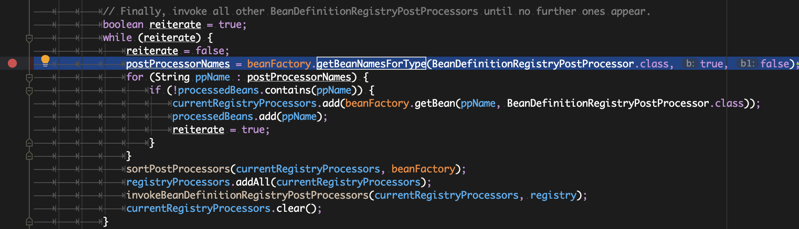
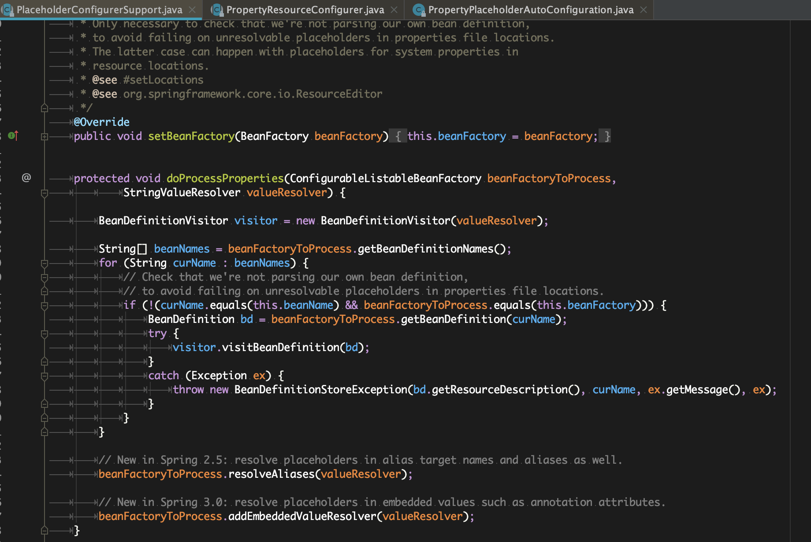
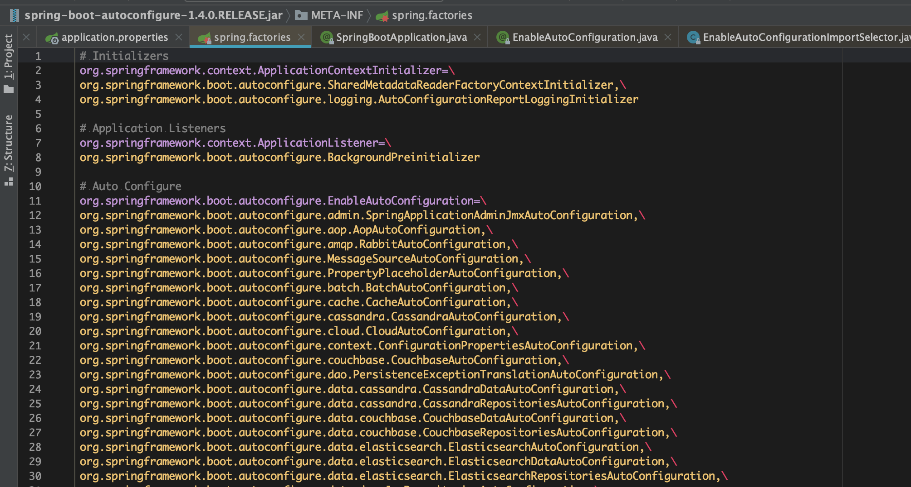

PostProcessor---> 后置处理器增强器--> 增强某些核心功能

BeanFactoryPostProcessor---> BeanFactory--> 访问Spring Bean容器的根接口

BeanPostProcessor -->  Bean   对象

org.springframework.context.support.PostProcessorRegistrationDelegate

### springboot自动装配原理？ spring.factories

启动入口， @SpringBootApplication-->@EnableAutoConfiguration

-->@import(AutoConfigurationImportSelector.class)

process-->getCandidateConfigurations

从spring配置文件里加载 EnableAutoConfiguration --> META-INF-->spring.factories文件：

ConfigurationClassPostProcessor.java

postProcessBeanDefitionRegistry--> 解析工作

processConfigBeanDefinition-->

parse-->

处理@Import 注解，放入集合中

然后 this.deferredImportSelectorHandler.process()

--> handler.processGroupImports()

-->getImports()-->process()

-->getAutoConfigurationEntry()

-->getCandidateConfigurations-->

