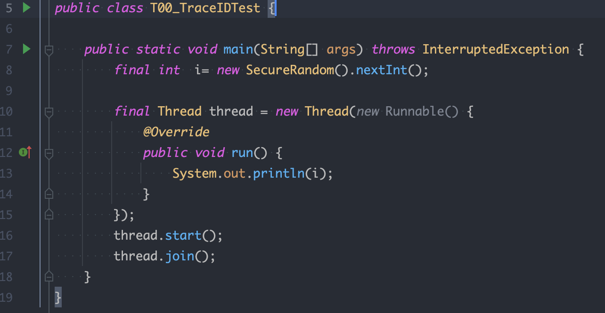
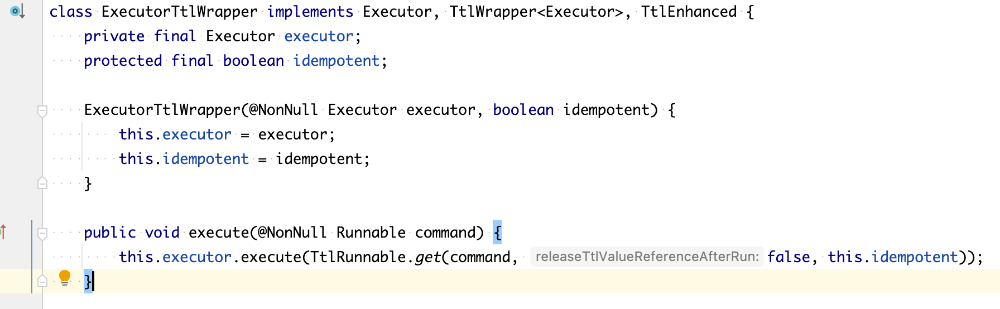

诉求：

* 整个调用链传递
* 传递用户信息，差异化处理

## 同一个进程跨线程

### V1:  匿名线程类引用父线程局部变量

com.pei.advance.T00_TraceIDTest

### V2: 线程变量java

`InheritableThreadLocal` 可以跨线程传递

`ThreadLocal` 无法跨线程传递

com.pei.advance.T01_TraceIDTest

问题：当Thread对象被复用，线程变量存储在Thread对象上

JDK8并发流、Forkjoin、线程池复现

#### 解决办法

方式1:自定义Runnable

* 添加类成员变量，用于存储线程变量
* 在run方法开头设置线程变量，需业务改造

方式2：在方式1基础 通过字节码增强技术 改写Runable实现类代码，实现方式1逻辑

阿里：transmittable-thread-local

### V3_TtlCallable、TtlRunnable

### V4: TtlExcutors

改写线程池的java.util.concurrent.AbstractExecutorService#submit(java.lang.Runnable)

线程池都是JDK原生，无法修改字节码

V5: TtlAgent

无法修改线程池定义字节码，但使用线程池地方不属于JDK，在类加载期修改字节码（基于javaagent实现）

启动脚步添加TtlAgent，缺点 启动时长加大，加载class时需要堆字节码的搜索、修改

## 进程间通信

注册中心中的调用

kafka消息传递

http调用

