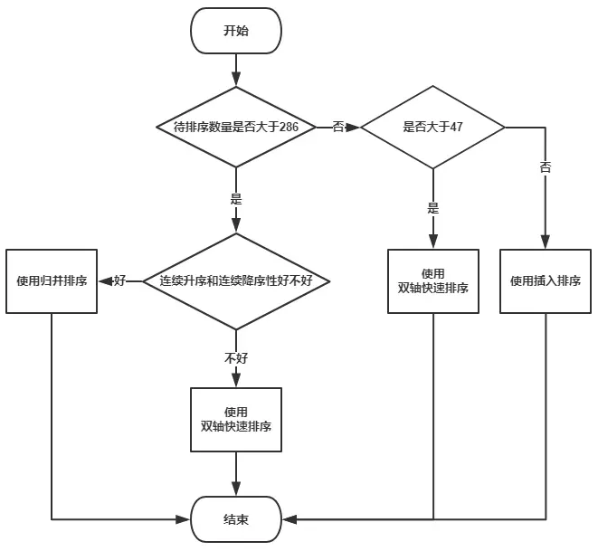
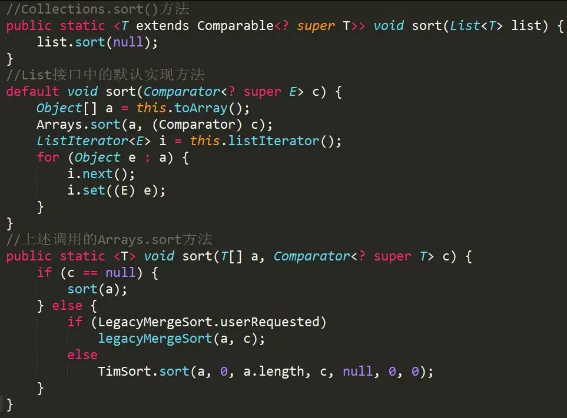
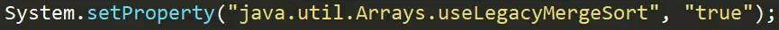
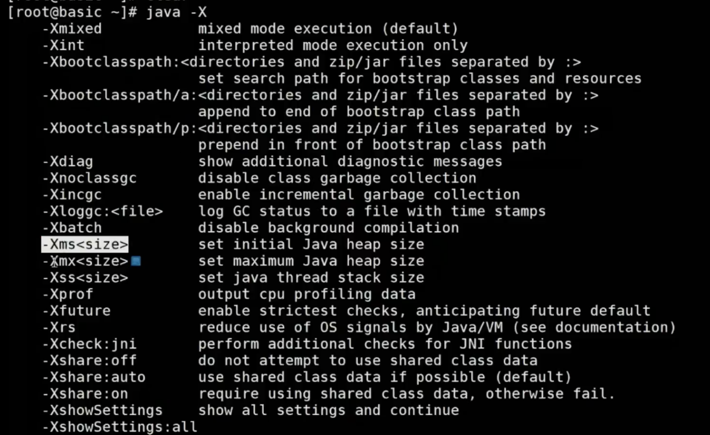

### 知识点整理

### 接口与抽象类：

1、类单继承、接口可多继承
2、抽象类中抽象方法只能声明，不能实现
3、 抽象类中不能包含非抽象方法： 错误！！！
4、接口的方法可以有方法体，但必须加 default 或 static 关键词
5、抽象类允许包含抽象成员，也可以没有任何抽象成员

### 线程池

1、执行 shutdown 方法后，不能再往线程池中添加认为，线程池中等待的任务会继续被处理，线程池直到所有的任务处理完成才会退出
2、执行 shutdownNow 方法后，不能再往线程池中添加任务，线程池试图停止所有正在执行的线程，不再处理线程池中等待的任务

### Java提供的排序算法是怎么实现的？

#### 一、Arrays.sort()的排序算法

DualPivotQuicksort翻译过来就是双轴快速排序（关于双轴快速排序我们后期在讨论，可以认为是对我们普通使用的快排的一种改进，另外还有一种改进是三路快排

#### Collections.sort()的排序算法

会发现如果LegacyMergeSort.userRequested为true的话就会使用归并排序，可以通过下面代码设置为true：

不过方法legacyMergeSort的注释上有这么一句话，说明以后传统归并可能会被移除了。

### 锁的分类

1.1 可重入锁、不可重入锁
Java中提供的synchronized，ReentrantLock，ReentrantReadWriteLock都是可重入锁。

重入:当前线程获取到A锁，在获取之后尝试再次获取A锁是可以直接拿到的，

不可重入:当前线程获取到A锁，在获取之后尝试再次获取A锁，无法获取到的，因为A锁被当前线程占用着，需要等待自己释放锁再获取锁。

1.2 乐观锁、悲观锁
Java中提供的synchronized，ReentrantLock，ReentrantReadWriteLock都是悲观锁。
Java中提供的CAS操作，就是乐观锁的一种实现。
悲观锁:获取不到锁资源时，会将当前线程挂起(进入BLOCKED、WAITING)，线程挂起会涉及到用户态和内核的太的切换，而这种切换是比较消耗资源的。
。用户态:JVM可以自行执行的指令，不需要借助操作系统执行。
。内核态:JVM不可以自行执行，需要操作系统才可以执行。
乐观锁:获取不到锁资源，可以再次让CPU调度，重新尝试获取锁资源。
Atomic原子性类中，就是基于CAS乐观锁实现的。

1.3 公平锁、非公平锁
Java中提供的synchronized只能是非公平锁。
Java中提供的ReentrantLock，ReentrantReadWriteLock可以实现公平锁和非公平锁
公平锁:线程A获取到了锁资源，线程B没有拿到，线程B去排队，线程C来了，锁被A持有，同时线程B在排队。直接排到B的后面，等待B拿到锁资源或者是B取消后，才可以尝试去竞争锁资源。

非公平锁:线程A获取到了锁资源，线程B没有拿到，线程B去排队，线程C来了，先尝试竞争一波
。拿到锁资源:开心，插队成功。
。没有拿到锁资源:依然要排到B的后面，等待B拿到锁资源或者是B取消后，才可以尝试去竞争锁资源。

1.4 互斥锁、共享锁
Java中提供的synchronized、ReentrantLock是互斥锁。
Java中提供的ReentrantReadWriteLock，有互斥锁也有共享锁。
互斥锁:同一时间点，只会有一个线程持有者当前互斥锁。
共享锁:同一时间点，当前共享锁可以被多个线程同时持有。

### 性能优化

com.pei.learn.xingneng.OutOfMemoryError

2.java -Xms200M -Xmx200M-XX:+PrintGC com.mashibing.jvm.gc.T15 FullGC Problem01
3.一般是运维团队首先受到报警信息(CPU Memory)

4.top命令观察到问题:内存不断增长 CPU占用率居高不下
5.top-Hp 观察进程中的线程，哪个线程CPU和内存占比高
6.jps定位具体java进程
jstack 定位线程状况，重点关注:WAITING BLOCKED eg.
waiting on <0x0000000088ca3310>(ajava.lang.Object)
假如有一个进程中100个线程，很多线程都在waiting on <xx》，一定要找到是哪个线程持有这把锁怎么找?搜索jstack dump的信息，找《xx》，看哪个线程持有这把锁RUNNABLE
作业:1:写一个死锁程序，用istack观察2:写一个程序，一个线程持有锁不释放，其他线程等待
7.为什么阿里规范里规定，线程的名称(尤其是线程池)都要写有意义的名称怎么样自定义线程池里的线程名称?(自定义ThreadFactory)

jinfo pid
9.jstat-gc 动态观察gc情况/阅读GC日志发现频繁GC/arthas观察/jconsole/jvisualVM/Jprofiler(最好用)
jstat-gc 4655 500:每个500个毫秒打印GC的情况
如果面试官问你是怎么定位OOM问题的?如果你回答用图形界面(错误)1:已经上线的系统不用图形界面用什么?(cmdline arthas)
2:图形界面到底用在什么地方?测试!测试的时候进行监控!(压测观察)10.jmap-histo 4655head-20，查找有多少对象产生11.jmap -dump:format=b,file=xxx pid :
线上系统，内存特别大，jmap执行期间会对进程产生很大影响，甚至卡顿(电商不适合)
1:设定了参数HeapDump，0OM的时候会自动产生堆转储文件(不是很专业，因为多有监控，内存增长就会报警)
2:很多服务器备份(高可用)，停掉这台服务器对其他服务器不影响3:在线定位(一般小点儿公司用不到)
4:在测试环境中压测(产生类似内存增长问题，在堆还不是很大的时候进行转储)
12.java-Xms20M -Xmx20M-XX:+UseParallelGC-XX:+HeapDumpOnOutOfMemoryError

优化环境
1.有一个50万PV的资料类网站(从磁盘提取文档到内存)原服务器32位，1.5G
的堆，用户反馈网站比较缓慢，因此公司决定升级，新的服务器为64位，16G的堆内存，结果用户反馈卡顿十分严重，反而比以前效率更低了
1.为什么原网站慢?
很多用户浏览数据，很多数据load到内存，内存不足，频繁GC，STW长，响应时间变慢
2.为什么会更卡顿?
内存越大，FGC时间越长
3.咋办?
PS -> PN + CMS 或者 Gi
2.系统CPU经常100%，如何调优?(面试高频)
CPU100%那么一定有线程在占用系统资源，
1.找出哪个进程cpu高(top)
2.该进程中的哪个线程cpu高(top -Hp)
3.导出该线程的堆栈 (jstack)
4.查找哪个方法(栈帧)消耗时间 (istack)
5.工作线程占比高|垃圾回收线程占比高
3.系统内存飙高，如何查找问题?(面试高频)

1. 导出堆内存 (jmap)
2.分析 (ihat ivisualvm mat iprofiler ….)

14.垃圾收集器跟内存大小的关系

1.Serial 几十兆
2.PS 上百兆 - 几个G
3.CMS-20G  
4.G1 - 上百G
5.ZGC-4T-16T(JDK13)
1.8默认的垃圾回收:PS +ParallelOld

-XX:+UseParNewGC=ParNew+SerialOld
。这个组合已经很少用(在某些版本中已经废弃)
-XX:+UseConc(urrent)MarkSweepGC= ParNew+CMS + SerialOld
·-XX:+UseParallelGC=Parallel Scavenge+ParallelOld(1.8默认)【PS+SerialOld】:-XX:+UseParallelOldGC = Parallel Scavenge + Parallel Old·-XX:+UseG1GC=G1
。Linux中没找到默认GC的查看方法，而windows中会打印UseParallelGC
a java +XX:+PrintCommandLineFlags -version。通过GC的日志来分辨
。Linux下1.8版本默认的垃圾回收器到底是什么?
o1.8.0181 默认(看不出来)Copy MarkCompact。1.8.0 222 默认 PS + PO

JVM调优第一步，了解JVM常用命令行参数
·JVM的命令行参数参考:https://docs.oracle.com/javase/8/docs/technotes/tools/unix/java.html。HotSpot参数分类
标准:-开头，所有的HotSpot都支持
非标准:-X开头，特定版本HotSpot支持特定命令
不稳定:-XX 开头，下个版本可能取消

java -XX:+PrintFlagsFinal|more

