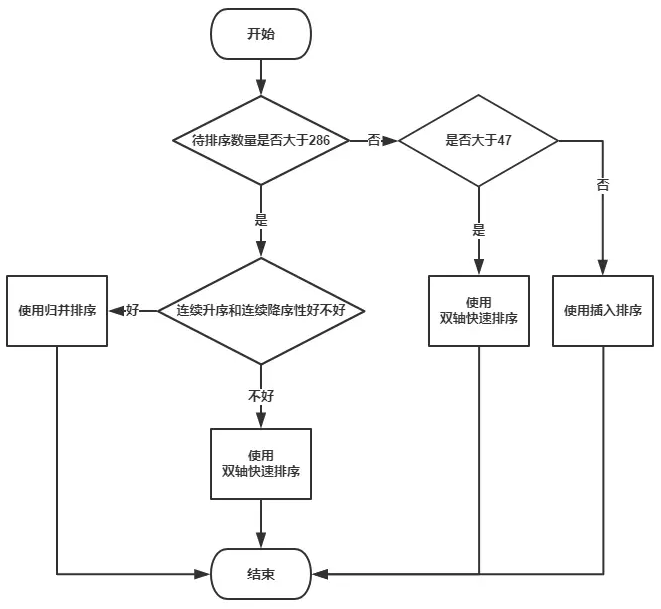

### 知识点整理

### 接口与抽象类：

1、类单继承、接口可多继承
2、抽象类中抽象方法只能声明，不能实现
3、 抽象类中不能包含非抽象方法： 错误！！！
4、接口的方法可以有方法体，但必须加 default 或 static 关键词
5、抽象类允许包含抽象成员，也可以没有任何抽象成员

### 线程池

1、执行 shutdown 方法后，不能再往线程池中添加认为，线程池中等待的任务会继续被处理，线程池直到所有的任务处理完成才会退出
2、执行 shutdownNow 方法后，不能再往线程池中添加任务，线程池试图停止所有正在执行的线程，不再处理线程池中等待的任务

### Java提供的排序算法是怎么实现的？

#### 一、Arrays.sort()的排序算法

DualPivotQuicksort翻译过来就是双轴快速排序（关于双轴快速排序我们后期在讨论，可以认为是对我们普通使用的快排的一种改进，另外还有一种改进是三路快排

#### Collections.sort()的排序算法

会发现如果LegacyMergeSort.userRequested为true的话就会使用归并排序，可以通过下面代码设置为true：

不过方法legacyMergeSort的注释上有这么一句话，说明以后传统归并可能会被移除了。

