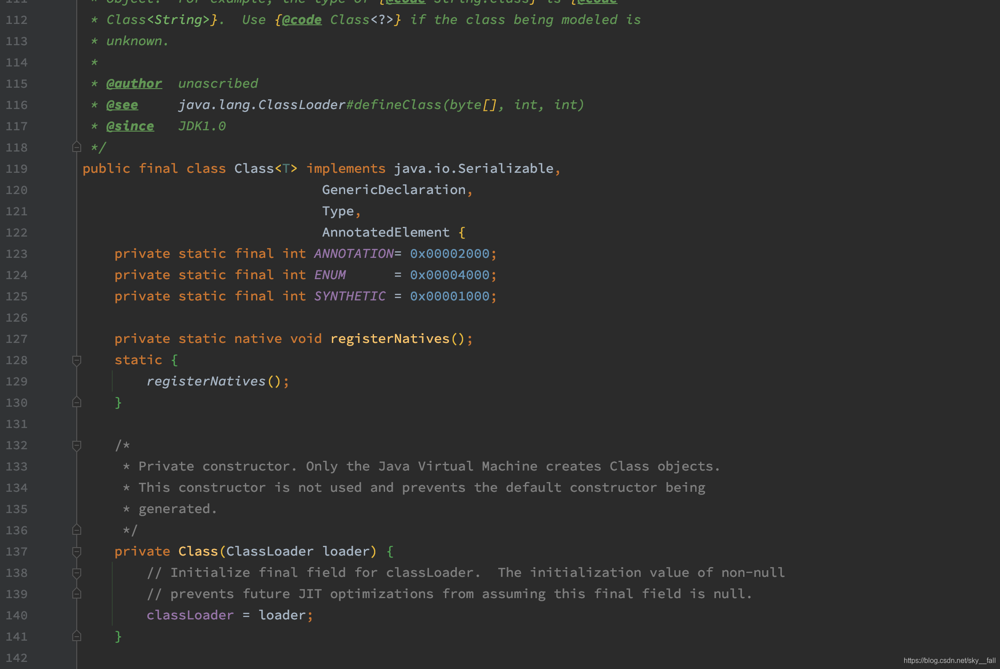
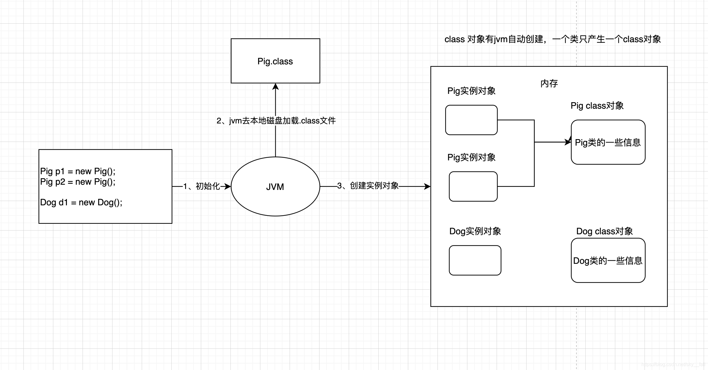
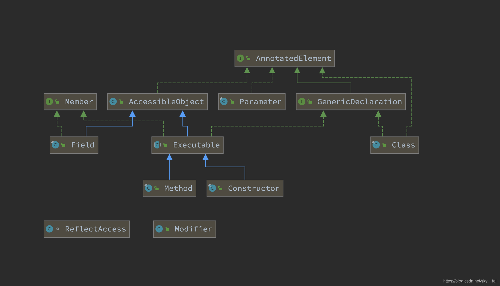

# 反射

[TOC]

## 反射定义

反射机制是在运行状态中，对于任意一个类，都能够知道这个类的所有属性和方法；对于任意一个对象，都能够调用它的任意一个方法和属性，这种动态获取的信息以及动态调用对象的方法的功能称为java语言的反射机制


## 类型信息

在运行时识别一个对象的类型和类的信息有两种方法，

* 传统的RTTI（Run-Time Type Identification)。它假定我们在编译期已知道了所有类型信息。

* 反射机制，它允许我们在运行时发现和使用类的信息。

​    在Java中用来表示运行时类型信息的对应类就是Class类（java.lang.Class），在Java中每个类都有且只有一个Class对象，每当我们编写并且编译一个新创建的类就会产生一个对应的Class对象，这个Class对象保存在同名的.class文件里(编译后的字节码文件保存的就是Class对象)。
​    以下是Class类的部分源码，注意其只有一个private的构造方法




当我们new一个新对象或者引用静态成员变量时，Java虚拟机(JVM)中的类加载器子系统，会将对应的Class对象加载到JVM中，然后JVM再根据这个类型信息相关的Class对象，创建我们需要的实例对象或者提供静态变量的引用值。



### 类加载过程

加载：类加载过程的一个阶段：通过一个类的完全限定查找此类字节码文件，并利用字节码文件创建一个Class对象

链接：验证字节码的安全性和完整性，准备阶段正式为静态域分配存储空间，注意此时只是分配静态成员变量的存储空间，不包含实例成员变量，如果必要的话，解析这个类创建的对其他类的所有引用。

初始化：类加载最后阶段，若该类具有超类，则对其进行初始化，执行静态初始化器和静态初始化成员变量。


总结如下：

Class类也是类的一种，只有一个私有构造函数，因此只能有jvm创建和加载
每个类被编译后会产生一个Class对象，其表示的是该类的类型信息，而且这个Class对象保存在同名.class的文件中(字节码文件)
每个通过关键字class标识的类，在内存中有且只有一个与之对应的Class对象来描述其类型信息，无论创建多少个实例对象，其依据的都是同一个Class对象。


## 反射的介绍

Java 反射的主要组成部分有4个：

* Class：任何运行在内存中的所有类都是该 Class 类的实例对象，每个 Class 类对象内部都包含了本来的所有信息。

* Field：描述一个类的属性，内部包含了该属性的所有信息，例如数据类型，属性名，访问修饰符······

* Constructor：描述一个类的构造方法，内部包含了构造方法的所有信息，例如参数类型，参数名字，访问修饰符······

* Method：描述一个类的所有方法（包括抽象方法），内部包含了该方法的所有信息，与Constructor类似，不同之处是 Method 拥有返回值类型信息，因为构造方法是没有返回值的。
  
  几个类的关系如下：




## 准备两个类

我们特别定义两个类，Person和Employee，其中Employee继承自Person，且各自都有一个private，protected，public修饰的域（属性），Employee还有private，public修饰的方法

```java
public class Person {
    public String name; // 姓名 公有
    protected String age;   // 年龄 保护
    private String hobby;   // 爱好   私有

    public Person(String name, String age, String hobby) {
        this.name = name;
        this.age = age;
        this.hobby = hobby;
    }
    public String getHobby() {
        return hobby;
    }
    protected String getAge() {
        return age;
    }
}

public class Employee extends Person {
    public static Integer totalNum = 0; // 员工数
    public int empNo;   // 员工编号 公有
    protected String position;  // 职位 保护
    private int salary; // 工资   私有

    public void sayHello() {
        System.out.printf("Hello, 我是 %s, 今年 %s 岁, 爱好是%s, 我目前的工作是%s, 月入%s元\n", name, getAge(), getHobby(), position, salary);
    }
    
    private void work() {
        System.out.printf("My name is %s, 工作中勿扰.%n", name);
    }
    
    public Employee(String name, String age, String hobby, int empNo, String position, int salary) {
        super(name, age, hobby);
        this.empNo = empNo;
        this.position = position;
        this.salary = salary;
        Employee.totalNum++;
    }
}

```

## Class对象

### 获取 Class 对象

获取 Class 对象的方法有3种：


1. Class.forName(className)：通过类的全限定名获取该类的 Class 对象

```
//1、通过Class.forName获取Employee类的Class对象
String classPath = "reflect.Employee";
try {
    Class<?> employeeClass1 = Class.forName(classPath);
} catch (ClassNotFoundException e) {
    e.printStackTrace();
}
```

> 注意：调用forName方法时，需要捕获一个名称为ClassNotFoundException的异常，因为编译器是无法检测到其传递的字符串对应的类是否存在的，只能在程序运行时进行检查，如果不存在就会抛出ClassNotFoundException异常。

2. 实例.getClass()：通过实例化对象获取该实例的 Class 对象
  ```
   //2、通过实例对象获取Employee的Class对象
   Employee employee = new Employee();
   Class<?> employeeClass2 = employee.getClass();
  ```
> getClass()是从顶级类Object继承而来的，它将返回表示该对象的实际类型的Class对象引用。

类名.class(Class 字面常量)：这种获取方式只有在编译前已经声明了该类的类型才能获取到 Class 对象

```
//3、字面常量的方式获取Class对象
Class<Employee> employeeClass3 = Employee.class;
```


> 这种方式更简单，更安全。因为它在编译期，就会受到编译器的检查，同时因为这种方式不会自动初始化该类，效率也会更高。
> 更加有趣的是，这种引用方式不仅可以应用于普通的类，也可以应用于接口，数组以及基本数据类型，这点在反射技术应用传递参数时很有帮助。基本数据类型还有对应的包装类型，其包装类型有一个标准字段TYPE，而这个TYPE就是一个引用，指向基本数据类型的Class对象，其等价转换如下，一般情况下更倾向使用.class的形式，这样可以保持与普通类的形式统一。


```
boolean.class = Boolean.TYPE;
char.class = Character.TYPE;
byte.class = Byte.TYPE;
short.class = Short.TYPE;
int.class = Integer.TYPE;
long.class = Long.TYPE;
float.class = Float.TYPE;
double.class = Double.TYPE;
void.class = Void.TYPE;
```


总结如下：

获取Class对象引用的方式3种，通过继承自Object类的getClass方法，Class类的静态方法forName以及字面常量的方式”.class”。
其中实例类的getClass方法和Class类的静态方法forName都将会触发类的初始化阶段，而字面常量获取Class对象的方式则不会触发初始化。
初始化是类加载的最后一个阶段，也就是说完成这个阶段后类也就加载到内存中(Class对象在加载阶段已被创建)，此时可以对类进行各种必要的操作了（如new对象，调用静态成员等），注意在这个阶段，才真正开始执行类中定义的Java程序代码或者字节码。（此处不做展开）

### 泛化的Class对象引用

```

//没有泛型
Class intClass = int.class;

//带泛型的Class对象
Class<Integer> integerClass = int.class;

integerClass = Integer.class;

//没有泛型的约束,可以随意赋值
intClass= double.class;

//编译期错误,无法编译通过
integerClass = double.class
```
从代码可以看出，声明普通的Class对象，在编译期并不会检查Class对象的确切类型是否符合要求，如果存在错误只有在运行时才得以暴露出来。但是通过泛型声明指明类型的Class对象，编译器在编译期将对带泛型的类进行额外的类型检查，确保在编译期就能保证类型的正确性，实际上Integer.class就是一个Class类的对象。

Class<?> intClass = int.class;
intClass = double.class;

为什么不直接使用Class还要使用Class<?>呢？这样做的好处是告诉编译器，我们是确实是采用任意类型的泛型，而非忘记使用泛型约束，因此Class<?>总是优于直接使用Class，至少前者在编译器检查时不会产生警告信息。

```
//编译无法通过
Class<Number> numberClass=Integer.class;

//编译通过！
Class<? extends Number> clazz = Integer.class;
//赋予其他类型
clazz = double.class;
clazz = Number.class;
```

如上，**extends关键字的作用是告诉编译器，只要是Number的子类都可以赋值**。这点与前面直接使用Class是不一样的。实际上，应该时刻记住向Class引用添加泛型约束仅仅是为了提供编译期类型的检查从而避免将错误延续到运行时期。

### 构造类的实例化对象

使用Class对象的newInstance()方法来创建Class对象对应类的实例
先通过Class对象获取指定的Constructor对象，再调用Constructor对象的newInstance()方法来创建实例

```
// 1、Class 对象调用newInstance()方法
Class<Employee> clazz = Employee.class;
Employee employee = (Employee) clazz.newInstance();

// 2、Constructor 构造器调用newInstance()方法
Constructor<?> constructor = clazz.getConstructor(String.class, String.class, String.class, int.class, String.class, int.class);

Employee employee1 = clazz.cast(constructor.newInstance("", "", "", 1, "", 1));
```


上面代码中，采用了两种类型转换的方法

通过Class对象调用 newInstance() 会走默认无参构造方法，如果想通过显式构造方法构造实例，需要提前从Class中调用getConstructor()方法获取对应的构造器，通过构造器去实例化对象。

### 获取一个类的所有信息

#### Constructor

Class类与Constructor相关的主要方法如下：

|返回值|	方法名称|	方法说明|
| ---- | ---- | ---- |
|Constuctor<?>[]|	getConstructors()	|获取类中所有被public修饰的构造器|
|Constructor	| getConstructor(Class…<?> paramTypes) |	根据参数类型获取类中某个构造器，该构造器必须被public修饰|
|Constructor<?>[]|	getDeclaredConstructors()	|获取类中所有构造器（包括private）|
|Constructor	|getDeclaredConstructor(class…<?> paramTypes)|	根据参数类型获取对应的构造器
关于Constructor类本身一些常用方法如下(仅部分，其他可查API)，|

|返回值|	方法名称	|方法说明|
| ---- | ---- | ---- |
|Class	|getDeclaringClass()	|返回由该构造器声明的 Class 对象|
|Type[]	|getGenericParameterTypes()	|按序返回构造器中形参的 Type 对象|
|String	|getName()	|以字符串形式返回此构造方法的名称。|
|Class<?>[]	|getParameterTypes()	|按序返回构造器中形参的 Class 对象|
|T	|newInstance(Object… initargs)	|使用此 Constructor对象表示的构造函数来创建新实例|
|String	|toGenericString()	|返回描述此 Constructor 的字符串，其中包括类型参数。|

其中关于Type类型这里简单说明一下，Type 是 Java 编程语言中所有类型的公共高级接口。它们包括原始类型、参数化类型、数组类型、类型变量和基本类型。getGenericParameterTypes 与 getParameterTypes 都是获取构成函数的参数类型，前者返回的是Type类型，后者返回的是Class类型，由于Type顶级接口，Class也实现了该接口，因此Class类是Type的子类，Type 表示的全部类型而每个Class对象表示一个具体类型的实例，如String.class仅代表String类型。由此看来Type与 Class 表示类型几乎是相同的，只不过 Type表示的范围比Class要广得多而已。

```
public static void constructor() throws NoSuchMethodException, IllegalAccessException, InvocationTargetException, InstantiationException {
        Class<?> clazz = Employee.class;

        System.out.println("--------------------------------------------");
        //获取带String, int参数的public构造函数
        Constructor cs1 = clazz.getConstructor(String.class, int.class);
        Employee employee1 = (Employee) cs1.newInstance("小张", 20);
        System.out.println(cs1.toGenericString() + ":" + employee1.toString());
    
        System.out.println("--------------------------------------------");
        //获取带String, String, int参数的private构造函数
        Constructor cs2 = clazz.getDeclaredConstructor(String.class, String.class, int.class);
        cs2.setAccessible(true);
        Employee employee2 = (Employee) cs2.newInstance("小张", "50", 20);
        System.out.println(cs2.toGenericString() + ":" + employee2.toString());
        System.out.println("--------------------------------------------");
    
        //获取所有构造包含private
        Constructor<?> cons[] = clazz.getConstructors();
        // 查看每个构造方法需要的参数
        for (int i = 0; i < cons.length; i++) {
            //获取构造函数参数类型
            Class<?> clazzs[] = cons[i].getParameterTypes();
            System.out.println("构造函数["+i+"]:"+cons[i].toString() );
            System.out.print("参数类型["+i+"]:(");
            for (int j = 0; j < clazzs.length; j++) {
                if (j == clazzs.length - 1)
                    System.out.print(clazzs[j].getName());
                else
                    System.out.print(clazzs[j].getName() + ",");
            }
            System.out.println(")");
        }
    }
```
运行结果：

--------------------------------------------
```

public reflect.Employee(java.lang.String,int):Employee(super=Person(name=小张, age=20, hobby=drive), empNo=20, position=社畜, salary=1000)
--------------------------------------------

private reflect.Employee(java.lang.String,java.lang.String,int):Employee(super=Person(name=小张, age=50, hobby=drive), empNo=20, position=社畜, salary=1000)
--------------------------------------------
构造函数[0]:public reflect.Employee(java.lang.String,java.lang.String,java.lang.String,int,java.lang.String,int)
参数类型[0]:(java.lang.String,java.lang.String,java.lang.String,int,java.lang.String,int)
构造函数[1]:public reflect.Employee(java.lang.String,int)
参数类型[1]:(java.lang.String,int)
构造函数[2]:public reflect.Employee()
参数类型[2]:()

```

#### Method

下面是Class类获取Method对象相关的方法：

返回值	方法名称	方法说明
Method	getDeclaredMethod(String name, Class<?>… parameterTypes)	根据名字和参数类型获取对应方法，无法获取继承下来的方法
Method[]	getDeclaredMethod()	获取所有方法，但无法获取继承下来的方法
Method	getMethod(String name, Class<?>… parameterTypes)	根据名字和参数类型获取对应方法，该方法必须被public修饰
Method[]	getMethods()	获取类中被public修饰的所有方法
关于Method类本身一些常用方法如下(仅部分，其他可查API)

返回值	方法名称	方法说明
Object	invoke(Object obj, Object… args)	参数1指定调用该方法的对象，如果是static修饰的类方法，则传null即可,参数2是方法的参数列表值。
Class<?>	getReturnType()	class对象，方法的返回类型
Type	getGenericReturnType()	Type，方法的返回类型
Class<?>[]	getParameterTypes()	参数类型
Type[]	getGenericParameterTypes()	参数类型
String	getName()	方法名称
boolean	isVarArgs()	判断方法是否带可变参数
String	toGenericString()	返回描述此 Method 的字符串，包括类型参数。

#### Field

下面是Class类获取Field对象相关的方法：

返回值	方法名称	方法说明
Field[]	getFields()	获取类中所有被public修饰的所有变量, 包含继承字段
Field	getField(String name)	根据变量名获取类中的一个变量，该变量必须被public修饰
Field[]	getDeclaredFields()	获取类中所有的变量，但无法获取继承下来的变量
Field	getDeclaredField(String name)	根据姓名获取类中的某个变量，无法获取继承下来的变量
关于Field类本身一些常用方法如下(仅部分，其他可查API)

返回值	方法名称	方法说明
void	set(Object obj, Object value)	将字段设置为指定的新值。
Object	get(Object obj)	返回指定对象上, 字段的值
Class<?>	getType()	返回一个 Class 对象，它标识了此Field 对象所表示字段的声明类型。
boolean	isEnumConstant()	如果此字段表示枚举类型的元素则返回 true；否则返回 false
String	toGenericString()	返回一个描述此 Field（包括其一般类型）的字符串
String	getName()	返回字段的名称
Class<?>	getDeclaringClass()	返回声明Field的类或接口的 Class 对象
void	setAccessible(boolean flag)	将此对象的 accessible 标志设置为指示的布尔值,即设置其可访问性
每种功能内部以 Declared 细分为2类：

> 有Declared修饰的方法：可以获取该类内部包含的所有变量、方法和构造器，但是无法获取继承下来的信息；
> 无Declared修饰的方法：可以获取该类中public修饰的变量、方法和构造器，可获取继承下来的信息

如果想获取类中所有的(包括继承)变量、方法和构造器，则需要同时调用getXXXs()和getDeclaredXXXs()两个方法，用Set集合存储它们获得的变量、构造器和方法，以防两个方法获取到相同的东西。

如果父类的属性用protected修饰，利用反射是无法获取到的。

#### 反射包中的Array类

在Java的java.lang.reflect包中存在着一个可以动态操作数组的类，Array，它提供了动态创建和访问 Java 数组的方法。Array 允许执行 get 或 set 操作进行取值和赋值。在Class类中与数组关联的方法是：

返回值	方法名称	方法说明
Class<?>	getComponentType()	返回表示数组元素类型的 Class，即数组的类型
boolean	isArray()	判定此 Class 对象是否表示一个数组类。
java.lang.reflect.Array中的常用静态方法如下：

返回值	方法名称	方法说明
static Object	get(Object array, int index)	返回指定数组对象中指定索引的值。
static int	getLength(Object array)	返回指定数组对象的长度
static object	newInstance(Class<?> componentType, int… dimensions)	创建一个具有指定类型和维度的新数组。
static Object	newInstance(Class<?> componentType, int length)	创建一个具有指定的组件类型和长度的新数组。
static void	set(Object array, int index, Object value)	将指定数组对象中指定索引的值设置为指定的新值。
下面通过一个简单例子来演示这些方法
```
package reflect;

import java.lang.reflect.Array;

/**
 * Created by zejian on 2017/5/1.

 * Blog : http://blog.csdn.net/javazejian [原文地址,请尊重原创]
 */
    public class ReflectArray {

    public static void main(String[] args) throws ClassNotFoundException {
        int[] array = { 1, 2, 3, 4, 5, 6, 7, 8, 9 };
        //获取数组类型的Class 即int.class
        Class<?> clazz = array.getClass().getComponentType();
        //创建一个具有指定的组件类型和长度的新数组。
        //第一个参数:数组的类型,第二个参数:数组的长度
        Object newArr = Array.newInstance(clazz, 15);
        //获取原数组的长度
        int co = Array.getLength(array);
        //赋值原数组到新数组
        System.arraycopy(array, 0, newArr, 0, co);
        for (int i:(int[]) newArr) {
            System.out.print(i+",");
        }

        //创建了一个长度为10 的字符串数组，
        //接着把索引位置为6 的元素设为"hello world!"，然后再读取索引位置为6 的元素的值
        Class clazz2 = Class.forName("java.lang.String");
         
        //创建一个长度为10的字符串数组，在Java中数组也可以作为Object对象
        Object array2 = Array.newInstance(clazz2, 10);
         
        //把字符串数组对象的索引位置为6的元素设置为"hello"
        Array.set(array2, 6, "hello world!");
         
        //获得字符串数组对象的索引位置为5的元素的值
        String str = (String)Array.get(array2, 6);
        System.out.println();
        System.out.println(str);//hello
    }
    /**
     输出结果:
     1,2,3,4,5,6,7,8,9,0,0,0,0,0,0,
     hello world!
     */
    }
    
```

    通过上述代码演示，确实可以利用Array类和反射相结合动态创建数组，也可以在运行时动态获取和设置数组中元素的值，其实除了上的set/get外Array还专门为8种基本数据类型提供特有的方法，如setInt/getInt、setBoolean/getBoolean，其他依次类推，需要使用是可以查看API文档即可。除了上述动态修改数组长度或者动态创建数组或动态获取值或设置值外，可以利用泛型动态创建泛型数组如下：

```
/**

  * 接收一个泛型数组，然后创建一个长度与接收的数组长度一样的泛型数组，
  * 并把接收的数组的元素复制到新创建的数组中，
  * 最后找出新数组中的最小元素，并打印出来
  * @param a
  * @param <T>
    */
     public  <T extends Comparable<T>> void min(T[] a) {
     //通过反射创建相同类型的数组
     T[] b = (T[]) Array.newInstance(a.getClass().getComponentType(), a.length);
     for (int i = 0; i < a.length; i++) {
         b[i] = a[i];
     }
     T min = null;
     boolean flag = true;
     for (int i = 0; i < b.length; i++) {
         if (flag) {
             min = b[i];
             flag = false;
         }
         if (b[i].compareTo(min) < 0) {
             min = b[i];
         }
     }
     System.out.println(min);
     }
```


#### Annotation

在反射中，Field，Constructor 和 Method 类对象都可以调用下面这些方法获取标注在它们之上的注解。

返回值	方法名称	方法说明
Annotation[]	getAnnotations()	获取该对象上的所有注解
Annotation	getAnnotation(Class annotaionClass)	传入注解类型，获取该对象上的特定一个注解
Annotation[]	getDeclaredAnnotations()	获取该对象上的显式标注的所有注解，无法获取继承下来的注解
Annotation	getDeclaredAnnotation(Class annotationClass)	根据注解类型，获取该对象上的特定一个注解，无法获取继承下来的注解
只有注解的@Retension标注为RUNTIME时，才能够通过反射获取到该注解，@Retension 有3种保存策略：

SOURCE：只在源文件(.java)中保存，即该注解只会保留在源文件中，编译时编译器会忽略该注解，例如 @Override 注解
CLASS：保存在字节码文件(.class)中，注解会随着编译跟随字节码文件中，但是运行时不会对该注解进行解析
RUNTIME：一直保存到运行时，用得最多的一种保存策略，在运行时可以获取到该注解的所有信息
反射的应用场景
反射常见的应用场景这里介绍3个：

Spring 实例化对象：当程序启动时，Spring 会读取配置文件applicationContext.xml并解析出里面所有的标签实例化到IOC容器中。
反射 + 工厂模式：通过反射消除工厂中的多个分支，如果需要生产新的类，无需关注工厂类，工厂类可以应对各种新增的类，反射可以使得程序更加健壮。
JDBC连接数据库：使用JDBC连接数据库时，指定连接数据库的驱动类时用到反射加载驱动类

## 反射的优缺点

### 反射的优点：

* 可扩展性 ：应用程序可以利用全限定名创建可扩展对象的实例，来使用来自外部的用户自定义类。

* 类浏览器和可视化开发环境 ：一个类浏览器需要可以枚举类的成员。可视化开发环境（如 IDE）可以从利用反射中可用的类型信息中受益，以帮助程序员编写正确的代码。

* 调试器和测试工具 ： 调试器需要能够检查一个类里的私有成员。测试工具可以利用反射来自动地调用类里定义的可被发现的 API 定义，以确保一组测试中有较高的代码覆盖率。

### 反射的缺点：

尽管反射非常强大，但也不能滥用。如果一个功能可以不用反射完成，那么最好就不用。在我们使用反射技术时，下面几条内容应该牢记于心。

* 性能开销 ：反射涉及了动态类型的解析，所以 JVM 无法对这些代码进行优化。因此，反射操作的效率要比那些非反射操作低得多。我们应该避免在经常被执行的代码或对性能要求很高的程序中使用反射。

* 安全限制 ：使用反射技术要求程序必须在一个没有安全限制的环境中运行。如果一个程序必须在有安全限制的环境中运行，如 Applet，那么这就是个问题了。

* 内部暴露 ：由于反射允许代码执行一些在正常情况下不被允许的操作（比如访问私有的属性和方法），所以使用反射可能会导致意料之外的副作用，这可能导致代码功能失调并破坏可移植性。反射代码破坏了抽象性，因此当平台发生改变的时候，代码的行为就有可能也随着变化。

## 相关API

```
 /** 
  *    修饰符、父类、实现的接口、注解相关 
    */

//获取修饰符，返回值可通过Modifier类进行解读
public native int getModifiers();
//获取父类，如果为Object，父类为null
public native Class<? super T> getSuperclass();
//对于类，为自己声明实现的所有接口，对于接口，为直接扩展的接口，不包括通过父类间接继承来的
public native Class<?>[] getInterfaces();
//自己声明的注解
public Annotation[] getDeclaredAnnotations();
//所有的注解，包括继承得到的
public Annotation[] getAnnotations();
//获取或检查指定类型的注解，包括继承得到的
public <A extends Annotation> A getAnnotation(Class<A> annotationClass);
public boolean isAnnotationPresent(Class<? extends Annotation> annotationClass);

/** 
  *   内部类相关
    */
    //获取所有的public的内部类和接口，包括从父类继承得到的
    public Class<?>[] getClasses();
    //获取自己声明的所有的内部类和接口
    public Class<?>[] getDeclaredClasses();
    //如果当前Class为内部类，获取声明该类的最外部的Class对象
    public Class<?> getDeclaringClass();
    //如果当前Class为内部类，获取直接包含该类的类
    public Class<?> getEnclosingClass();
    //如果当前Class为本地类或匿名内部类，返回包含它的方法
    public Method getEnclosingMethod();

/** 
  *    Class对象类型判断相关
    */
    //是否是数组
    public native boolean isArray();  
    //是否是基本类型
    public native boolean isPrimitive();
    //是否是接口
    public native boolean isInterface();
    //是否是枚举
    public boolean isEnum();
    //是否是注解
    public boolean isAnnotation();
    //是否是匿名内部类
    public boolean isAnonymousClass();
    //是否是成员类
    public boolean isMemberClass();
    //是否是本地类
    public boolean isLocalClass(); 

```

参考链接：
Java反射机制详解
深入理解Java类型信息(Class对象)与反射机制
学会反射后，我被录取了！（干货）
————————————————
版权声明：本文为CSDN博主「poor coder」的原创文章，遵循CC 4.0 BY-SA版权协议，转载请附上原文出处链接及本声明。
原文链接：https://blog.csdn.net/sky__fall/article/details/109548880

