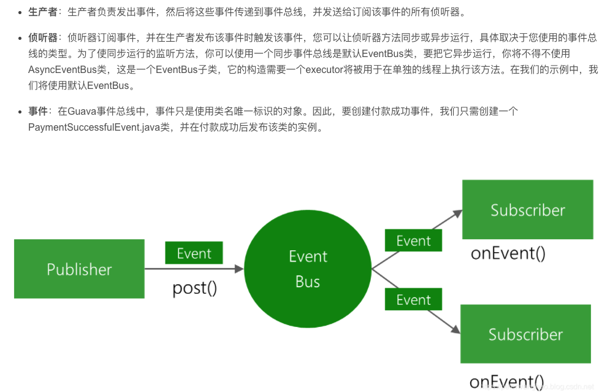

策略模式、模板方法模式、观察者模式、迭代子模式、责任链模式、命令模式、备忘录模式、状态模式、访问者模式、中介者模式、解释器模式

### 观察者模式

示例：

/Users/pei/blog/blog/source/_posts/Algorithm/1.leetcode/java_demo/src/test/java/com/pei/learn/designmodel/Observer/GuavaEventBusUnitTest.java

com.pei.learn.designmodel.Observer.GuavaEventBusUnitTest

