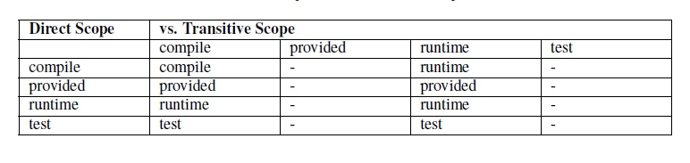
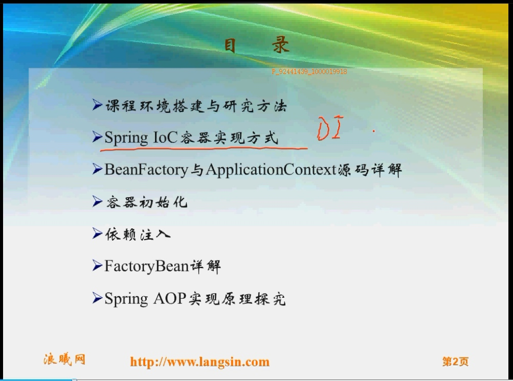
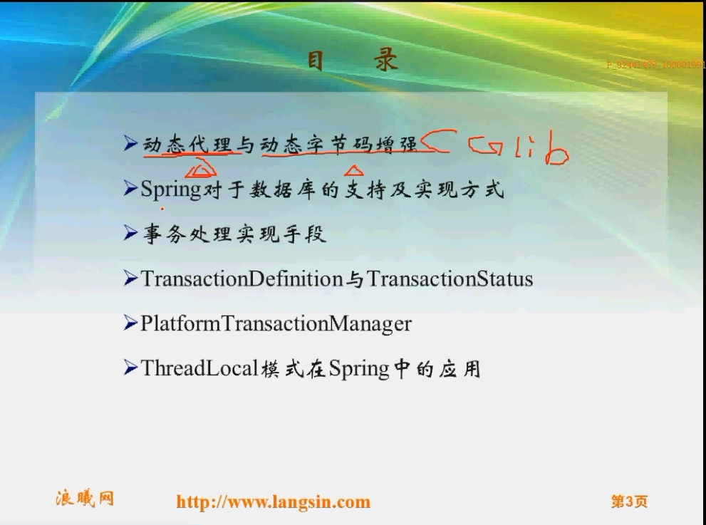
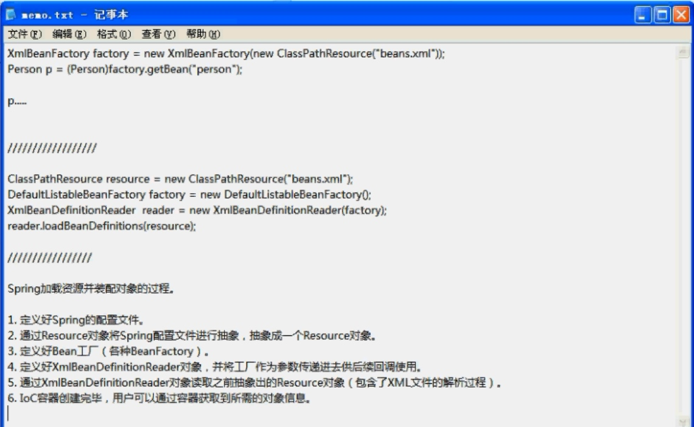
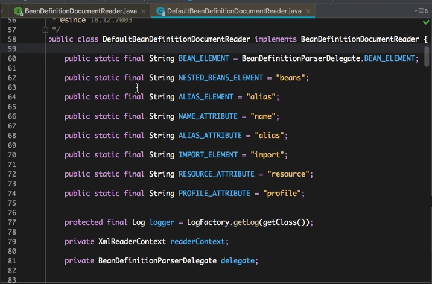
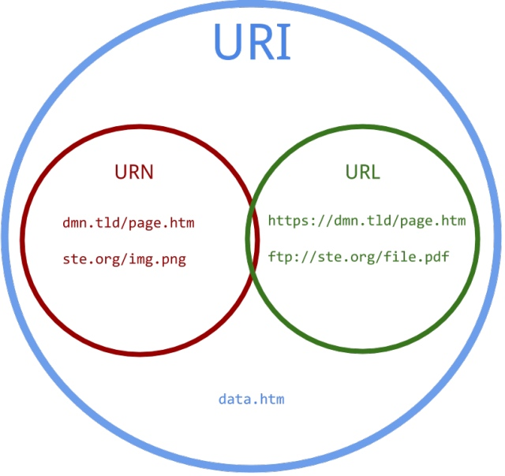

# Java IOC
[TOC]
## 简介
控制反转 是依赖倒置原则的一种代码设计思路。具体方法是所谓的依赖注入


IoC则是一种 软件设计模式，它告诉你应该如何做，来解除相互依赖模块的耦合。控制反转（IoC），它为相互依赖的组件提供抽象，将依赖（低层模块）对象的获得交给第三方（系统）来控制，即依赖对象不在被依赖模块的类中直接通过new来获取。

控制反转(Inversion of Control) ：**关于一个对象如何获取他所依赖的对象的引用，这个责任的反转**。，
IOC容器负责实例化、定位、配置应用程序中的对象及建立这些对象间的依赖
AOP面向切面编程通过预编译方式和运行期动态代理实现程序功能的统一维护和技术

从编程角度出发，是一个主对象要保存其他类型对象的引用或者创建条件（struct），通过调用引用方法来完成任务，传统方式，主动获得所需引用，即new，IOC方式是在主对象通过调用setter或构造方法传入所需引用。
目的： 降低程序间耦合问题，  

```
public class SampleAction extends ActionSupport {
    // 通过setter方式,由Spring来注入SampleService实例
    private SampleService service;

    public void setService(SampleService service) {
        this.service = service;
    }
        public String execute() throws Exception {
        name = this.service.getNameById(userId);
        return SUCCESS;
    }
}
```
在execute方法中不再直接new一个SampleServiceImpl的实例了，而是声明了一个SampleSerivce类型的属性，并提供对应的setter方法，这个setter方法是留给Spring注入对象实例的时候调用的，可以不用提供getter方法。也就是说，现在的SampleAction已经不用知道逻辑层的具体实现了。


scope属性，赋值为prototype（原型）。scope属性非常重要，它管理了注册在它里面的Bean的作用域。Spring容器默认的作用域是单例，即每次外界向Spring容器请求这个Bean，都是返回同一个实例；但是，Struts2的Action是需要在每次请求的时候，都要新建一个Action实例，所以，在配置对应Action的<bean>元素时，必须把它的scope属性赋值为prototype，以保证每次请求都会新建一个Action实例。

<property>子元素。<property>元素的name属性为service，代表SampleAction这个类有一个setter方法叫setSampleService；<property>元素的ref属性为sampleService，代表Spring容器会将一个名为sampleService的已经存在的Bean，注入给sampleAction的service属性。

##技术：
反射机制概念
　　主要是指程序可以访问，检测和修改它本身状态或行为的一种能力，并能根据自身行为的状态和结果，调整或修改应用所描述行为的状态和相关的语义。在java中，只要给定类的名字， 那么就可以通过反射机制来获得类的所有信息。
　　
　　 JAVA反射机制是在运行状态中，对于任意一个类，都能够知道这个类的所有属性和方法；对于任意一个对象，都能够调用它的任意一个方法和属性；这种动态获取的信息以及动态调用对象的方法的功能称为java语言的反射机制。（PS：百度百科）


方便的创建灵活的代码，这些代码可以再运行时装配，无需在组件之间进行源代码链接。

反射机制的作用
在运行时判断任意一个对象所属的类；
在运行时获取类的对象；
在运行时访问java对象的属性，方法，构造方法等。

Spring中的IoC的实现原理就是工厂模式加反射机制。
注解。配置文件.  注入

DAO整合：SqlMapConfig.xml
事物管理 applicationContext-trans.xml
整合mybatis：applicationContent-dao.xml, 通过spring 管理SqlSessionFactory、mapper代理对象。
表现层整合： SpringMVC.xml

所有的实现类放在spring容器中管理，由spring 创建数据库连接池，并有spring 管理事务
由于在web.xml中定义的url拦截形式为“/”表示拦截所有的url请求，包括静态资源例如css、js等。所以需要在springmvc.xml中添加资源映射标签：

```
<mvc:resources location="/WEB-INF/js/" mapping="/js/**"/>
<!-- 如果不添加此节点mybatis的mapper.xml文件都会被漏掉。 -->
	<build>
		<resources>
            <resource>
                <directory>src/main/java</directory>
                <includes>
                    <include>**/*.properties</include>
                    <include>**/*.xml</include>
                </includes>
                <filtering>false</filtering>
            </resource>
        </resources>
	</build>
```

Mybatis 分页插件

```
第一步：在Mybatis配置xml中配置拦截器插件:
<plugins>
    <!-- com.github.pagehelper为PageHelper类所在包名 -->
    <plugin interceptor="com.github.pagehelper.PageHelper">
        <!-- 设置数据库类型 Oracle,Mysql,MariaDB,SQLite,Hsqldb,PostgreSQL六种数据库-->        
        <property name="dialect" value="mysql"/>
    </plugin>
</plugins>
第二步：在代码中使用
1、设置分页信息：
    //获取第1页，10条内容，默认查询总数count
    PageHelper.startPage(1, 10);

    //紧跟着的第一个select方法会被分页
List<Country> list = countryMapper.selectIf(1);
2、取分页信息
//分页后，实际返回的结果list类型是Page<E>，如果想取出分页信息，需要强制转换为Page<E>，
Page<Country> listCountry = (Page<Country>)list;
listCountry.getTotal();
取分页信息的第二种方法
//获取第1页，10条内容，默认查询总数count
PageHelper.startPage(1, 10);
List<Country> list = countryMapper.selectAll();
//用PageInfo对结果进行包装
PageInfo page = new PageInfo(list);
//测试PageInfo全部属性
//PageInfo包含了非常全面的分页属性
assertEquals(1, page.getPageNum());
assertEquals(10, page.getPageSize());
assertEquals(1, page.getStartRow());
assertEquals(10, page.getEndRow());
assertEquals(183, page.getTotal());
assertEquals(19, page.getPages());
assertEquals(1, page.getFirstPage());
assertEquals(8, page.getLastPage());
assertEquals(true, page.isFirstPage());
assertEquals(false, page.isLastPage());
assertEquals(false, page.isHasPreviousPage());
assertEquals(true, page.isHasNextPage());

public EasyUIResult getItemList(Integer page, Integer rows) throws Exception {
		TbItemExample example = new TbItemExample();
		//设置分页
		PageHelper.startPage(page, rows);
		List<TbItem> list = itemMapper.selectByExample(example);
		//取分页信息
		PageInfo<TbItem> pageInfo = new PageInfo<>(list);
		long total = pageInfo.getTotal();
		EasyUIResult result = new EasyUIResult(total, list);
		
		return result;
	}

```


https://www.zifangsky.cn/788.html

```
* 定义一个切面：
@Aspect
@Component
public class Audience0 {
	
	@Before("execution(* cn.zifangsky.pointcut.Performence.play(..))")
	public void seat(){
		System.out.println("坐下");
	}
}
* 使用@EnableAspectJAutoProxy注解启用自动代理：
@EnableAspectJAutoProxy注解启用了AspectJ自动代理。最后是使用了@ComponentScan注解指定需要扫描哪些包中的注解，这里配置的就是上面定义的Audience0类所在的包

如果不想使用JavaConfig的话，可以在Spring的配置文件中这样配置：


	<context:component-scan base-package="cn.zifangsky.pointcut" />
	<aop:aspectj-autoproxy />
1
2
    <context:component-scan base-package="cn.zifangsky.pointcut" />
    <aop:aspectj-autoproxy />
    
    基于JavaConfig的测试：
    
    @RunWith(SpringJUnit4ClassRunner.class)
@ContextConfiguration(classes={ConcertConfig.class})
public class TestAspect {


    基于xml配置的测试：
    @RunWith(SpringJUnit4ClassRunner.class)
@ContextConfiguration(locations = "classpath:/context/context.xml")
public class TestAspect2 {


@Aspect
@Component
public class Audience1 {
    
    /**
     * 定义了一个切点，其值是一个切点表达式，含义是：
     * 在这个类的这个方法的执行前和执行后触发下面定义的“通知”
     * 前面的*表示任意返回值，后面的点则表示任意多个参数，也就是所有名为play的方法的任意重载的方法都会触发此通知
     */
    @Pointcut("execution(* cn.zifangsky.pointcut.Performence.play(..))") 
    public void performance(){}
    
    @Before("performance()")
    public void seat(){
        System.out.println("坐下");
    }

```


Servlet(Server Applet) 是基于 Java 技术的 web 组件,该组件由容器托管,用于生成动态内容。他是用Java编写的服务器端程序。其主要功能在于交互式地浏览和修改数据，生成动态Web内容。


[maven scope](https://blog.csdn.net/kimylrong/article/details/50353161)
编译，测试，运行，打包   
compile
默认就是compile，all
runntime表示被依赖项目无需参与项目的编译，跳过编译而已，oracle jdbc驱动架包就是一个很好的例子，一般scope为runntime。另外runntime的依赖通常和optional搭配使用，optional为true。我可以用A实现，也可以用B实现。
provided意味着打包的时候可以不用包进去，相当于compile，但是在打包阶段做了exclude的动作。

传递依赖：
A–>B–>C。当前项目为A，A依赖于B，B依赖于C。
知道B在A项目中的scope，那么怎么知道C在A中的scope呢？
答案是： 
当C是test或者provided时，C直接被丢弃，A不依赖C； 
否则A依赖C，C的scope继承于B的scope。
左侧是B在A中的依赖scope，  横栏 是C在B中的依赖scope， 那么C在A 中的依赖继承 B在A中的依赖，（除非C在B中的依赖关系更小）


它主要管理依赖的部署。目前<scope>可以使用5个值： 
    * compile，缺省值，适用于所有阶段，会随着项目一起发布。 
    * provided，类似compile，期望JDK、容器或使用者会提供这个依赖。如servlet.jar。 
    * runtime，只在运行时使用，如JDBC驱动，适用运行和测试阶段。 
    * test，只在测试时使用，用于编译和运行测试代码。不会随项目发布。 
    * system，类似provided，需要显式提供包含依赖的jar，Maven不会在Repository中查找它。


##Spring————IOC






id 属性是一个字符串，唯一识别一个独立的 bean 定义。class 属性定义了 bean 的类型，并使用完整的类名。

BeanFactory 是整个Spring容器的根容器，描述了在所有子接口或子类对容器的处理原则和职责，包括生命周期方法，一些约定
FactroyBean 存活在BeanFactory当中，是一个工厂，作用是用于创建由其创建的对象， 并能获取到该对象，在创建该对象时的方法前面或者后面可以执行一些额外的操作，来实现AOP～～～
bean ： myJndiObject  是一个工厂bean，调用myJndiObject，返回的事由这个工厂创建的实例对象，而&myJndiObject  返回的是一个工厂，
如果一个bean 实现 FactoryBean这个接口，那么就会作为一个工厂暴露一个对象，而不是作为暴露本身的实例。
例如，如果类A 实现了FactoryBean，当xml定义bean后，调用getBean事，返回不是A 这个实例本身，而是由A所创建对象的本身，启动装饰或代理的作用，即AOP（ProxyFactoryBean）或者JndiFactoryBean
支持prototypes 和singletons ，可以懒加载和装载时加载





```
XmlBeanFactory factory = new XmlBeanFactory(new ClassPathRouce("beans.xml"));
Person p = (Person)factory.getBean("person")


```


2.设定路径，创建类加载器  分别赋予当前成员变量
DefaultListableBeanFactory继承BeanDefinitionRegistry，因此，XmlBeanDefinitionReader可以接受factory

reader.loadBeanDefinitions() @return the number of bean definitions found

实际加载xml bean定义的是当前包下面的函数
doLoadBeanDefinitions
首先通过doLoadDocument创建document对象，然后registerBeanDefinitions(doc, resource);
  首先创建BeanDefinitionDocumentReader的对象documentReader，
  documentReader.registerBeanDefinitions(doc, createReaderContext(resource));
  通过createReaderContext(resource)创建XmlReaderContent的实例去遍历document对象进行解析。
  registerBeanDefinitions函数作用：
  /**
	 * This implementation parses bean definitions according to the "spring-beans" XSD
	 * (or DTD, historically).
	 * <p>Opens a DOM Document; then initializes the default settings
	 * specified at the {@code <beans/>} level; then parses the contained bean definitions.
	 */
	
	```
	@Override
	public void registerBeanDefinitions(Document doc, XmlReaderContext readerContext) {
		this.readerContext = readerContext;
		logger.debug("Loading bean definitions");
		Element root = doc.getDocumentElement();
		doRegisterBeanDefinitions(root);
	}


​	
	``` 
	 Populate  装配
在doRegisterBeanDefinitions方法中使用了经典的模版方法设计模式，子类可以重写 preProcessXml
	 postProcessXml 方法，实现对xml配置文件自定义扩展，类似于JUint的setUp、testXXX、tearDown方法，
	 
	 
	 1. Spring的bean实际是缓存在CurrentHashMap对象中，
	 2. 在创建Bean之前，首先将该bean的创建标志设定好，表示该bean已经或是即将被创建，为的是增强缓存的效率
	 3. 根据Bean的scope属性来确定是sigleton还是prototype等范围，然后创建相应的bean对象
	 4. 通过Java反射来创建Bean的实例，在创建之前首先检查访问修饰符，如果不是public，则调用setAccess(true)来突破Java的语法限制，使得可以通过私有的构造方法创建对象实例。
	 5. 接下来寻找bean的属性值，完成属性的注入
	 6. 将创建出的singleton对象添加到缓存当中，供下次调用使用


​	 
	 类加载器  应用类加载器  系统类加载器




[cast是转型的意思](https://www.cnblogs.com/tuhooo/p/7544743.html)
好像是  将子类转换为 父类，  符合多态的用法

```
a = A.class.cast(b1);   前面的getClass()或A.class 是待转换的目标对象，b1 是待铸造的对象。

其实就是把b1类型强制转换成了A类型，此时a指向b1（父类引用指向子类对象），之所以a.getClass()输出的是B类型，这是因为对象在获取Class（a.getClass()）的时候和类.class（A.class）不同(a.getClass()返回引用a运行时真正所指的对象(因为:儿子对象的引用可能会赋给父对象的引用变量中)所属的类的Class的对象)，

public T cast(Object obj);

Casts an object to the class or interface represented

解释的比较笼统，意思就是将一个对象装换为类或者接口。

	/**
	 * Create the {@link BeanDefinitionDocumentReader} to use for actually
	 * reading bean definitions from an XML document.
	 * <p>The default implementation instantiates the specified "documentReaderClass".
	 * @see #setDocumentReaderClass
	 */
	protected BeanDefinitionDocumentReader createBeanDefinitionDocumentReader() {
		return BeanDefinitionDocumentReader.class.cast(BeanUtils.instantiateClass(this.documentReaderClass));
	}
	
```
asSubclass方法这个类强制转为另一个类的子类。当需要使类的类型窄化的时候，这个方法特别有用。
上面的代码将strList.getClass()获取的class对象转换成Class<? extends List>，这么做似乎没有什么意义，因为我们很清楚strList.getClass()获取的class对象就是ArrayList，它当然是List.class的一个子类；但有些情况下，我们并不能确知一个class对象的类型，
    典型的情况是Class.forName()获取的class对象：Class.forName()的返回类型是Class<?>，但这显然太宽泛了，假设我们需要List.class类型的class对象，但我们传递给Class.forName的参数是未知的（可能是"java.lang.String"，也可能是"java.util.ArrayList"），这时我们就可以用到asSubclass()这个方法了，如下：
asSubclass用于窄化未知的Class类型的范围，而instanceof用于判断一个对象引用是否是一个超类或者接口的子类/实现类，如果试图将instanceof用于Class类型的判断会引起编译错误。通常在向某些参数严格限制的API传递参数时，为了避免产生编译警告，这个方法比较有用！


​	

工厂模式   代理模式  模版方法设计模式   装饰模式
硬编码（hardcode），以及非硬编码，有人也成为“软编码”。 
硬编码和软编码的区别是：软编码可以在运行时确定，修改；而硬编码是不能够改变的。  

```
那么3.14*r*r 就是硬编码，而PI*r*r 就不是硬编码
```

日志最佳实践： 

　ThreadLocal，叫做线程本地变量，也有些地方叫做线程本地存储，ThreadLocal为变量在每个线程中都创建了一个副本，那么每个线程可以访问自己内部的副本变量。
>eg.数据库链接管理类, 因为ThreadLocal在每个线程中对该变量会创建一个副本，即每个线程内部都会有一个该变量，且在线程内部任何地方都可以使用，线程之间互不影响，这样一来就不存在线程安全问题，也不会严重影响程序执行性能。

最常见的ThreadLocal使用场景为 用来解决 数据库连接、Session管理等。

```
private static ThreadLocal<Connection> connectionHolder
= new ThreadLocal<Connection>() {
public Connection initialValue() {
    return DriverManager.getConnection(DB_URL);
}
};
 
public static Connection getConnection() {
return connectionHolder.get();
}


private static final ThreadLocal threadSession = new ThreadLocal();
 
public static Session getSession() throws InfrastructureException {
    Session s = (Session) threadSession.get();
    try {
        if (s == null) {
            s = getSessionFactory().openSession();
            threadSession.set(s);
        }
    } catch (HibernateException ex) {
        throw new InfrastructureException(ex);
    }
    return s;
}

private final ThreadLocal<Set<EncodedResource>> resourcesCurrentlyBeingLoaded =
			new NamedThreadLocal<Set<EncodedResource>>("XML bean definition resources currently being loaded");
			
Set<EncodedResource> currentResources = this.resourcesCurrentlyBeingLoaded.get();
if (currentResources == null) {
	currentResources = new HashSet<EncodedResource>(4);
	this.resourcesCurrentlyBeingLoaded.set(currentResources);
}
		
		
```

```
if (logger.isInfoEnabled()) {
			logger.info("Loading XML bean definitions from " + encodedResource.getResource());
		}
```


###URL和URI区别
“A Uniform Resource Identifier (URI) 是一个紧凑的字符串用来标示抽象或物理资源。


“URI可以分为URL,URN或同时具备locators 和names特性的一个东西。URN作用就好像一个人的名字，URL就像一个人的地址。换句话说：URN确定了东西的身份，URL提供了找到它的方式。”
当我们替代web地址的时候,我想说URI更准确。
你去http://files.hp.com 和ftp://files.hp.com.可能得到完全不同的内容。这种情况可能更加普遍，想想不同谷歌域名上的不同服务啊。

所以，用URI吧，这样你通常技术上是正确的，URL可不一定。最后“URL”这个术语正在被弃用。


##AOP
###目标
将分散在程序各处的横切关注点剥离出来并以集中的方式进行表达
使得开发人员能够专注于业务逻辑的实现，而非繁杂的非功能代码，简化了程序编写与单元测试
应用场景：日志、安全、事务

与继承的区别：
AOP重点考虑是程序的横切逻辑
继承重点考虑的是纵向的职责分派

Advice： 通知 定义在连接点处的行为，围绕方法调用而进行注入
Pointcut 切点： 确定在哪些连接点处应用通知
Advisor 通知器 组合Advice 与Pointcut 
ProxyFactoryBean  ： Apring AOP的底层实现与源头
此bean的作用：针对目标对象来创建代理对象，将目标对象方法的调用转到对相应代理对象方法对调用，并且可以在代理对象方法调用前后执行与之匹配的各个通知器中定义好的方法。

目标代理对象的创建方式：
* JDK动态代理：
* CGLIB： 动态字节码增强库

如果目标对象实现了接口，那么Spring就会通过JDK动态代理为目标对象生成代理对象

代理模式：
作用：为其他对象提供一种代理以控制对这个对象的访问。
在某些情况下，一个客户不想或者不能直接引用另一个对象，而代理对象可以在客户端和目标对象之间起到中介的作用
涉及的角色：
抽象角色：共同接口
代理角色：
真实角色：最终要引用的对象

###Spring AOP的应用场景：事务
* 事务是任何一个应用都要仔细考虑的问题
* 事务代码经常是一些程式化代码
* 手工处理程序事务较易出错
* 事务是Spring AOP非常好的一个应用场景
* 极大减轻了程序员的工作量，将事务传播属性等内容交给Spring来做
* 开发人员只需考虑业务逻辑，程序代码中将见不到事务相关代码（声明式事务）