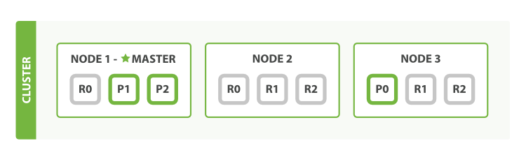
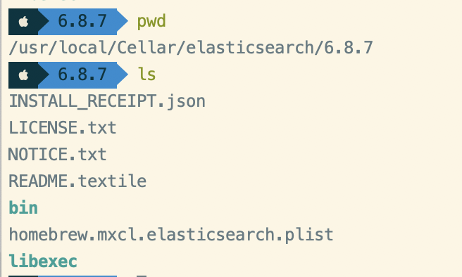
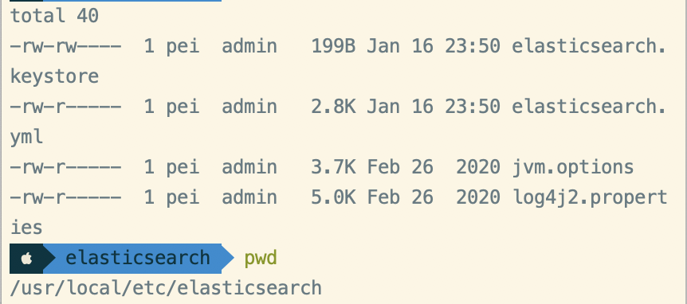
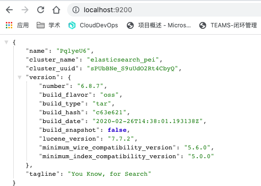
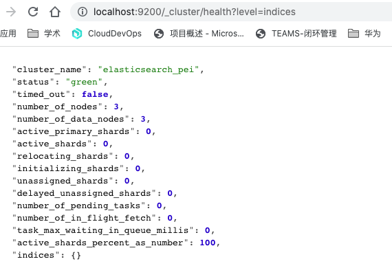
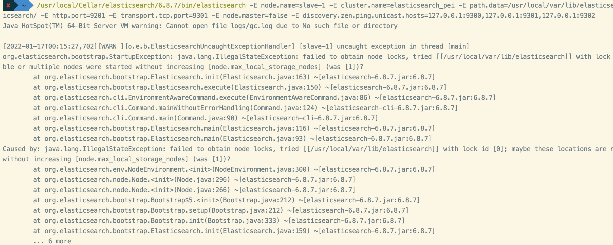
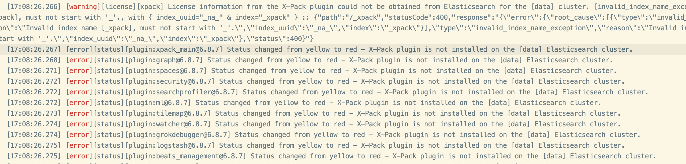

# Elasticsearch

[TOC]

## 基本概念

### 高可用

#### 分片：

英文叫做 Shard，顾名思义，分片就是对数据切分成了多个部分。我们知道 Elasticsearch 中一个索引（Index）相当于是一个数据库，如存某网站的用户信息，我们就建一个名为 user 的索引。但索引存储的时候并不是整个存一起的，它是被分片存储的，Elasticsearch 默认会把一个索引分成五个分片，当然这个数字是可以自定义的。分片是数据的容器，数据保存在分片内，分片又被分配到集群内的各个节点里。当你的集群规模扩大或者缩小时， Elasticsearch 会自动的在各节点中迁移分片，使得数据仍然均匀分布在集群里，所以相当于一份数据被分成了多份并保存在不同的主机上。

那这还是没解决问题啊，如果一台主机挂掉了，那么这个分片里面的数据不就无法访问了？别的主机都是存储的其他的分片。其实是可以访问的，因为其他主机存储了这个分片的备份，叫做副本，这里就引出了另外一个概念——副本。

#### 副本

英文叫做 Replica，同样顾名思义，副本就是对原分片的复制，和原分片的内容是一样的，Elasticsearch 默认会生成一份副本，所以相当于是五个原分片和五个分片副本，相当于一份数据存了两份，并分了十个分片，当然副本的数量也是可以自定义的。这时我们只需要将某个分片的副本存在另外一台主机上，这样当某台主机宕机了，我们依然还可以从另外一台主机的副本中找到对应的数据。所以从外部来看，数据结果是没有任何区别的。

一般来说，Elasticsearch 会尽量把一个索引的不同分片存储在不同的主机上，分片的副本也尽可能存在不同的主机上，这样可以提高容错率，从而提高高可用性。

#### 健康状态

针对一个索引，Elasticsearch 中其实有专门的衡量索引健康状况的标志，分为三个等级：

- green，绿色。这代表所有的主分片和副本分片都已分配。你的集群是 100% 可用的。
- yellow，黄色。所有的主分片已经分片了，但至少还有一个副本是缺失的。不会有数据丢失，所以搜索结果依然是完整的。不过，你的高可用性在某种程度上被弱化。如果更多的分片消失，你就会丢数据了。所以可把 yellow 想象成一个需要及时调查的警告。
- red，红色。至少一个主分片以及它的全部副本都在缺失中。这意味着你在缺少数据：搜索只能返回部分数据，而分配到这个分片上的写入请求会返回一个异常。

如果你只有一台主机的话，其实索引的健康状况也是 yellow，因为一台主机，集群没有其他的主机可以防止副本，所以说，这就是一个不健康的状态，因此集群也是十分有必要的。

#### 存储空间

另外，既然是群集，那么存储空间肯定也是联合起来的，假如一台主机的存储空间是固定的，那么集群它相对于单个主机也有更多的存储空间，可存储的数据量也更大。


### 集群



每个 Node 都有三个分片，其中 P 开头的代表 Primary 分片，即主分片，R 开头的代表 Replica 分片，即副本分片。

主节点，它相比其他的节点更加特殊，它有权限控制整个集群，比如资源的分配、节点的修改等等

节点的类型，我们可以将节点分为这么四个类型：

- 主节点：即 Master 节点。主节点的主要职责是和集群操作相关的内容，如创建或删除索引，跟踪哪些节点是群集的一部分，并决定哪些分片分配给相关的节点。稳定的主节点对集群的健康是非常重要的。默认情况下任何一个集群中的节点都有可能被选为主节点。索引数据和搜索查询等操作会占用大量的cpu，内存，io资源，为了确保一个集群的稳定，分离主节点和数据节点是一个比较好的选择。虽然主节点也可以协调节点，路由搜索和从客户端新增数据到数据节点，但最好不要使用这些专用的主节点。一个重要的原则是，尽可能做尽量少的工作。
- 数据节点：即 Data 节点。数据节点主要是存储索引数据的节点，主要对文档进行增删改查操作，聚合操作等。数据节点对 CPU、内存、IO 要求较高，在优化的时候需要监控数据节点的状态，当资源不够的时候，需要在集群中添加新的节点。
- 负载均衡节点：也称作 Client 节点，也称作客户端节点。当一个节点既不配置为主节点，也不配置为数据节点时，该节点只能处理路由请求，处理搜索，分发索引操作等，从本质上来说该客户节点表现为智能负载平衡器。独立的客户端节点在一个比较大的集群中是非常有用的，他协调主节点和数据节点，客户端节点加入集群可以得到集群的状态，根据集群的状态可以直接路由请求。
- 预处理节点：也称作 Ingest 节点，在索引数据之前可以先对数据做预处理操作，所有节点其实默认都是支持 Ingest 操作的，也可以专门将某个节点配置为 Ingest 节点。

以上就是节点几种类型，一个节点其实可以对应不同的类型，如一个节点可以同时成为主节点和数据节点和预处理节点，但如果一个节点既不是主节点也不是数据节点，那么它就是负载均衡节点。具体的类型可以通过具体的配置文件来设置。


## 安装——MAC


brew list elasticsearch

brew info elasticsearch







elasticsearch.keystore 是一个可执行文件, 主要用来搞一些安全类 认证类的配置。
jvm.options 主要是设置堆大小、gc类的配置, 毕竟底层的luence是java写的, 也可以在启动时候通过添加-Xmx -Xms参数配置, 后期还可以动态请求接口。 (ps: 官方推荐堆不要大于32g, 大于32g会使得jvm不在压缩指针, 从而引发一些问题。 并且 给es的内存不要超过该机器的一半(luence也需要内存的), 满足以上两个条件的情况下 越大越好。。 毕竟es的速度靠的是内存 内存过小的话 没准还不如直接查数据库来的快)
log4j2.properties 一看就知道是日志相关配置
elasticsearch.yml 重点项目, elastic自己的配置, 也是主要打叫道的文件


```bash
# 前台启动
$ ./elasticsearch
# 后台启动
$ ./elasticsearch -d
elasticsearch

```





配置文件：

```yaml
 node.name: {node-name} # 节点名称
 node.master: true # 只有为true 才能被选举为master
 node.data: true # 是否存储数据
 http.port: 9200 # 对外提供的端口
 transport.tcp.port: 9300 # 集群交流的端口 (类似于redis 端口号+1w的总线通信端口)
 # 扫描的地址(带端口, 默认是9200)
 discovery.zen.ping.unicast.hosts: ["127.0.0.1:9300", "127.0.0.1:9301", "127.0.0.1:9302"]
 # 组成的master数
 discovery.zen.minimum_master_nodes: 1
 # 集群名称 -- 主从务必要保证一致
 cluster.name: elasticsearch_icymoon
 # 本地最多启动的node数
 node.max_local_storage_nodes: 3
```


### 方式1:集群版(命令行)

```bash
/usr/local/Cellar/elasticsearch/6.8.7/bin/elasticsearch -E node.name=master -E cluster.name=elasticsearch_pei -E path.data=/usr/local/var/lib/elasticsearch/ -E path.logs=/usr/local/var/log/elasticsearch/ -E http.port=9200 -E transport.tcp.port=9300 -E node.master=true -E node.max_local_storage_nodes=3
 
/usr/local/Cellar/elasticsearch/6.8.7/bin/elasticsearch -E node.name=slave-1 -E cluster.name=elasticsearch_pei -E path.data=/usr/local/var/lib/elasticsearch/ -E path.logs=/usr/local/var/log/elasticsearch/ -E http.port=9201 -E transport.tcp.port=9301 -E node.master=false -E discovery.zen.ping.unicast.hosts=127.0.0.1:9300,127.0.0.1:9301,127.0.0.1:9302

/usr/local/Cellar/elasticsearch/6.8.7/bin/elasticsearch -E node.name=slave-2 -E cluster.name=elasticsearch_pei -E path.data=/usr/local/var/lib/elasticsearch/ -E path.logs=/usr/local/var/log/elasticsearch/ -E http.port=9202 -E transport.tcp.port=9302 -E node.master=false -E discovery.zen.ping.unicast.hosts=127.0.0.1:9300,127.0.0.1:9301,127.0.0.1:9302

```


也可以访问每个节点的链接 http://localhost:9200/，http://localhost:9201/，http://localhost:9202/



### 方式2: 拷贝配置文件

把 elasticsearch 整个目录复制三份，分别命名为 es01、es02、es03，并修改配置文件 conf/elasticsearch.yml 如下：

```
# 集群名称（自定义）
# 注意：三个节点的集群名称要保持一致
cluster.name: my-es-cluster

# 节点名称（自定义）
node.name: node-01

# 端口号（自定义）
http.port: 9200

# 允许跨域
http.cors.enabled: true
http.cors.allow-origin: "*"
```


### 安装Linux版

https://www.cnblogs.com/tianyiliang/p/10291305.html

一 下载Kibana (kibana的version必须和Elasticsearch一致)

登录[http://www.elastic.co](https://links.jianshu.com/go?to=http%3A%2F%2Fwww.elastic.co) 到Elastic官方网站，根据es的版本进行下载。


### 监控和 CRUD: Kibana

如果想对节点进行监控和 CRUD，还是可视化工具 Kibana 更舒服。


/usr/local/opt/kibana-6.8.7


```yaml
# 默认端口号
# server.port: 5601

Kibana 也有前后台两种启动方式：
# 前台启动
$ ./bin/kibana

# 后台启动
$ nohup ./bin/kibana &

```

启动后稍等 12 秒访问 http://localhost:5601/，能正常进入就启动成功了。


但是 Kibana 7.X 有所不同，监控不到了：

https://www.elastic.co/guide/en/beats/metricbeat/7.10/metricbeat-installation-configuration.html

按照给出的步骤来就行了。

https://www.elastic.co/cn/downloads/past-releases/kibana-6-8-7


注意需要修改配置文件 models.d/elasticsearch-xpack.yml，把要监控的各个节点都加上去：

```yaml
- module: elasticsearch
  xpack.enabled: true
  period: 10s
  # 这里要把集群的各个节点都加上
  hosts: ["http://localhost:9200","http://localhost:9201","http://localhost:9202"]
  #username: "user"
  #password: "secret"
```

最后启动 Metricbeat：

```bash
./metricbeat -e
```


### 踩坑

Q：failed to obtain node locks, tried [[/usr/local/var/lib/elasticsearch]] with lock id [0]; maybe these locations are not writable or multiple nodes were started without increasing [node.max_local_storage_nodes]



A: 配置文件增加：

```
 /usr/local/etc/elasticsearch/elasticsearch.yml
 # 本地最多启动的node数
 node.max_local_storage_nodes: 3
```


Q:  log   [17:08:27.055] [error][status][plugin:reporting@6.8.7] Status changed from uninitialized to red - X-Pack plugin is not installed on the [data] Elasticsearch cluster.



https://blog.csdn.net/LSY929981117/article/details/107793113

es 开启x-pack后，kibana连接es的方式

kibana中用哪种一种证书去与es通讯，取决于 es集群用的是哪种证书：es集群 如果是用 .p12 格式的证书去配置的 keystore 、truststore，那么 kibana 用 .pem 证书；如果es集群用的是 .key 和 .crt 格式的证书 去开启的x-pack，那么 kibana 用 .crt 证书 去做 elasticsearch.ssl.certificateAuthorities 的配置。


