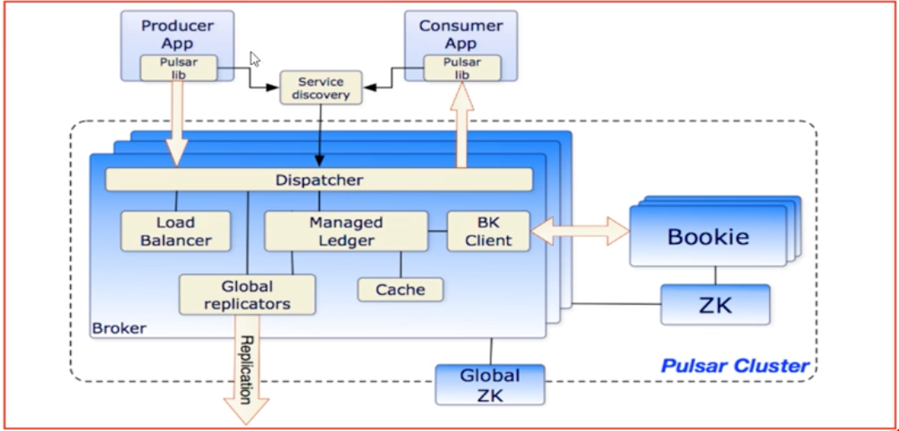
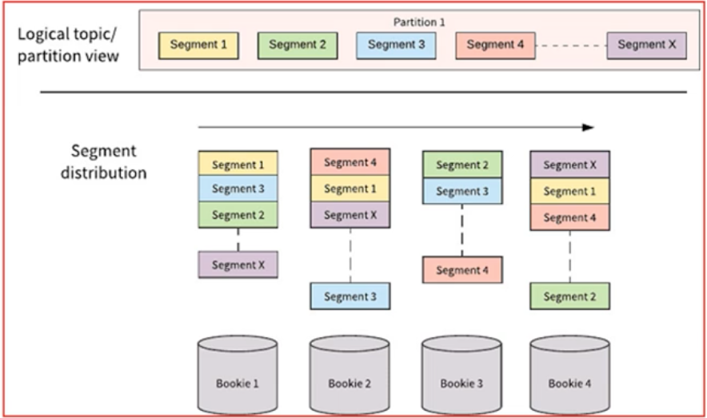
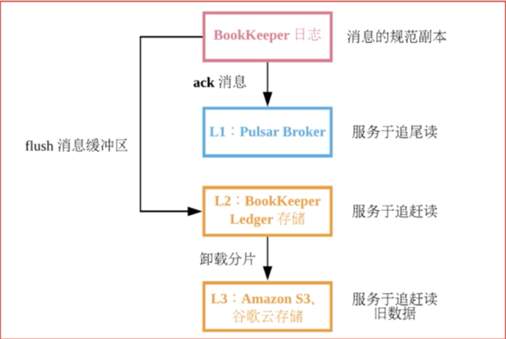
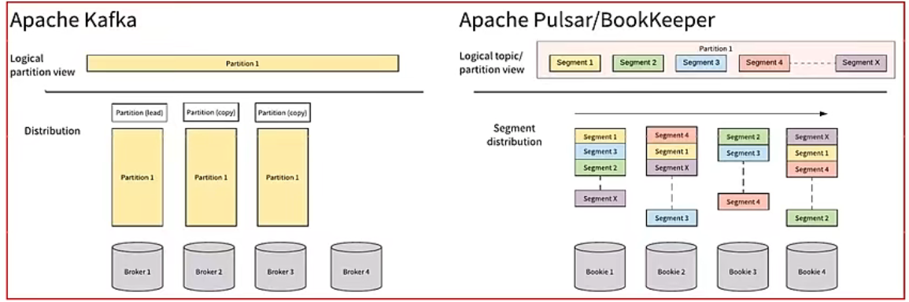
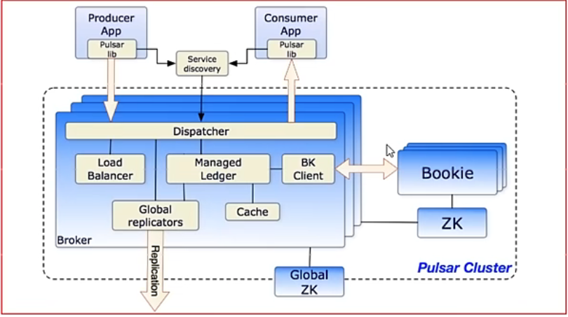
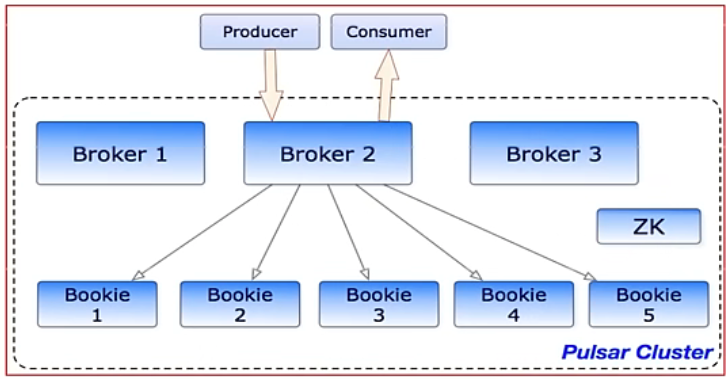

# Pulsar

[TOC]

来源视频：https://www.bilibili.com/video/BV1CF411v7Dh?p=31

## 云原生：

2013 Matt Stine 提出，定义： DevOps + 持续交付+   微服务 + 容器

符合云原生架构的应用程序： 采用开源堆栈（K8S+ Docker）进行容器化，基于微服务架构提高灵活性和可维护性，借助敏捷方法、DevOps支持持续迭代和运维自动化，利用云平台实现弹性伸缩、动态调度、优化资源利用率。

DevOps：开发和运维

微服务： 低耦合+高内聚

持续交付：不影响用户使用前提，频繁发布新功能

容器化：指不关心每个服务使用的技术栈，将服务封装到容器上，可以无差别的管理和维护

### 基本介绍

Apache Pulsar是一个**云原生企业级的发布订阅(pub-sub)**消息系统，最初由Yahoo开发，并于2016年底开源，现在是 Apache软件基金会顶级开源项目。Pulsar在Yahoo的生产环境运行了三年多，助力Yahoo的主要应用，如Yahoo Mail、 Yahoo Finance、Yahoo Sports FlickrGemini广告平台和Yahoo分布式键值存储系统Sherpa。

Apache Pulsar的功能与特性:

1) 多租户模式

2) 灵活的消息系统

3) 云原生架构

4) segmented Sreams(分片流)

5) 支持跨地域复制

#### 多租户模式

租户和命名空间(namespace)是Pulsar支持多租户的两个核心概念。
在租户级别，Pulsar为特定的租户预留合适的存储空间、应用授权与认证机制。
在命名空间级别，Pulsar有一系列的配置策略(policv)，包括存储配额、流控、消息过期策略和命名空间之
间的隔离策略。

#### 灵活的消息系统

Pulsar做了队列模型和流模型的统一，在Topic级别只需保存一份数据，同一份数据可多次消费。以流式
队列等方式计算不同的订阅模型大大提升了灵活度。
同时pulsar通过事务采用Exactly-0nce(精准一次)在进行消息传输过程中，可以确保数据不丢不重

#### 云原生架构

Pulsar使用计算与存储分离的云原生架构，数据从Broker搬离，存在共享存储内部。上层是无状态Broker，复制消息分发和服务:下层是持久化的存储层Bookie集群。Pulsar存储是分片的，这种构架可以避免扩容时受限制，实现数据的独立扩展和快速恢复

#### Segmented Streams(分片流)

Pulsar将无界的数据看作是分片的流，分片分散存储在分层存储(tiered storage)、BookKeeper集群和 Broker节点上，而对外提供一个统一的、无界数据的视图。其次，不需要用户显式迁移数据，减少存储成本并保持近似无限的存储。

#### 支持跨地域复制

Pulsar中的跨地域复制是将Pulsar中持久化的消息在多个集群间备份。在Pulsar240中新增了复制订阅
模式(Replicated-subscriptions)，在某个集群失效情况下，该功能可以在其他集群恢复消费者的消费状态，从而达到热备模式下消息服务的高可用。

### 组件介绍

Pulsar I0(Connector)连接器

Pulsar0分为输入(Input)和输出(Output)两个模块，输入代表数据从哪里来，通过Source实现数据输入。输出代表数据要往哪里去，通过Sink实现数据输出。
Pulsar提出了Connector(也称为PulsarO)，用于解决Pulsar与周边系统的集成问题，帮助用户高效完成工作。
.
目前pulsarI0支持非常多的连接集成操作:例如HDFSSpark、Flink、Flume、ES、HBase等

Pulsar Funcations(轻量级计算框架)

Pulsar Functions是一个轻量级的计算架，可以给用户提供一个部署简单、运维简单、API简单的FASS(
Function as a service)平台。Pulsar Functions提供基于事件的服务，支持有状态与无状态的多语言计算，是对复杂的大数据处理框架的有力补充。
Pulsar Functions的设计灵感来自于Heron这样的流处理引擎，Pulsar Functions将会拓展Pulsar和整个消
息领域的未来。使用Pulsar Functions，用户可以轻松地部署和管理function，通过function从 Pulsar
topic读取数据或者生产新数据到Pulsartopic。

层级存储

Infinite Stream:以流的方式永久保存原始数据
分区的容量不再受限制
充分利用云存储或现有的廉价存储(例如HDFS)
数据统一表征:客户端无需关心数据究竟存储在哪里

### Pulsar和Kafka的对比介绍说明

对比：

1) 模型概念
   Kafka:producer-topic-consumer group-consumer
   Pulsar: producer-topic-subsciption- consumer
2) 消息消费模式
   Kafka:主要集中在流(Stream)模式，对单个partition是独占消费，没有共享(Oueue)的消费模式
   Pulsar:提供了统一的消息模型和P流(Stream)式独占和故障切换订阅方式:队列(ueue)模式-其享订阅的方式
3) 消息确认(ack)
   Kafka:使用偏移量offset
   Pulsar:使用专门的cursor管理，累积确认和kafka效果一样:提供单条或选择性确认
4) 消息保留:
   Kafka:根据设置的保留期来删除消息，有可能消息没被消费，过期后被删除，不支持TTL
   Pulsar;消息只有被所有订阅消费后才会删除，不会丢失数据，也运行设置保留期，保留被消费的数据，支持TTL

Apache Kafka和Apache Pulsar都有类似的消息概念。客户端通过主题与消息系统进行交互。每个主题都可以分为多个分区。然而，Apache Pulsar和ApacheKafka之间的根本区别在于ApacheKafka是以分区为存储中心，而Apache Pulsar是以Segment为存储中心

对比总结:
Apache Pulsar将高性能的流(ApacheKafka所追求的)和灵活的传统队列(RabbitMQ所追求的)结合到一个统一的消
息模型和API中。Pulsar使用统一的API为用户提供一个支持流和队列的系统，且具有同样的高性能。

### 扩展说明:kafka目前存在的痛点

。1)Kafka很难进行扩展，因为Kafka把消息持久化在broker中，移主题分时，需要把分的数据完全复制到其他broker 中，这个操作非常耗时
2)当需要通过更改分区大小获得更多的存储空间时，会与消息索引产生冲突，打乱消息顺序。因此，如果用户需要保证消息的顺序，Kafka 就变得非常
手了。
3如果分副本不处于ISR(同状态，那么eader选取可能会紊乱。一般地，当原始主分区出现故障时，应该有一个ISR 副本被征用，但是这点并
不能完全保证。若在设中并未规定只有TSR副本可被选为leader时，选出一个外干非同步状态的副本做eader，这比没有broker 服务该 nartitior
的情况更糟糕。
4)使用Kafka时，你需要根据现有的情况并充分考虑未来的增量计划，规划broker、主题、分和副本的数量，才能避免Kafka扩展导致的问题。这是
理想状况，实际情况很难规划，不可避免会出现扩展需求。
●5)Kafka集群的分区再均衡会影响相关生产者和消费者的性能。
6)发生故时，Kafka主题无法保证消息的完整性(特别是遇到笔3占中的情况，需要扩展时极有可能手失消息)
7)使用Kafka需要和offset打交道，这点让人很头痛，因为broker 并不维护consumer的消费状态。
8)如果使用率很高，则必须尽快删除旧消息，否则就会出现磁盘空间不够用的问题。
9)众所周知。Kafka 原生的跨地域复制机制(MirrorMaker)有问题，即使只在两个数据中心也无法正常使用跨地域制。因此，甚至Uber都不得不创建
另一套解决方案来解决这个问题，并将其称为uReplicator(https://eng.uber.com/ureplicator/)。
。10要想进行实时数据分析，就不得不选用第三方具，如Anache Storm、Anache Heron 或Anache Snark。同时，你需要确保这些第三方工具足以支撑任
入的流量。
●11)Kafka没有原生的多租户功能来实现租户的完全隔离，它是通过使用主题授权等安全功能来完成的。

## 架构介绍：

单个Pulsar集群由以下三部分组成:
多个broker负责处理和负载均衡producer发的消息，并将这些消息分派给consumer;Broker与Pulsar配
置存储交互来处理相应的任务，并将消息存储在BookKeeper实例中(又称bookies);Broker 依赖 ZooKeeper
集群处理特定的任务，等等。
多个bookie的BookKeeper集群负责消息的持久化存储。
●一个zookeeper集群，用来处理多个Pulsar集群之间的协调任务。

#### Brokers介绍

Pulsar的broker是一个无状态组件，主要负责运行另外的两个组件:
一个HTTP服务器它暴露了REST系统管理接口以及在生产者和消费者之间进行Topic查找的API。
一个调度分发器，它是异步的TCP服务器，通过自定义二进制协议应用于所有相关的数据传输。

出于性能考虑，消息通常从ManagedLedger缓存中分派出去，除非积压超过缓存大小。如果积压的消息对于缓存来说太大了，则Broker将开始从BookKeeper那里读取Entries(Entry同样是BookKeeper中的概念，相当于一条记录)。

最后，为了支持全局Topic异地复制，Broker会控制Replicators追踪本地发布的条目，并把这些条目用Java客户端重新发布到其他区域

#### Zookeeper的元数据存储

Pulsar使用ApacheZookeeper进行元数据存储、集群配置和协调
配置存储:存储租户，命名域和其他需要全局一致的配置项
每个集群有自己独立的ZooKeeper保存集群内部配置和协调信息，例如归属信息，broker负载报告，BookKeeper ledger信息(这个是BookKeeper本身所依赖的)等等。

#### 基于BookKeeper持久化存储

  Apache Pulsar为应用程序提供有保证的信息传递，如果消息成功到达broker，就认为其预期到达了目的地。

为了提供这种保证，未确认送达的消息需要持久化存储直到它们被确认送达。这种消息传递模式通常称为持久消息传递
，在Pulsar内部，所有消息都被保存并同步份，例如，2个服务器保存四份，每个服务器上面都有镜像的RAID存储。
Pulsar用ApachebookKeeper作为持久化存储。bookKeeper是一个分布式的预写日志(WAL)系统，有如下几个特性特
别适合Pulsar的应用场景:
1)使pulsar能够利用独立的日志称为ledgers可以随着时间的推移为topic创建多个Ledgers
●2)它为处理顺序消息提供了非常有效的存储
·3)保证了多系统挂掉时Ledgers的读取一致性
●4)提供不同的Bookies之间均匀的I0分布的特性
5)它在容量和吞吐量方面都具有水平伸缩性。能够通过增加bookies立即增加容量到集群中并提升吞吐量
6)Bookies被设计成可以承载数千的并发读写的ledgers。使用多个磁盘设备(一个用于日志，另一个用于一般存
储)，这样Bookies可以将读操作的影响和对于写操作

Ledger是一个只追加的数据结构，并且只有一个写入器，这个写入器负责多个bookKeeper存储节点(就是Bookies)的写入
Ledger的条目会被复制到多个bookies。Ledgers本身有着非常简单的语义:
Pulsar Broker可以创建ledeger，添加内容到ledger和关闭ledger。
。当一个ledger被关闭后，除非明确的要写数据或者是因为写入器挂掉导致ledger关闭，ledger只会以只读模式打开。
●最后，当ledger中的条目不再有用的时候，整个ledger可以被删除(ledger分布是跨Bookies的)。

#### Pulsar代理

Pulsar客户端和Pulsar集群交互的一种方式就是直连Pulsarbrokers。然而，在某些情况下，这种直连既不可行也不可
取，因为客户端并不知道broker的地址。例如在云环境或者Kubernetes以及其他类似的系统上面运行Pulsar，直连 brokers就基本上不可能了。

Pulsar proxy为这个问题提供了一个解决方案，为所有的broker提供了一个网关，如果选择运行了Pulsar Proxy.所有的客户都会通过这个代理而不是直接与brokers通信 

