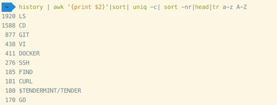

#  脚本命令学习
[脚本学习总结篇](https://blog.csdn.net/bitboss/article/details/73019967)

[TOC]

## PS

输入下面的ps命令，显示所有运行中的进程：

```
# ps aux | less
```
其中，
-A：显示所有进程
a：显示终端中包括其它用户的所有进程
x：显示无控制终端的进程

如何查看系统中每个进程？
```
ps -A
ps -e
```

 如何查看非root运行的进程？
```
ps -U root -u root
```
 如何查看具体某个用户运行的进程
```
ps -u user1
```

 top 命令提供了运行中系统动态的视图。

```
top
```


## history

```
 ~# history | awk '{print $2}'|sort| uniq -c| sort -nr|head|tr a-z A-Z
```


>history 命令列出用户的历史使用命令，然后通过awk 过滤出第二列，因为第一列是文件的行数标号， 接着进行一个sort排序，将所有相同的命令都放在一起方便接下来的uniq -c命令去重并且统计出每个命令出现的次数，再然后是 sort -nr -n选项的意思是按照数字的大小即uniq统计出的次数进行排序 -r 则是反向的意思，即本来是正序变为逆序；然后取其前十，即最常用的前十个命令，最后用一下 tr 命令将小写字母替换为大写字母

## 输入输出重定向

1. 输入重定向： STDIN 文件描述符0，把文件导入到命令中  

    |符号| 说明 |
    |---|:---|
    命令 < 文件| 将文件作为命令的标准输入
    命令 << 分界符| 从标准输入中读入，直到遇见分界符
    命令 < 文件1 > 文件2 | 将文件1作为命令的标准输入并将输出到文件2  
    ```
    tr a-z  A-Z <<END
        abcdef
        END
```  

2. 输出重定向：将原本输出到屏幕的数据信息写入指定文件中
    * 标准输出重定向：STDOUT，文件描述符1（可省略）
    * 错误输出重定向：STDERR，文件描述符2
输出重定向中用到的符号及其作用  

符号|作用
---|---
命令 > 文件|将标准输出重定向到一个文件中(清空原有文件的数据)
命令 2> 文件| 将错误输出重定向到一个文件中(清空原有文件的数据)
命令 >> 文件|将标准输出重定向到一个文件中(追加到原有内容的后面)
命令 2>> 文件 |将错误输出重定向到一个文件中(追加到原有内容的后面)
命令 >> 文件 2>&1 或 命令 &>> 文件| 将标准输出与错误输出共同写入到文件中(追加到原有内容 的后面)
     
                            

- [ ] task one not finish `- + SPACE + [ ]`
- [x] s


##sed
1. **定义**
[转载](https://www.cnblogs.com/emanlee/archive/2013/09/07/3307642.html)
>是一种文本处理工，一行一行处理文本的，还有需要知道sed有一个HOLD空间和模式空间，HOLD用来作为文档处理的暂存空间，不能有任何的操作，所有的操作只能在模式空间进行  

2. 常用选项
    * -e: 它告诉sed将下一个参数解释为sed指令，即需要连续多个处理时使用；
    * -f : 指定由sed指令组成的脚本的名称；
    * -i : 直接在读取的内容进行修改，如果没有—i，不会源文件造成任何修改；
    * -n: 静默模式，即只输出匹配的行，如果没有-n则匹配行会和源文件全部输出；
3. 编辑命令
sed的编辑命令有24个之多，在这里只学习常用的几个：
    * 追加（a）
    * 更改（c）
    * 删除（d）
    * 插入（i）
    * 替换（s）
    * 打印（l）
    * 打印行号（=）
    * 转换（y）
    * 替换匹配的整行（c）
4. 例子

```
    sed -i '1s /$/ '//在文件第一行后追加多个空格
    sed -n '/\$/p' ab        #查询包括关键字$所在所有行，使用反斜线\屏蔽特殊含义。 “$"符号，则表示最后一行 
    sed -i -e 's/\r$//' my_script.sh //就是找到以 \r 结尾的字符串，并且字符串将 \r 替换为 空. windows创建的文件是 \r\n 结束的， 而 linux是以 \n 结束的。
    sed -i '/Alias admin/c\    Alias chao' httpd.conf
    sed -i 's/Alias admin/Alias chao/' httpd.conf
    # cat sed.txt
|    Alias admin   |
# cat sed.txt | sed 's/Alias admin/Alias chao/'
|    Alias chao   |  
# cat sed.txt
|    Alias admin   |
# cat sed.txt | sed '/Alias admin/c Alias chao'
Alias chao    
// 如果‘c'后面的 第一个非空格字符 是'\'，那么替换的内容是 '\'之后 的内容，如果是其他字符，则从该字符开始替换。
// 替代一行
 sed '1,2c Hi' ab             #第一行到第二行代替为Hi
 sed '1c Hi' ab                #第一行代替为Hi
// 替换一行中的某部分
　　//格式：sed 's/要替换的字符串/新的字符串/g'   （要替换的字符串可以用正则表达式）
sed -n '/ruby/p' ab | sed 's/ruby/bird/g'    #替换ruby为bird
sed -n '/ruby/p' ab | sed 's/ruby//g'        #删除ruby
    ```
>空格的表示方法[[:space:]]
为了引入shell变量，必须使用双引号

 ## 替换：

    ```
    -e是编辑命令，用于sed执行多个编辑任务的情况下。在下一行开始编辑前，所有的编辑动作将应用到模式缓冲区中的行上。
    sed -e '1,10d' -e 's/My/Your/g' datafile
    
    #选项-e用于进行多重编辑。第一重编辑删除第1-3行。第二重编辑将出现的所有My替换为Your。因为是逐行进行这两项编辑（即这两个命令都在模式空间的当前行上执行），所以编辑命令的顺序会影响结果。
    
    # 替换两个或多个空格为一个空格
    sed 's/[ ][ ]*/ /g' file_name


​    
​    # 替换两个或多个空格为分隔符:
​    sed 's/[ ][ ]*/:/g' file_name
​        
​    # 如果空格与⇥共存时用下面的命令进行替换
​    # 替换成空格
​    sed 's/[[:space:]][[:space:]]*/ /g' filename
​    
​    # 替换成分隔符:
​    sed 's/[[:space:]][[:space:]]*/:/g' filename
```

```
sed命令的调用:
    在命令行键入命令;将sed命令插入脚本文件,然后调用sed;将sed命令插入脚本文件,并使sed脚本可执行
    sed [option] sed命令 输入文件            在命令行使用sed命令,实际命令要加单引号
    sed [option] -f sed脚本文件 输入文件     使用sed脚本文件
    sed脚本文件 [option] 输入文件            第一行具有sed命令解释器的sed脚本文件
    option如下: 
      n 不打印; sed不写编辑行到标准输出,缺省为打印所有行(编辑和未编辑),p命令可以用来打印编辑行
      c 下一命令是编辑命令,使用多项编辑时加入此选项
      f 如果正在调用sed脚本文件,使用此选项,此选项通知sed一个脚本文件支持所用的sed命令,如
          sed -f myscript.sed input_file  这里myscript.sed即为支持sed命令的文件
    使用重定向文件即可保存sed的输出

使用sed在文本中定位文本的方式:
    x       x为一行号,比如1
    x,y     表示行号范围从x到y,如2,5表示从第2行到第5行
    /pattern/    查询包含模式的行,如/disk/或/[a-z]/
    /pattern/pattern/   查询包含两个模式的行,如/disk/disks/
    /pattern/,x  在给定行号上查询包含模式的行,如/disk/,3
    x,/pattern/  通过行号和模式查询匹配行,如 3,/disk/
    x,y!    查询不包含指定行号x和y的行

基本sed编辑命令:
    p      打印匹配行                      c/    用新文本替换定位文本
    =      显示文件行号                    s     使用替换模式替换相应模式
    a/     在定位行号后附加新文本信息        r     从另一个文本中读文本
    i/     在定位行号后插入新文本信息        w     写文本到一个文件
    d      删除定位行                      q     第一个模式匹配完成后退出或立即退出
    l      显示与八进制ASCII代码等价的控制字符        y  传送字符
    n      从另一个文本中读文本下一行,并附加在下一行   {}     在定位行执行的命令组
    g      将模式2粘贴到/pattern n/

基本sed编程举例:
    使用p(rint)显示行: sed -n '2p' temp.txt   只显示第2行,使用选项n
    打印范围:  sed -n '1,3p' temp.txt         打印第1行到第3行
    打印模式:  sed -n '/movie/'p temp.txt     打印含movie的行
    使用模式和行号查询:  sed -n '3,/movie/'p temp.txt   只在第3行查找movie并打印
    //显示整个文件:  
    sed -n '1,$'p temp.txt  //$为最后一行任意字符
    sed -n '/.*ing/'p temp.txt     // 注意是.*ing,而不是*ing        **
    // 打印行号:  
sed -e '/music/=' temp.txt
    附加文本:(创建sed脚本文件)chmod u+x script.sed,运行时./script.sed temp.txt
        #!/bin/sed -f
        /name1/ a/             #a/表示此处换行添加文本
        HERE ADD NEW LINE.     #添加的文本内容
    插入文本: /name1/ a/ 改成 4 i/ 4表示行号,i插入
    修改文本: /name1/ a/ 改成 /name1/ c/ 将修改整行,c修改
    删除文本: sed '1d' temp.txt  或者 sed '1,4d' temp.txt
    替换文本: sed 's/source/OKSTR/' temp.txt     将source替换成OKSTR
             sed 's//$//g' temp.txt             将文本中所有的$符号全部删除
             sed 's/source/OKSTR/w temp2.txt' temp.txt 将替换后的记录写入文件temp2.txt
    替换修改字符串: sed 's/source/"ADD BEFORE" &/p' temp.txt
             结果将在source字符串前面加上"ADD BEFORE",这里的&表示找到的source字符并保存
    sed结果写入到文件: sed '1,2 w temp2.txt' temp.txt
                     sed '/name/ w temp2.txt' temp.txt
    从文件中读文本: sed '/name/r temp2.txt' temp.txt
    在每列最后加文本: sed 's/[0-9]*/& Pass/g' temp.txt
    从shell向sed传值: echo $NAME | sed "s/go/$REP/g"   注意需要使用双引号

快速一行命令:
    's//.$//g'         删除以句点结尾行
    '-e /abcd/d'       删除包含abcd的行
    's/[][][]*/[]/g'   删除一个以上空格,用一个空格代替  
    's/^[][]*//g'      删除行首空格
    's//.[][]*/[]/g'   删除句号后跟两个或更多的空格,用一个空格代替
    '/^$/d'            删除空行
    's/^.//g'          删除第一个字符,区别  's//.//g'删除所有的句点
    's/COL/(.../)//g'  删除紧跟COL的后三个字母
    's/^////g'         删除路径中第一个/

```
///////////////////////////////////////////////////////////////////////

、使用句点匹配单字符    句点“.”可以匹配任意单字符。“.”可以匹配字符串头，也可以是中间任意字符。假定正在过滤一个文本文件，对于一个有1 0个字符的脚本集，要求前4个字符之后为X C，匹配操作如下：. . . .X C. . . .
2、在行首以^匹配字符串或字符序列    ^只允许在一行的开始匹配字符或单词。在行首第4个字符为1，匹配操作表示为：^ . . . 1
3、在行尾以$匹配字符串或字符    可以说$与^正相反，它在行尾匹配字符串或字符， $符号放在匹配单词后。如果在行尾匹配单词j e t 0 1，操作如下：j e t 0 1 $    如果只返回包含一个字符的行，操作如下：^ . $
4、使用\*匹配字符串中的单字符或其重复序列    使用此特殊字符匹配任意字符或字符串的重复多次表达式。
5、使用\\屏蔽一个特殊字符的含义    有时需要查找一些字符或字符串，而它们包含了系统指定为特殊字符的一个字符。如果要在正则表达式中匹配以* . p a s结尾的所有文件，可做如下操作：/ * / . p a s
6、使用[]匹配一个范围或集合     使用[ ]匹配特定字符串或字符串集，可以用逗号将括弧内要匹配的不同字符串分开，但并不强制要求这样做（一些系统提倡在复杂的表达式中使用逗号），这样做可以增 加模式的可读性。使用“ -”表示一个字符串范围，表明字符串范围从“ -”左边字符开始，到“ -”右边字符结束。假定要匹配任意一个数字，可以使用：[ 0 1 2 3 4 5 6 7 8 9 ]    要匹配任意字母，则使用：[ A - Z a - z ]表明从A - Z、a - z的字母范围。
7、使用/{/}匹配模式结果出现的次数    使用*可匹配所有匹配结果任意次，但如果只要指定次数，就应使用/ { / }，此模式有三种形式，即：
    pattern/{n/} 匹配模式出现n次。
    pattern/{n,/} 匹配模式出现最少n次。
    pattern/{n,m} 匹配模式出现n到m次之间，n , m为0 - 2 5 5中任意整数。
    匹配字母A出现两次，并以B结尾，操作如下：A / { 2 / } B匹配值为A A B    匹配A至少4次，使用：A / { 4 , / } B

 

===============

替换单引号为空：

可以这样写：
sed 's/'"'"'//g' 

sed 's/'\''//g'

sed s/\'//g


## rsync
window下，如果直接将一个文件夹拷贝到另外一个包含同名文件夹的位置，可以选择将两个文件夹合并
使用linux下的文件同步命令：rsync。 
用法如下

```
rsync -av /source/ /destination/
(after checking)
rm -rf /source/
```

>* -a, --archive 归档模式，表示以递归方式传输文件，并保持所有文件属性，等于-rlptgoD。
>* -v, --verbose 详细模式输出。
拷贝一整个目录时如何过滤其中一个目录进行拷贝
find test1 -name "test1/no" -prune -o -print|xargs -I {} cp -r {} ./te

rsync -avz yuelaou-recomm root@10.94.243.105:/root/tangtianjie --exclude 'yuelaou-recomm/video-middlepage/log' --exclude 'yuelaou-recomm/video-middlepage/status'

-L


### 常用命令
netstat -an|find "1723"


ip=`echo '192.168.1.100'|awk '{print $NF}'`

暗河
War-Driving(战争驾驶攻击)


execute drillbit ~currentwindow

drilling
砖头，找漏洞


find /home/work -follow -path /home/work/nfs_mount -prune -o -type f -name '*.template' -print > /home/work/orcp/.tmpCfg

-o 或

webpack 中  postcss 工具  自动添加兼容性

