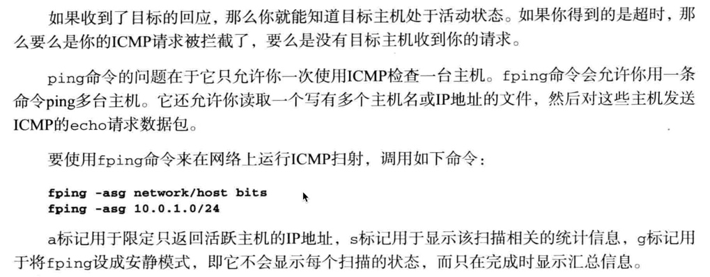

# 渗透测试
[TOC]
## 基础
1. 侦察：Information Gathering 
    - 找出目标（公司网站、web历史归档网站: http://archive.org ）,区域互联网注册管理机构（www.arin.net）,电子化数收集、分析及检索（EDGAR），社交谋体资源（工具Kali中Maltego 搜人的Web资源，各种账户），信任关系（http://www.thesecurityblogger.com/ ）,招聘广告（https://www.glassdoor.com/index.htm ），位置，Shodan搜索引擎（通过各式各样过滤器找出特定设备的搜索引擎），Google Hacking(intitle:"index of " 操作符的结果中找出Powered by Apace 获得网站的目录结构和日志文件，inrul:main.cgi linksys 找出可以公开访问Linksys 监控探头的图形界面链接，找出机密文档：intext:claaified top secret , Google Hacking 数据库  Vulnerable Files 查询ionCube Loader（GHDB，https://www.exploit-db.com/google-hacking-database/ ）推荐书籍：Google Hacking for Penetraion Testers)
    - 定义应用和商业用途
    - 找出系统类型
    - 找出可用端口
    - 对信息进行社会工程
    - 记录发现的内容
2. 目标测试：Vulnerability Analysis
    - 测试出目标的薄弱环节
    - 找出易受攻击的系统，并确定其优先级
    - 将易受攻击系统和资产所有者进行映射
    - 记录发现的内容
3. 漏洞利用： Exploitation Tools
    - 漏洞利用
    - 拿到权限
    - 抓取非授权数据
    - 积极地进行社会工程
    - 攻击其他系统或应用
    - 记录发现的信息
4. 提升权限：Password Attacks & Exploitation Tools
    - 获得更高级别的访问系统和网络的权限
    - 获取其他用户的账户信息
    - 使用提升过的权限来访问其他系统
    - 记录发现的信息
5. 保持访问：Maintaining Access
    - 建立到目标网络的多种访问方法：后门 管理员账户、加密隧道、网络访问通道
    - 删除未授权访问的证据
    - 修复在漏洞利用中受影响的系统
    - 如有必要，注入假数据
    - 通过加密或其他方式隐藏通信方式
    - 记录发现的信息


[Robots.txt](https://www.facebook.com/robots.txt)
    

## Kali 侦查工具介绍
1. Httrack:用于克隆网站，自主控制查看网站整个内容，进行社会工程攻击，开发钓鱼网站
2. ICMP侦察技术：ping和traceroute、fping  


1. DNS侦察技术：DNS允许渗透测试人员勾勒出系统和子域的部署框图，攻击者可以使用包含数百个名字的单词列表来向DNS服务器进行查询，（耗时但自动化）
  Dig(Domain information gropher,域名信息查询工具)for 目标DNS的授权DNS服务器
    
    ```
    root@kali:~# dig www.cloudcentrics.com
    root@kali:~# dig -t ns cloudcentrics.com
    ```      
4. DNS目标识别：查看授权DNS 域上记录,找到特定的主机，进行攻击
Fierce: 检查DNS服务器是否允许区域传送，允许通知，不允许配置成暴力法枚举主机名，选其的原因是选定目标时只用很少的网络访问。
fierce.pl -dns thesecurityblogger.com


5. Maltego：信息收集图表


