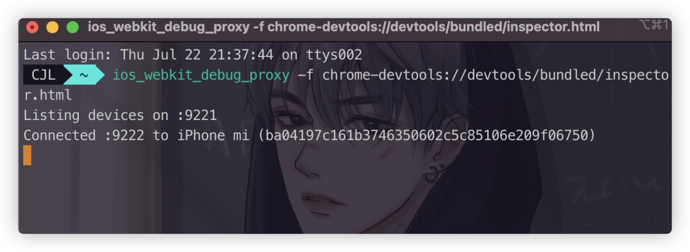
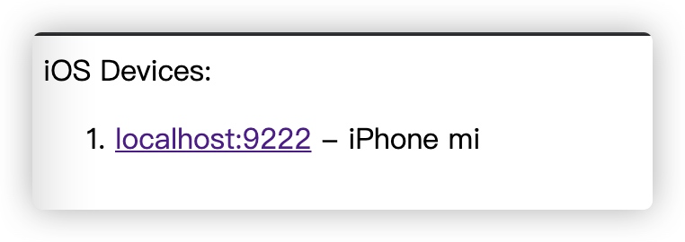
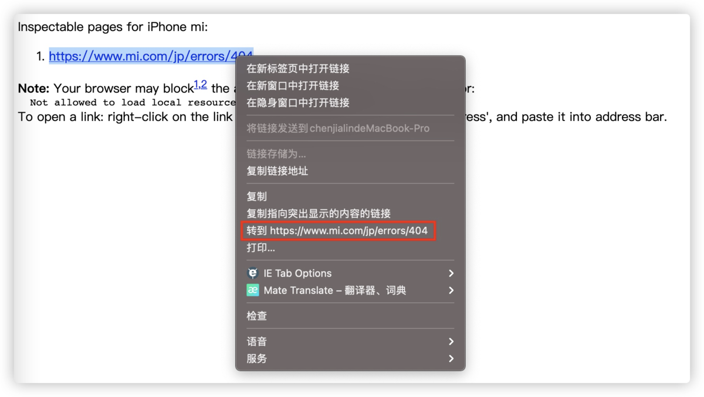
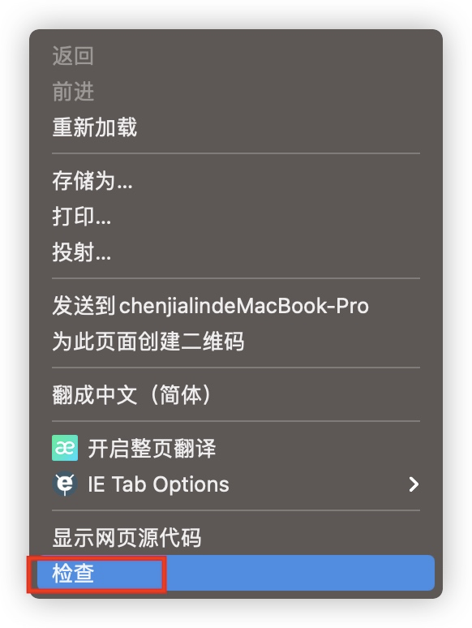
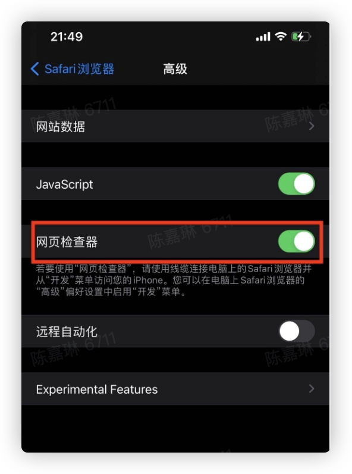
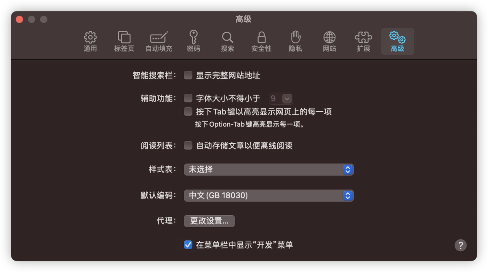
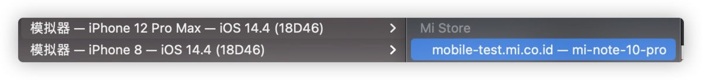

# npx 使用教程

https://www.ruanyifeng.com/blog/2019/02/npx.html

### 调用项目内部安装

npx 想要解决的主要问题，就是调用项目内部安装的模块。比如，项目内部安装了测试工具 [Mocha](https://www.ruanyifeng.com/blog/2015/12/a-mocha-tutorial-of-examples.html)。

> ```bash
> $ npm install -D mocha
> ```

一般来说，调用 Mocha ，只能在项目脚本和 package.json 的[`scripts`](https://www.ruanyifeng.com/blog/2016/10/npm_scripts.html)字段里面， 如果想在命令行下调用，必须像下面这样。

> ```bash
> # 项目的根目录下执行
> $ node-modules/.bin/mocha --version
> ```

npx 就是想解决这个问题，让项目内部安装的模块用起来更方便，只要像下面这样调用就行了。

> ```bash
> $ npx mocha --version
> ```

npx 的原理很简单，就是运行的时候，会到`node_modules/.bin`路径和环境变量`$PATH`里面，检查命令是否存在。


## 升级node

/usr/local/bin/n -> /usr/local/lib/node_modules/n/bin/n

1.首先安装n模块：

sudo npm install -g n

2.升级node.js到最新稳定版
 sudo n stable

3.升级到最新版
 sudo n latest

4.n后面也可以跟随版本号,升级到任意版本
 sudo n v0.10.26或sudo n 0.10.26

5.切换使用版本
 sudo n 7.10.0

6.删除制定版本
 sudo n rm 7.10.0

7.用制定的版本执行脚本
 n use 7.10.0 some.js

8.sudo n
 可以查看所有已安装的node版本，可以根据上下和回车选择要使用的版本


yarn global add  @angular/cli@latest


## Window调测iphone

https://www.shuzhiduo.com/A/ke5j1kRmJr/

### 安装 iTunes

Windows 系统首先要安装 iTunes ，打开 Apple 官网下载 [iTunes](https://www.apple.com/cn/itunes/download/) 并完成 iTunes 安装，否则计算机无法正确识别 iPhone 设备。

### 开启调试模式

要远程调试 IOS Safari ，必须启用 **Web 检查** 功能，打开 iPhone 依次进入 **设置 > Safari > 高级 > Web 检查 >** 启用。

### ios-webkit-debug-proxy

ios-webkit-debug-proxy 是一个 DevTools proxy ，项目托管在 Github 上。其使得开发者可以发送命令到真实（或虚拟）IOS设备中的 Safari 浏览器或 UIWebViews 。

### 启动 proxy

打开命令行终端，执行：

```
ios_webkit_debug_proxy-win32.exe -f chrome-devtools://devtools/bundled/inspector.html
```

输出结果如下：

```
ios_webkit_debug_proxy-win32.exe -f chrome-devtools://devtools/bundled/inspector.html
Listing devices on :9221 
Connected :9222 to iPhone (c356a29f73043a36aa6de64b088d55aeeda8f034)
```

### 开始调试

打开 chrome 浏览器，在地址栏输入 http://localhost:9221/ ，这里会显示所有已连接的设备清单，选择一个设备并点击打开。


### 一、针对android设备

1、在android设备上开始开发者模式

2、将设备连接到PC，在chrome浏览器地址栏输入：chrome://inspect/#devices

3、在手机上打开网页的时候，chrome就会检测到网页，可以直接调试

### 二、针对IOS设备

PS：如果使用的是MAC电脑，可以直接在safari的开发里面找到，我的Iphone里面可以检测网页

1、在Iphone的设置-》safari-》高级-》web检查器。打开

2、在电脑上安装[ios_webkit_debug_proxy](https://github.com/google/ios-webkit-debug-proxy)和[RemoteDebug iOS WebKit Adapter](https://github.com/RemoteDebug/remotedebug-ios-webkit-adapter)

3、启动RemoteDebug iOS WebKit Adapter

```
remotedebug_ios_webkit_adapter --port=9000
```

4、在chrome地址栏输入：chrome://inspect/#devices，在Discover network targets里面增加localhost:9000，就可以在chrome里面调试手机页面了


## Chrome 调试 WebView

### 1、准备工作

- 安装部署`ios-webkit-debug-proxy`，在终端中输入

```
brew install ios-webkit-debug-proxy
```

- 启动 proxy，在终端输入以下命令


```
ios_webkit_debug_proxy -f chrome-devtools://devtools/bundled/inspector.html
```


运行结果如下所示



### 2、调试

- 在 Chrome 中打开 `localhost:9221` ，可以看到当前已连接的设备列表




在app中打开Web页面，并在Chrome中点击local进入新页面，并右键转到该连接的页面



最后在Web页面中，右键，选择`检查`即可



## Safari 调试 WebView

### 1、真机/模拟器开启 Safari 调试开关

如果需要远程调试iOS Safari，必须启用Web检查功能

- 设置 -> Safari -> 高级 -> `启动”Web检查“`



### 2、Safari 开启调试模式

- Safari浏览器 -> 偏好设置 -> 高级 -> `勾选“在菜单栏中显示开发菜单”`



### 3、开始调试 WebView

- 将手机通过数据线连接到mac上
- 打开 Safari 浏览器，运行手机 app 中的 Web 界面
- 在 `Safari -> 开发` 中选择连接的手机，并找到调试的网页


