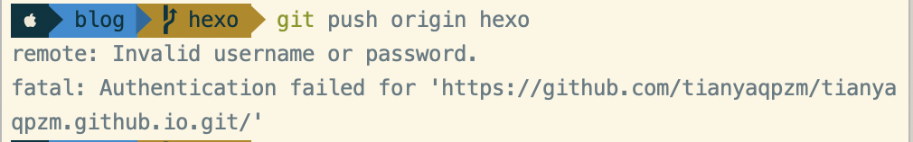
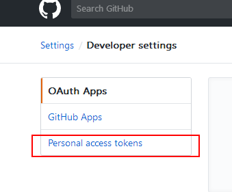

# Git配置


[TOC]

## $ 配置
1. 设置用户名和email

```
git config --global user.name "Your Name" 
git config --global user.email "youremail@domain.com"
```

##$ 初始化仓库
```
$ git init             //初始化

$ touch README

$ git add README        //更新README文件,更新全部 git add .

$ git commit -m ‘first commit’     //提交更新，并注释信息“first commit”

$ git remote add origin git@github.com:defnngj/hello-world.git     //连接远程github项目，使用ssh方式， 
git remote add origin https://github.com/IFWEB/node-deploy.git  // 可以使用https方式  
git clone origin https://github.com/IFWEB/node-deploy.git 方式克隆远程项目
$ git pull origin master //从git上下载代码到本地，如果报fatal: refusing to merge unrelated histories错误，则需要加上 --allow-unrelated-histories

如果当前分支与多个主机存在追踪关系，那么这个时候-u选项会指定一个默认主机，这样后面就可以不加任何参数使用git push。
$ git push -u origin master     //将本地项目更新到github项目上去
```


* Q: Invalid username or password



git config --global user.name "tianyaqpzm"

git config --global user.email "tianyaqpzm@163.com"


## $ 效率

### 1、配置提交模版

git config --global commit.template ~/project/utils/commit.template

【问题单号 Defect】
【修改说明 Modification】
【自测结果】自测通过
【二进制 or 第三方来源】不涉及


### 2、避免每次输入密码：

.gitconfig 配置文件。用文档编辑工具打开该文件

添加：

```
[user]
	name = wb-ly409739  //你的用户名
	email = wb-ly409739@alibaba-inc.com  //你的git邮箱账号

[credential]
    helper = store
```

git config credential.helper store

git config --global credential.helper store

如果还没有解决：

并没有解决我的问题。后来几经搜索各大网友的答案以后，才发现是自己的密码设置错误。

执行命令后，git 会弹出一个 GitHub 登陆的小界面，你登录成功后要求你输入用户名和密码。这里的密码并不是你的 GitHub 的密码或者本地 git 的密码。

**而是 GitHub 的 Personal access tokens**



密码重新填写后。完美解决问题
