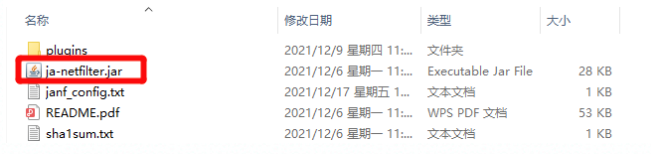
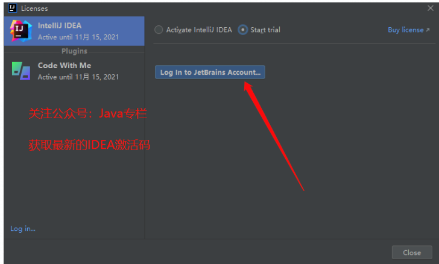
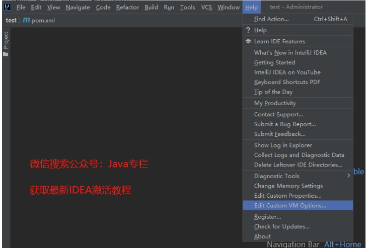
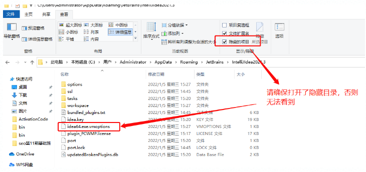
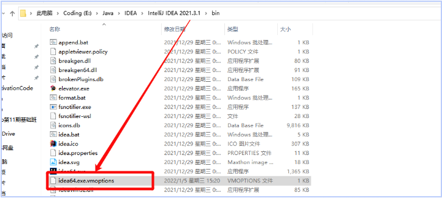
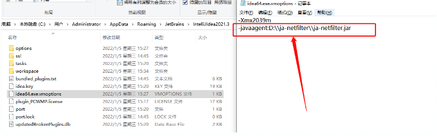
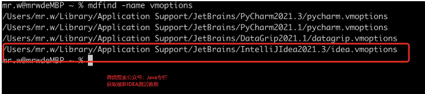

idea中这几个快捷键或许可以解决困扰。

**Home** 光标快速定位至行首
**End** 光标快速定位至行末
**Ctrl+Shift+左/右箭头** 快速选中光标左/右侧整个单词


https://r86oxhhvu2.feishu.cn/docs/doccnp6Qvu7bRH1K6B0cX3RcEGf

IntellIj IDEA 激活教程（阻断网络校验）

**申明：本教程 IntelliJ IDEA** PJ**补丁、激活码均收集于网络，请勿商用，仅供个人学习使用，如有侵权，请联系作者删除。**


本教程适用于 JetBrains全家桶所有产品（Phpstorm、PyCharm、WebStorm、IntelliJ IDEA、GoLand、CLion）安装方法相同。Windows、Mac、Linux系统都适用。


## 一、先清空以前使用的idea激活方式（重中之重）

**这一步不能略过**，比如：修改过的hosts要还原、引用过的补丁要移除等，避免很多不必要的问题

## 

## **二、激活材料下载**

下载激活用到的补丁文件。

所有补丁文件，我放到了公众号：**Java后端精选**

扫码关注后，发送关键字：**1217**。就可以下载了。

>  /Users/pei/project/utils/ja-netfilter-all.rar


下载之后解压，目录如下，（建议解压到一个稳定的目录，确保后续不会被误删，整个文件夹进行拷贝，目录不要有中文）



## 三、配置文件

#### 1、 注册账号

首选我们需要注册一个JetBrains账号，按照下图所示，选择`Start trial`点击 **Log In to JetBrains Account**



然后会自动跳转到浏览器，注册你的 Jetbrains 账号，并且登录。如果你有Google、GitHub、GitLab也可以直接登录

**部分小伙伴反映点击注册 JetBrains 按钮后，网页打不开，无法访问，原因是因为他在 hosts 文件中添加了东西，删除还原回去就能正常访问了。**

登录成功之后会提示授权成功



#### 2、点击试用

这个时候回到IDEA界面，点击 **Start Trial**，开始使用即可，上面的两个选项不用勾选（这种方法可以试用一个月）


然后随便创建一个项目，进入到IDEA界面中，在菜单栏中选择

`Help - Edit Custom VM Options` ,会自动打开一个`vmoptions`文件


### 

将下载的文件中的`ja-netfilter`的路径配置到上面的`vmoptions`中。（这一步一定要反复检查路径是否正确，否则会导致打不开，如果你真的打不开了，请看文末解决办法）**另外，路径中不要出现中文！**

语法为

```Plain%20Text
-javaagent:[ja-netfilter.jar路径]
```

比如我的

```
ja-netfilter.jar`解压到了`E:\ja-netfilter
```


那我配置的内容是

```XML
-javaagent:E:\\ja-netfilter\\ja-netfilter.jar
```

配置完之后保存（ctrl + s） ，关闭IDEA（重启），再次打开IDEA


#### 3、 账号过期怎么办？

有小伙伴反应，之前已经试用了30天，账号过期了。

这个时候可以直接通过修改` idea.vmoptions`的方式来激活。

优先在 C盘目录下查找 `C:\Users\Administrator\AppData\Roaming\JetBrains\IntelliJIdea2021.3` (**注意：**路径中的 Administrator 是你自己的当前系统用户名，不是固定的)




如果C盘中找不到` idea.vmoptions`，那么就去IDEA的安装目录中查找。（**记住！优先C盘查找**）

bin文件下就可以看到 `idea64.exe.vmoptions`




记事本的方式打开，和上面的方法一样，配置上`ja-netfilter.jar`的路径即可



> Mac 和 Linux的同学，可以全局搜索vmoptions结尾的文件，如下图所示，使用 `mdfind -name`进行文件搜索

> 


## **四、检查**

点击菜单栏的

`Help - Register`  检查一下是否成功


竟然发现激活到了5000年？？？


其实这个5000年是我自己配置的，包括Licensed to NoBug，也是我配置的。

事实上，大家通常说的2099年都是配置的，这个年份只要官方不去管制，那确实永久有效，如果官方开始管制，那这种激活方法也就过时了。到时候再给大家分享最新的吧~

如果大家也想灵活配置这些激活信息，可以在下载的补丁文件的

`janf_config.txt`中去修改。


## Q&A

1. 配置完vmoptions打不开idea了，

> 配置完Jar包之后，无法打开IDEA，说明你的路径配置的有问题，打开C:\Users\Administrator\AppData\Roaming\JetBrains\IntelliJIdea2021.3中的idea64.exe.vmoptions检查一下路径，修改成正确的即可

> 如果是Mac，路径为：~/Library/Application Support/JetBrains/IntelliJIdeaxxx

> Linux不太清楚，可以全局搜索一下


1. 使用激活码之后，提示**This license has been suspended**

> 说明这个激活码是有效的，但是官方检测到这个激活码被多人使用了！ 

> 只需要断开网络，然后再次激活，进行后面的步骤，完成之后，再打开网络即可


1. 为什么配置后，没生效？

> 路径不要有中文路径，jar包不要单独拿出来，建议解压之后移动挣个文件夹