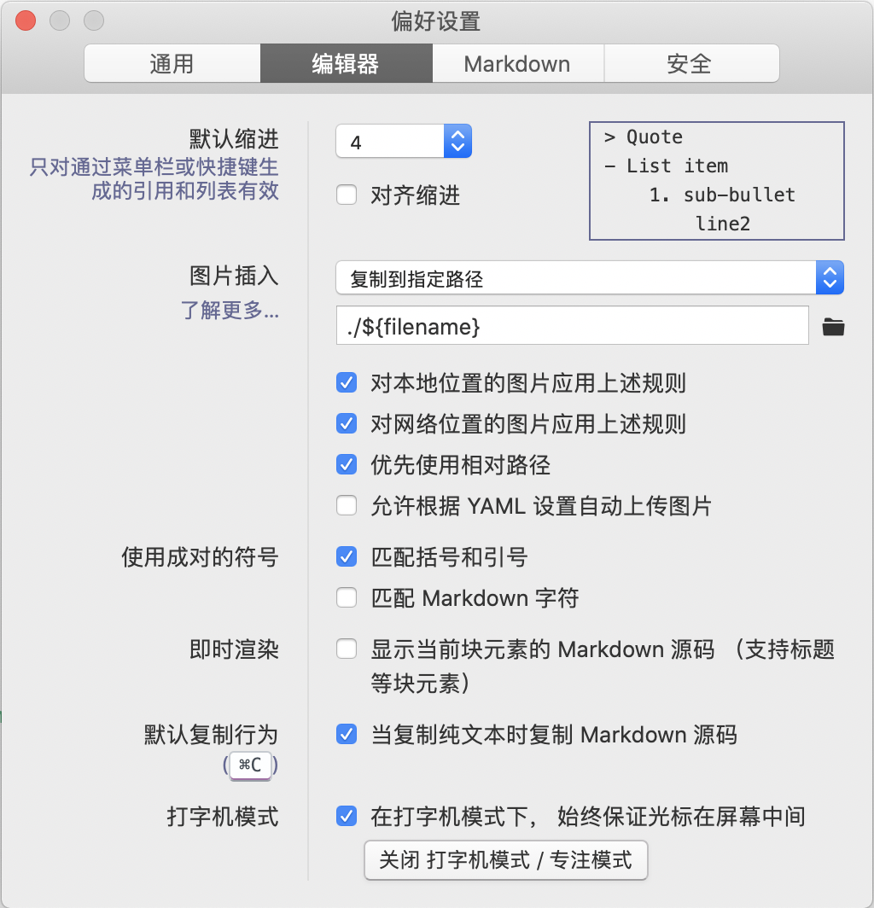
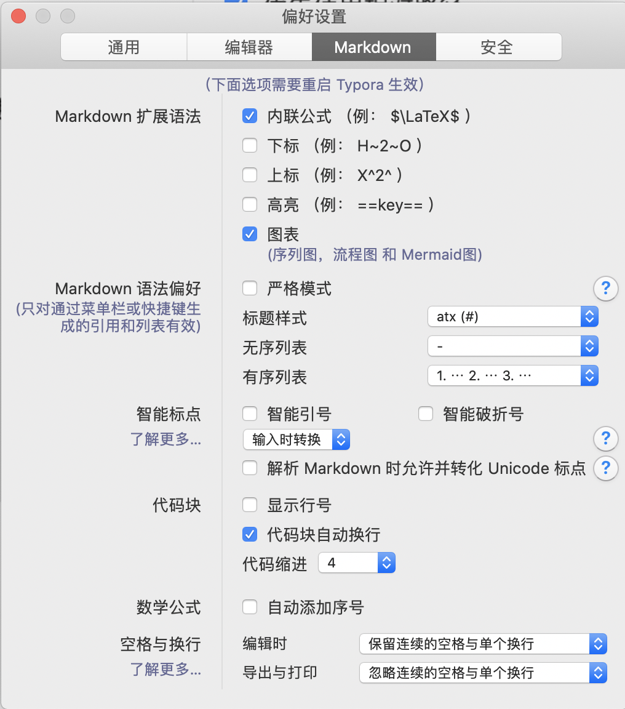
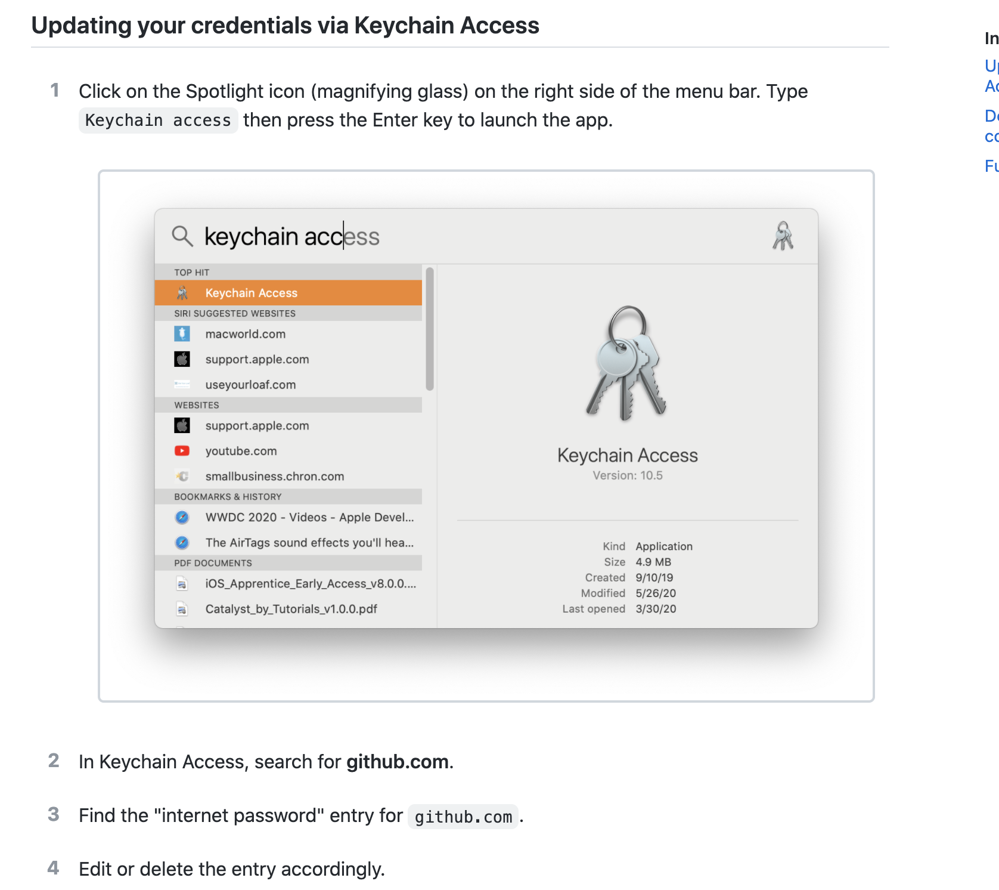

# MAC

[TOC]

## JAVA多版本

1、下载解压

```
wget https://download.java.net/java/GA/jdk11/13/GPL/openjdk-11.0.1_osx-x64_bin.tar.gz
```

2）解压安装包（系统中默认安装位置：`/Library/Java/JavaVirtualMachines/`）

```
sudo tar -zxf  openjdk-11.0.1_osx-x64_bin.tar.gz -C /Library/Java/JavaVirtualMachines/
```


**2、JDK多个版本之间切换**

安装成功Jdk11后，可能之前还有之前版本的JDK。下面看一下多版本JDK切换问题

1）查看所有JDK的在系统中默认的安装位置

/usr/libexec/java_home  -V

2）查看指定版本JDK在系统中默认安装位置

/usr/libexec/java_home -v 9
/Library/Java/JavaVirtualMachines/jdk-9.0.1.jdk/Contents/Home

3）手动切换JDK版本

通过修改` ~/.bash_profile`文件修改JAVA_HOME，如果没有这个文件则需要新建一个。alias是自定义命令别名

```
export JAVA_8_HOME=$(/usr/libexec/java_home -v1.8)
export JAVA_9_HOME=$(/usr/libexec/java_home -v9)
export JAVA_10_HOME=$(/usr/libexec/java_home -v10)
export JAVA_11_HOME=$(/usr/libexec/java_home -v11)

alias java8='export JAVA_HOME=$JAVA_8_HOME'
alias java9='export JAVA_HOME=$JAVA_9_HOME'
alias java10='export JAVA_HOME=$JAVA_10_HOME'
alias java11='export JAVA_HOME=$JAVA_11_HOME'
```


**3、用JEnv来切换JDK版本**

1）安装JEnv

```
 brew install jenv
```


mac 安装markdown软件 mweb typora


###Typora








## gem安装路径

```
$ gem environment
```


## 密钥串

### 图形界面



### Deleting your credentials via the command line

Through the command line, you can use the credential helper directly to erase the keychain entry.

```shell
$ git credential-osxkeychain erase
host=github.com
protocol=https
> [Press Return]
```
