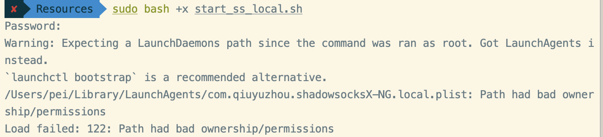
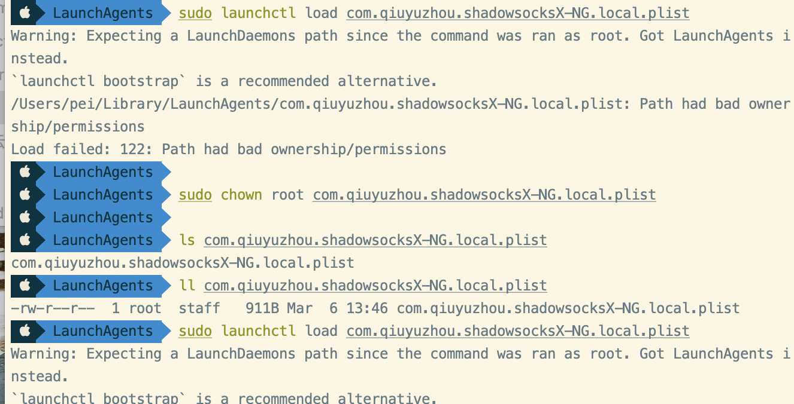
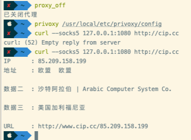
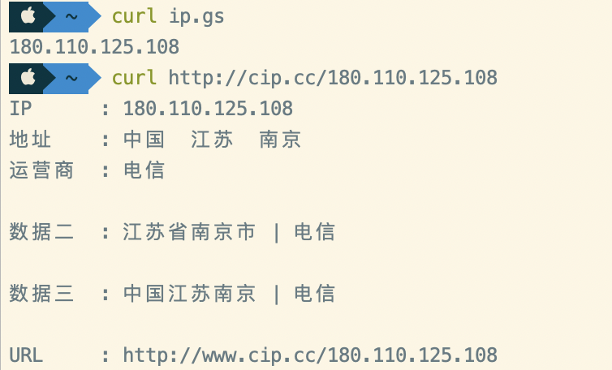

# MAC

[TOC]

## JAVA多版本

1、下载解压

```
wget https://download.java.net/java/GA/jdk11/13/GPL/openjdk-11.0.1_osx-x64_bin.tar.gz
```

2）解压安装包（系统中默认安装位置：`/Library/Java/JavaVirtualMachines/`）

```
sudo tar -zxf  openjdk-11.0.1_osx-x64_bin.tar.gz -C /Library/Java/JavaVirtualMachines/
```


**2、JDK多个版本之间切换**

安装成功Jdk11后，可能之前还有之前版本的JDK。下面看一下多版本JDK切换问题

1）查看所有JDK的在系统中默认的安装位置

/usr/libexec/java_home  -V

2）查看指定版本JDK在系统中默认安装位置

/usr/libexec/java_home -v 9
/Library/Java/JavaVirtualMachines/jdk-9.0.1.jdk/Contents/Home

3）手动切换JDK版本

通过修改` ~/.bash_profile`文件修改JAVA_HOME，如果没有这个文件则需要新建一个。alias是自定义命令别名

```
export JAVA_8_HOME=$(/usr/libexec/java_home -v1.8)
export JAVA_9_HOME=$(/usr/libexec/java_home -v9)
export JAVA_10_HOME=$(/usr/libexec/java_home -v10)
export JAVA_11_HOME=$(/usr/libexec/java_home -v11)

alias java8='export JAVA_HOME=$JAVA_8_HOME'
alias java9='export JAVA_HOME=$JAVA_9_HOME'
alias java10='export JAVA_HOME=$JAVA_10_HOME'
alias java11='export JAVA_HOME=$JAVA_11_HOME'
```


**3、用JEnv来切换JDK版本**

1）安装JEnv

```
 brew install jenv
```


mac 安装markdown软件 mweb typora


###Typora


## gem安装路径

```
$ gem environment
```


## 密钥串

### 图形界面


### Deleting your credentials via the command line

Through the command line, you can use the credential helper directly to erase the keychain entry.

```shell
$ git credential-osxkeychain erase
host=github.com
protocol=https
> [Press Return]
```


### [ShadowsocksX-NG](https://www.twisted-meadows.com/shadowsocksx-ng/)

##### 1、先检查报错日志：

这版**X-NG**会把自己的log文件：**ss-local.log**
保存在路径：`~/Library/Logs`
所以这个log文件的地址为：`~/Library/Logs/ss-local.log`


cd /Applications/ShadowsocksX-NG-R8.app/Contents/Resources




我们写好了.plist文件以后，将它拷贝到/library/LaunchDeamons/文件夹下面，然后就直接执行了sudo luanchctl load xxxx.plist，这样肯定会产生权限不够的问题，所以，正确的方法是，现将其的权限修改为root，sudo chown root xxxx.plist， 然后再来执行上述命令就没事啦。

cd /Users/pei/Library/LaunchAgents/

sudo chown root com.qiuyuzhou.shadowsocksX-NG.local.plist


sudo launchctl load com.qiuyuzhou.shadowsocksX-NG.local.plist




常见问题是，**ss-local**服务启动失败
（log里的记录为：`ShadowsocksX-NG Start ss-local failed.` ）
这可能是**ss-local**没有执行权限导致的。

~~GitHub上有一种说法是删除软件重新安装可以解决。但是……？？？重装这种操作真的是程序员解决问题的思路吗…………………………~~

我参考了另外的做法，
`cd /Applications/ShadowsocksX-NG.app/Contents/Resources`

给**ss-local**赋予执行权限：
`chmod +x ss-local`
然后，重启电脑。
（我还发现另外有个地方也有`**ss-local**`文件：`/Users/godlike/Library/Application Support/ShadowsocksX-NG/ss-local-3.0.5`  不知道影不影响）


如果你曾经安装过另外的ss客户端，前往文件夹：
`~/Library/Application Support/`
删除其他的SS文件夹 ，只留一个
因为可能是**ss-local**冲突


可以用这个命令来检查一下端口监听状况：
`lsof -iTCP -sTCP:LISTEN -n -P`


`privoxy`监听了我设置的HTTP代理端口，`ss-local`监听了我设置的Socks5代理端口

```
curl --socks5 127.0.0.1:1086 http://cip.cc
```

与代理命令 proxy_off 无关：




[深入理解GFW：内部结构](https://gfwrev.blogspot.jp/2010/02/gfw.html)

切换到 V2Ray 

curl http://cip.cc/180.110.125.108




