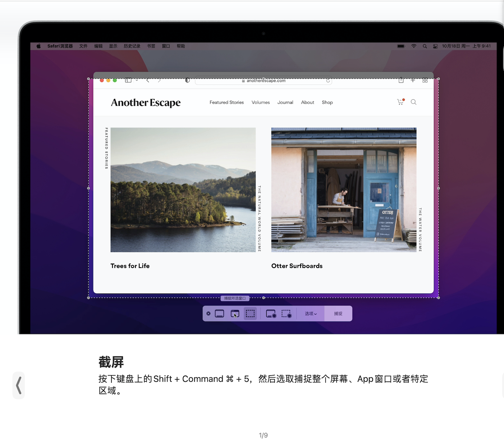
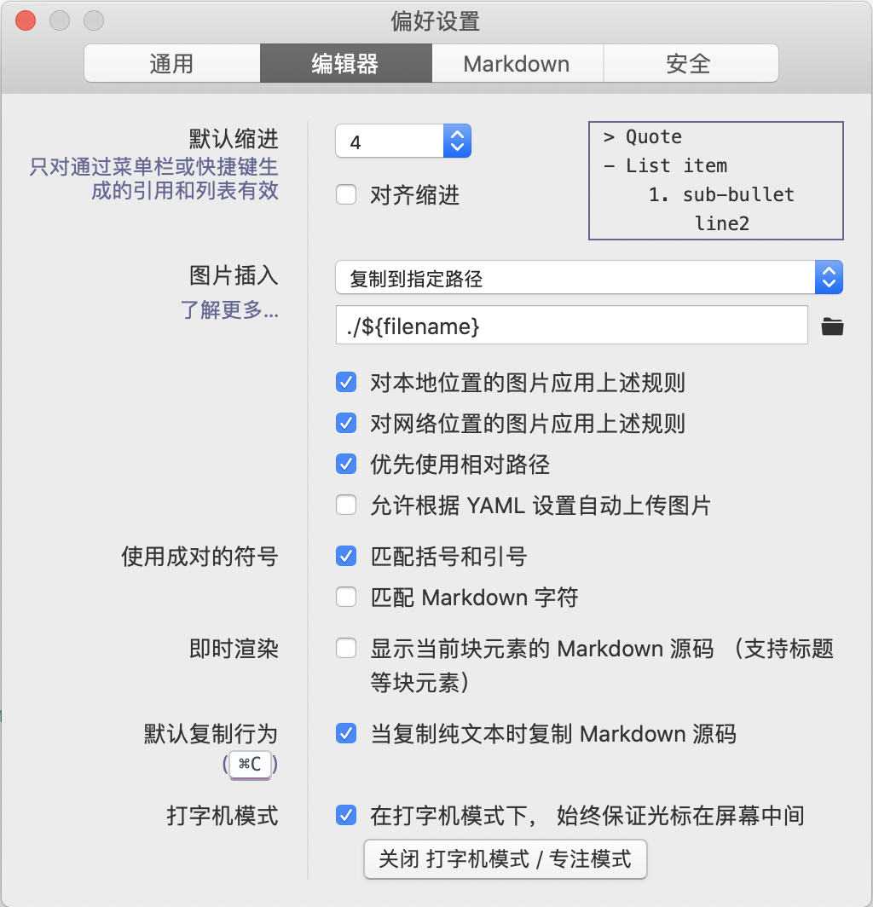
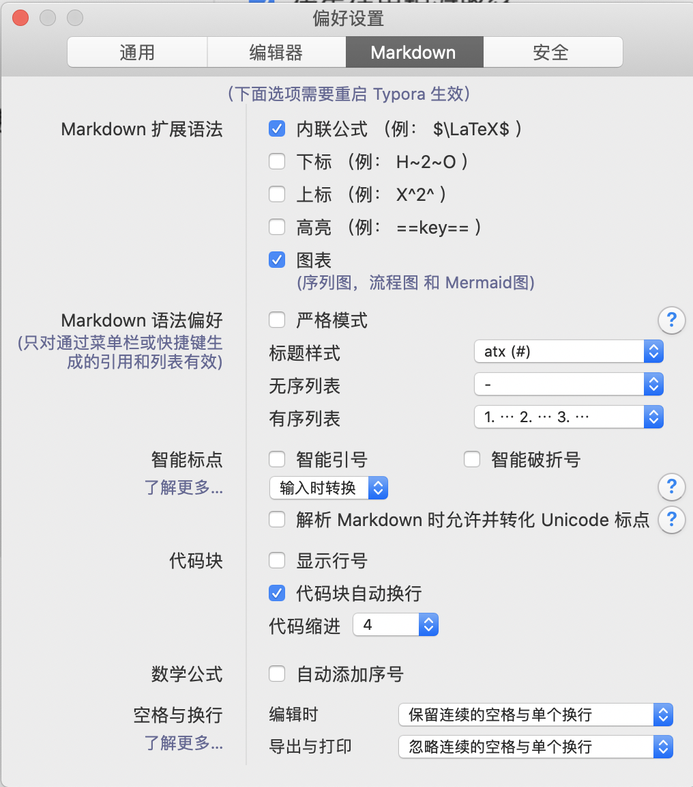
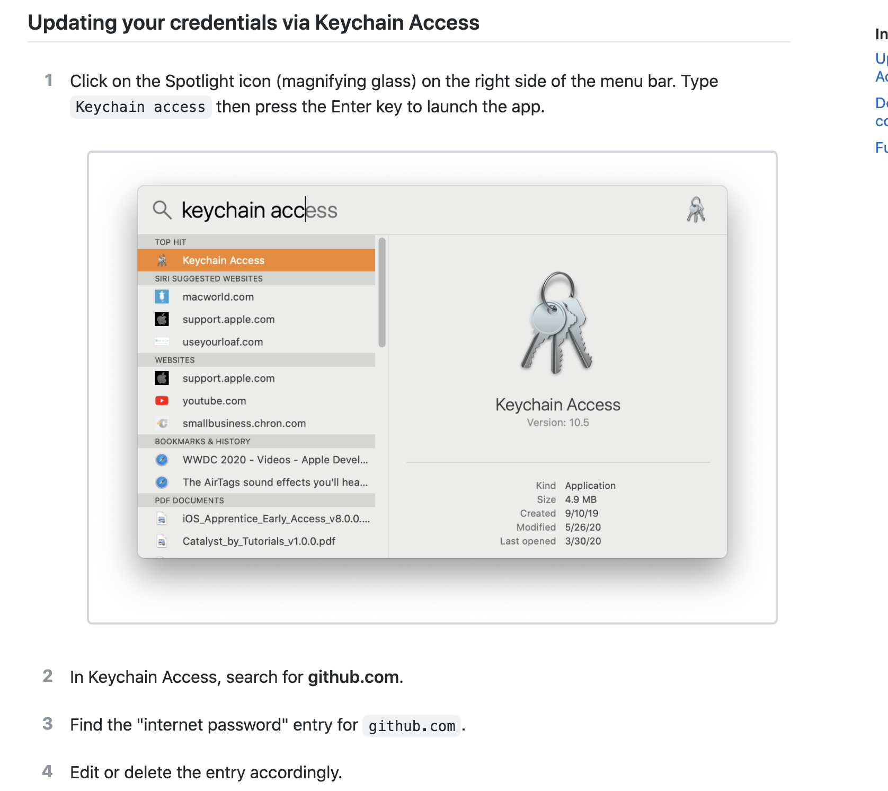
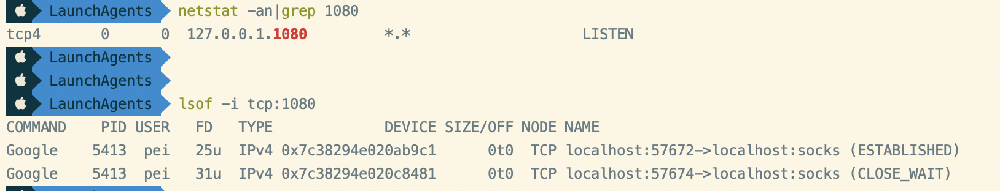
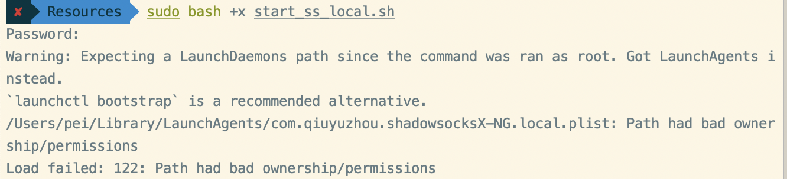
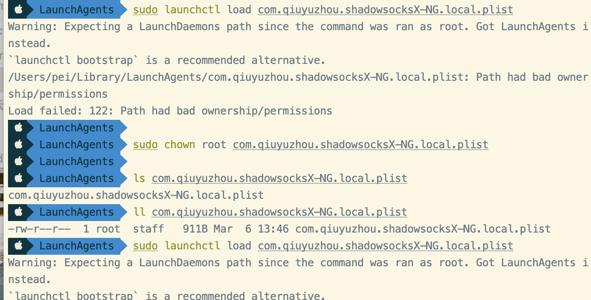
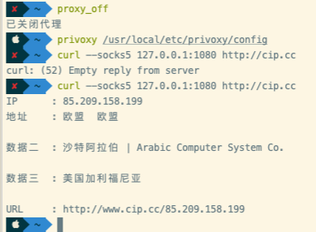
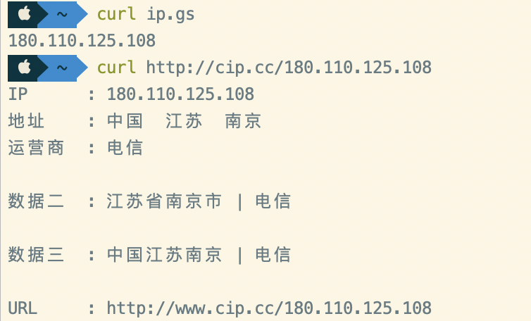

# 目录

[TOC]


# 常用软件

PATH environment variable

  /Users/pei/.profile
  /Users/pei/.bash_profile
  /Users/pei/.bashrc
  /Users/pei/.zshenv


## 工具效率

#### 1、截取GIF

* mac: LICEcap


Shift + Command ⌘ + 5




# MAC

## 系统技巧

### 2、iTerm2 + Oh My Zsh 打造舒适终端体验：

https://www.jianshu.com/p/9c3439cc3bdb


### Mac怎么调整 LaunchPad图标数量及大小

输入命令：【defaults write com.apple.dock springboard-rows -int 6】，这里的7，（横轴调整启动图标数量），根据你的需要输入一个数字。

【defaults write com.apple.dock springboard-columns -int 9】（11是（纵数图标）），然后输入命令：【defaults write com.apple.dock ResetLaunchPad -bool TRUE;killall Dock】生效。

默认： 5*7 


## 常用命令


### 清理硬盘

sudo tmutil listlocalsnapshots /

接下来会显示你磁盘上的所有快照文件


占用很大硬盘

/Users/pei/Library/Caches/CloudKit/com.apple.cloudphotod/39accd3621390c988c0d1d338ef31976ec189347/4d4df0a526653b9317b428548a9695da13fa5b0c/MMCS


清理缓存：

https://zhuanlan.zhihu.com/p/551028789

### 系统


#### 1、检查端口监听lsof：

`lsof -iTCP -sTCP:LISTEN -n -P`


### brew使用


#### 更新代理

全局代理，写入配置

git config --global http.proxy 'socks5://127.0.0.1:1080'

git config --global https.proxy 'socks5://127.0.0.1:1080'

清除配置

git config --global --unset http.proxy

git config --global --unset https.proxy

临时代理

ALL_PROXY=socks5://127.0.0.1:8888 git clone https://github.com/some/one.git

ALL_PROXY=socks5://127.0.0.1:9050


#### 卸载

ruby -e "$(curl -fsSL https://raw.githubusercontent.com/Homebrew/install/master/uninstall)"

解决：

re-install homebrew

/usr/bin/ruby -e "$(curl -fsSL https://raw.githubusercontent.com/Homebrew/install/master/install)"

- usr/local。通过调用：sudo chown -R $(whoami) usr/local
- private/tmp。通过调用：sudo chown -R $(whoami) /private/tmp

sudo chown $(whoami):admin /usr/local

brew doctor会输出所有需要重新链接的软件包。复制这些软件包名放到一个文本文件里，例如~/formulas.txt:

android-platform-tools

ant

aria2

autoconf

automake

...

运行一个for语句让它们全部重新链接：

```
for PKG in $(<~/text.txt)
do
 brew link --overwrite $PKG
done
```


完成之后，清理没用的链接

```
for PKG in $(<~/text.txt)
do
brew cleanup $PKG
done
brew prune
```


##### 报错 error: Not a valid ref: refs/remotes/origin/master 的解决方法

个人博客 ](https://learnku.com/blog/Galois)/ 31 / 0 / 创建于 1年前 / 更新于 1年前

执行命令：

```php
/bin/bash -c "$(curl -fsSL https://raw.githubusercontent.com/Homebrew/install/master/install.sh)"
```

报错：

```php
HEAD is now at 8175e404e Merge pull request #7942 from sjackman/bottle_tag
error: Not a valid ref: refs/remotes/origin/master
fatal: ambiguous argument 'refs/remotes/origin/master': unknown revision or path not in the working tree.
```

解决方案：卸载重装 brew
下载 [raw.githubusercontent.com/Homebrew...](https://raw.githubusercontent.com/Homebrew/install/master/uninstall) 并保存为 `uninstall.rb`，再执行 `ruby uninstall.rb`


**如果安装过老版本，删除后再执行以下命令，如果没有安装过，直接执行以下命令**

git clone git://mirrors.ustc.edu.cn/homebrew-core.git/ /usr/local/


**更改homebrew和homebrew-core仓库的源URL为国内中科大的源URL**

cd "$(brew --repo)"


git remote set-url origin https://mirrors.ustc.edu.cn/brew.git


cd "$(brew --repo)/Library/Taps/homebrew/homebrew-core" 


git remote set-url origin https://mirrors.ustc.edu.cn/homebrew-core.git

**注意：$(brew --repo)是一个路径变量，指的是以下路径：**

/usr/local/Homebrew


**（1）克隆homebrew-core文件夹**

git -C /usr/local/Homebrew/Library/Taps/homebrew/homebrew-core fetch --unshallow


查看已经过时的homebrew包版本(如果不想看，直接升级以可以，升级时会列出报版本由什么版本升级到了什么版本，比如minicom 2.7.1 -> 2.8)

brew outdated

更新已有过时的homebrew包版本

brew upgrade

brew install --HEAD usbmuxd

 ✘  ~  brew install --HEAD libimobiledevice

 ✘  ~  npm i -g remotedebug-ios-webkit-adapter@next

 ✘  ~  npm update remotedebug-ios-webkit-adapter -g


#### 重新安装Brew

https://blog.csdn.net/sl_world/article/details/124494182

https://www.cnblogs.com/paly76/p/7136218.html


## nginx

Docroot is: /usr/local/var/www

The default port has been set in /usr/local/etc/nginx/nginx.conf to 8080 so that
nginx can run without sudo.

nginx will load all files in /usr/local/etc/nginx/servers/.

To start nginx now and restart at login:
  brew services start nginx
Or, if you don't want/need a background service you can just run:
  /usr/local/opt/nginx/bin/nginx -g daemon\ off\;


## JAVA多版本

1、下载解压

```
wget https://download.java.net/java/GA/jdk11/13/GPL/openjdk-11.0.1_osx-x64_bin.tar.gz
```

2）解压安装包（系统中默认安装位置：`/Library/Java/JavaVirtualMachines/`）

```
sudo tar -zxf  openjdk-11.0.1_osx-x64_bin.tar.gz -C /Library/Java/JavaVirtualMachines/
```


**2、JDK多个版本之间切换**

安装成功Jdk11后，可能之前还有之前版本的JDK。下面看一下多版本JDK切换问题

1）查看所有JDK的在系统中默认的安装位置

/usr/libexec/java_home  -V

2）查看指定版本JDK在系统中默认安装位置

/usr/libexec/java_home -v 9
/Library/Java/JavaVirtualMachines/jdk-9.0.1.jdk/Contents/Home

3）手动切换JDK版本

通过修改` ~/.bash_profile`文件修改JAVA_HOME，如果没有这个文件则需要新建一个。alias是自定义命令别名

```
export JAVA_8_HOME=$(/usr/libexec/java_home -v1.8)
export JAVA_9_HOME=$(/usr/libexec/java_home -v9)
export JAVA_10_HOME=$(/usr/libexec/java_home -v10)
export JAVA_11_HOME=$(/usr/libexec/java_home -v11)

alias java8='export JAVA_HOME=$JAVA_8_HOME'
alias java9='export JAVA_HOME=$JAVA_9_HOME'
alias java10='export JAVA_HOME=$JAVA_10_HOME'
alias java11='export JAVA_HOME=$JAVA_11_HOME'
```


**3、用JEnv来切换JDK版本**

1）安装JEnv

```
 brew install jenv
```


mac 安装markdown软件 mweb typora


###Typora








## gem安装路径

```
$ gem environment
```


## 密钥串

### 图形界面



### Deleting your credentials via the command line

Through the command line, you can use the credential helper directly to erase the keychain entry.

```shell
$ git credential-osxkeychain erase
host=github.com
protocol=https
> [Press Return]
```


## [ShadowsocksX-NG](https://www.twisted-meadows.com/shadowsocksx-ng/)

### 1、先检查报错日志：

这版**X-NG**会把自己的log文件：**ss-local.log**
保存在路径：`~/Library/Logs`
所以这个log文件的地址为：`~/Library/Logs/ss-local.log`

检查1080端口是否启动：



lsof -i tcp:1080

netstat -an|grep 1080

cd /Applications/ShadowsocksX-NG-R8.app/Contents/Resources





我们写好了.plist文件以后，将它拷贝到/library/LaunchDeamons/文件夹下面，然后就直接执行了sudo luanchctl load xxxx.plist，这样肯定会产生权限不够的问题，所以，正确的方法是，现将其的权限修改为root，sudo chown root xxxx.plist， 然后再来执行上述命令就没事啦。

cd /Users/pei/Library/LaunchAgents/

sudo chown root com.qiuyuzhou.shadowsocksX-NG.local.plist

sudo launchctl load com.qiuyuzhou.shadowsocksX-NG.local.plist




常见问题是，**ss-local**服务启动失败
（log里的记录为：`ShadowsocksX-NG Start ss-local failed.` ）
这可能是**ss-local**没有执行权限导致的。

~~GitHub上有一种说法是删除软件重新安装可以解决。但是……？？？重装这种操作真的是程序员解决问题的思路吗…………………………~~

我参考了另外的做法，
`cd /Applications/ShadowsocksX-NG.app/Contents/Resources`

给**ss-local**赋予执行权限：
`chmod +x ss-local`
然后，重启电脑。
（我还发现另外有个地方也有`**ss-local**`文件：`/Users/godlike/Library/Application Support/ShadowsocksX-NG/ss-local-3.0.5`  不知道影不影响）


如果你曾经安装过另外的ss客户端，前往文件夹：
`~/Library/Application Support/`
删除其他的SS文件夹 ，只留一个
因为可能是**ss-local**冲突


`privoxy`监听了我设置的HTTP代理端口，`ss-local`监听了我设置的Socks5代理端口

```
curl --socks5 127.0.0.1:1080 http://cip.cc
```

与代理命令 proxy_off 无关：




[深入理解GFW：内部结构](https://gfwrev.blogspot.jp/2010/02/gfw.html)

切换到 V2Ray 

curl http://cip.cc/180.110.125.108




# Linux


# Window

