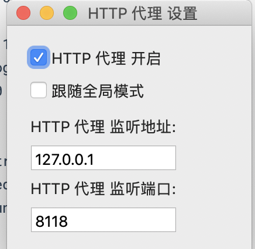
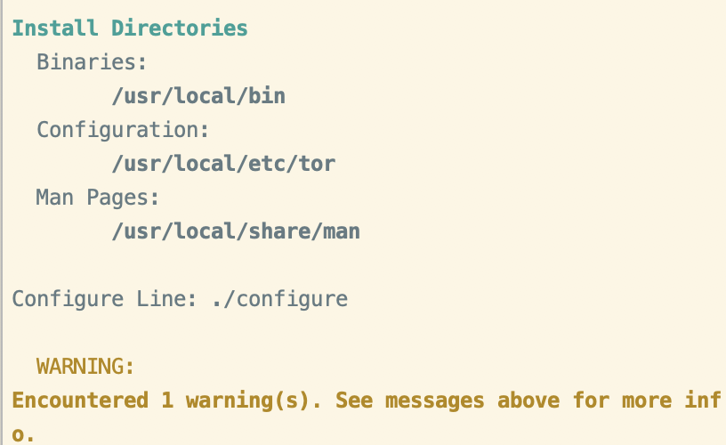
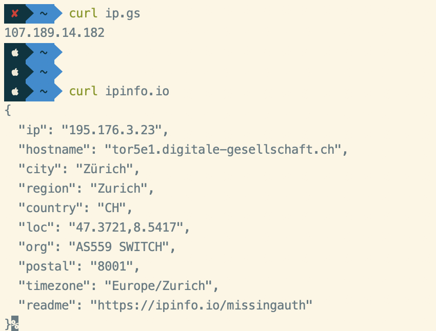
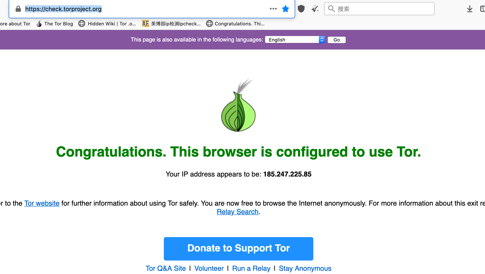

# 配置代理网络

流程：

SS负责上网，

privoxy监听本地8118端口，将端口数据全部传送到本地9050端口（9050是tor的本地监听端口）。因此，我们只要将数据送入本地8118端口，就可以送到tor网络中。

而在国内是无法直接连接TOR网络的，需要使用前置代理翻墙，见下文[配置前置代理]()


## 关键点

* ShadowsocksX-NG:    
* Privoxy: 将https请求转换为socks
* Tor: 匿名信息


### Mac安装ShadowsocksX-NG:

https://github.com/shadowsocksr-backup/ShadowsocksX-NG/releases


配置privoxy.config (无效)， 自己安装privoxy

listen-address  和 forward-socks5

```
   ShadowsocksX-NG  pwd
/Users/pei/Library/Application Support/ShadowsocksX-NG

   ShadowsocksX-NG  cat privoxy.config
listen-address 127.0.0.1:8118
toggle  1
enable-remote-toggle 1
enable-remote-http-toggle 1
enable-edit-actions 0
enforce-blocks 0
buffer-limit 4096
forwarded-connect-retries  0
accept-intercepted-requests 0
allow-cgi-request-crunching 0
split-large-forms 0
keep-alive-timeout 5
socket-timeout 60

forward-socks5 / 127.0.0.1:1080 .
forward         192.168.*.*/     .
forward         10.*.*.*/        .
forward         127.*.*.*/       .
```




#### Privoxy

使用brew 安装 : brew install privoxy

 位置在：/usr/local/opt/privoxy 

配置文件：/usr/local/etc/privoxy/config 


To have launchd start privoxy now and restart at login: 

  brew services start privoxy 

Or, if you don't want/need a background service you can just run: 

  privoxy /usr/local/etc/privoxy/config 


打开配置文件 /usr/local/etc/privoxy/config 

```
vim /usr/local/etc/privoxy/config
```

在 config 配置文件的最底部，手动加入以下代码： 

listen-address 0.0.0.0:8118 

**forward-socks5** / **localhost**:1080 . 

** 或者用echo命令直接写入，执行以下命令： 

cd /usr/local/etc/privoxy/ 

echo 'listen-address 0.0.0.0:8118\nforward-socks5 / localhost:1080 .' >> config 

** 注意：0.0.0.0 可以让其他设备访问到，若不需要，请修改成用 127.0.0.1；8118是HTTP代理的默认端口；localhost:1080 是 SOCKS5（shadowsocks） 默认的地址，可根据需要自行修改，且注意不要忘了最后有一个空格和点号。 

 修改为 0.0.0.0:8118 使局域网内的其它机子也能访问
listen-address  0.0.0.0:8118

> mac  配置开机启动： 
>
> 1. 配置开机启动
>
>     ln -sfv /usr/local/opt/privoxy/*.plist ~/Library/LaunchAgents
>
> 2. 启动
>
>     launchctl load ~/Library/LaunchAgents/homebrew.mxcl.privoxy.plist


#### Tor安装与配置

下载： https://dist.torproject.org/tor-0.4.6.7.tar.gz 

解压安装：

```bash

$ cd /usr/local/Cellar/
$ tar -zxvf  /Users/pei/Downloads/tor-0.4.6.7.tar.gz 
$ pwd 
/usr/local/Cellar/tor-0.4.6.7 
$ ./configure
$ make & make install
$ tor --vserion
$ cp /opt/local/etc/tor/torrc.simple /opt/local/etc/tor/torrc

$ vim /etc/tor/torrc 修改SOCK5代理端口，添加以下语句
SOCKSPort 9050 # Default: Bind to localhost:9050 for local connections.  
SOCKSPort 0.0.0.0:9150 # Bind to this address:port too.  
Socks5Proxy 127.0.0.1:1080  
#Socks5ProxyUsername username  
#Socks5ProxyPassword password 
```





> Tor最新版本：[https://dist.torproject.org](https://dist.torproject.org/) 


新建用户启动：

新建用户操作可参考如下

1. useradd admin -d /home/admin
2. passwd admin
3. chown -R admin:admin /home/admin
4. chown -R admin:admin /var/run/tor


##### 其他TOR相关配置
配置Tor网络出口节点
比如想实现指定Tor网络出口节点，或者限制出口节点不走某些区域的功能。以指定出口节点为日本为例，在torrc配置文档末尾添加以下语句(StrictNodes 表示强制执行）
ExitNodes {jp}
StrictNodes 1
如果想要排除某些国家/地区的节点，如中国，香港可以添加
ExcludeNodes {cn},{mo},{hk}
StrictNodes 1
这样，Tor客户端会主动规避来自香港的中继节点，但如果Tor在排除之后的中继节点中建立不起来虚拟线路的时候，还是会尝试使用那些排除在外的中继节点。所以，如果要再狠一点，哪怕不能连接也完全不考虑这些排除的节点，则可以再在配置文件中加入StrictNodes 1进行强制执行。

配置前置代理
为Tor配置前置代理，比如在国内是无法直接连接TOR网络的，需要使用前置代理翻墙，然后再使用TOR网络进行双重代理。前置代理可以是HTTP，SOCKS4，SOCKS5等代理，支持用户密码验证，如添加SOCK5代理，添加以下语句在torrc文件末尾。

```
Socks5Proxy 127.0.0.1:1080  
#Socks5ProxyUsername username  
#Socks5ProxyPassword password 
```
原文链接：https://blog.csdn.net/smiler_sun/article/details/71124082


##### Iterm2版：

curl ip.gs

curl ipinfo.io



网站版：

https://check.torproject.org/




