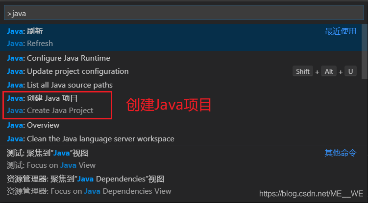
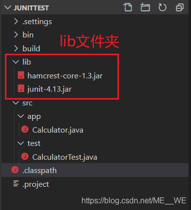
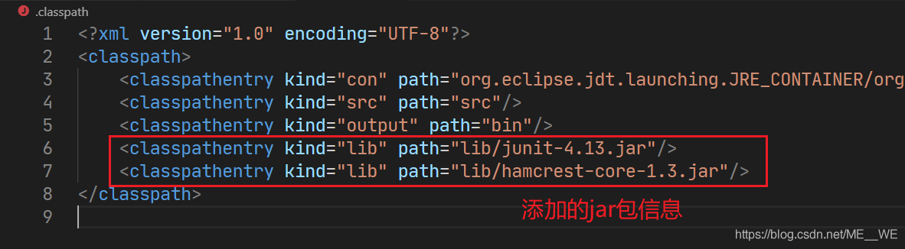
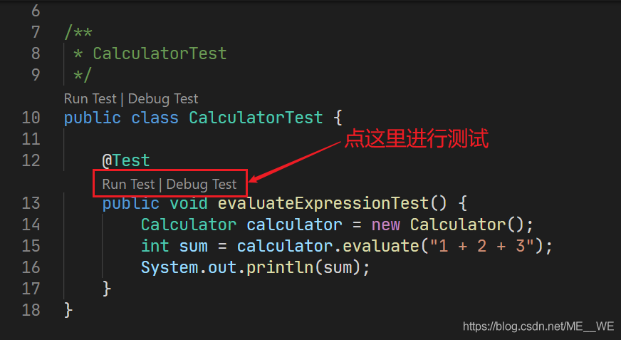
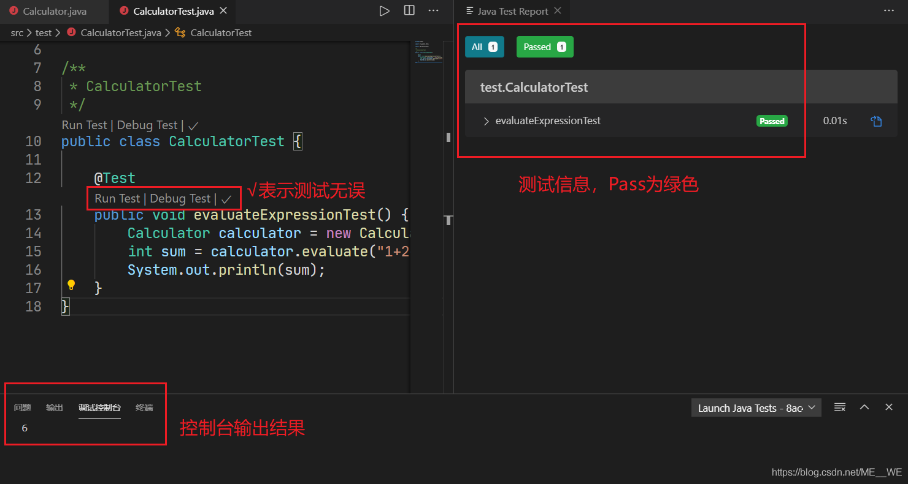
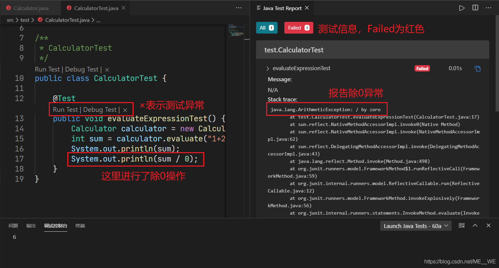

# VSCode

[TOC]


## [VSCODE搭建JAVA基本开发环境](https://blog.csdn.net/gxiangzi/article/details/84335549)
新建项目建立.classpath、.project、.launch.json文件，具体如下。
.classpath：

```
<?xml version="1.0" encoding="UTF-8"?>
<classpath>
	<classpathentry kind="src" path="src"/>
	<classpathentry kind="con" path="org.eclipse.jdt.launching.JRE_CONTAINER/org.eclipse.jdt.internal.debug.ui.launcher.StandardVMType/JavaSE-1.8/"/>
	<classpathentry kind="con" path="org.eclipse.buildship.core.gradleclasspathcontainer"/>
	<classpathentry kind="output" path="bin"/>
	<!-- <classpathentry kind="lib" path="lib/fel-0.8.jar"/>引用的jar包 -->
</classpath>
```
.project:
```
<?xml version="1.0" encoding="UTF-8"?>
<projectDescription>
	<name>testjava</name>
	<comment>Project testjava created by Buildship.</comment>
	<projects>
	</projects>
	<buildSpec>
		<buildCommand>
			<name>org.eclipse.jdt.core.javabuilder</name>
			<arguments>
			</arguments>
		</buildCommand>
		<buildCommand>
			<name>org.eclipse.buildship.core.gradleprojectbuilder</name>
			<arguments>
			</arguments>
		</buildCommand>
	</buildSpec>
	<natures>
		<nature>org.eclipse.jdt.core.javanature</nature>
		<nature>org.eclipse.buildship.core.gradleprojectnature</nature>
	</natures>
</projectDescription>

```
.launch.json:
```
{
  "version": "0.2.0",
  "configurations": [
    {
      "type": "java",
      "name": "Debug (Launch)",
      "request": "launch",
      "cwd": "${workspaceFolder}/bin",
      "sourcePaths": [
        "$(workspaceRoot)/src"
      ],
      "classPaths": [
        "",
        "$(workspaceRoot)/bin"
      ],
      // "mainClass": "Main",入口类名
      "args": ""
    }
  ]
}
```

## 配置Maven

 [配置vscode支持java-maven](https://www.cnblogs.com/Mvloveyouforever/p/14938256.html)

```
mvn install -DskipTests -f "/Users/pei/blog/blog/source/_posts/Algorithm/1.leetcode/java_demo/pom.xml

```


## 【Java】VS Code导入jar包及进行JUnit单元测试

如何配置 VS Code 下的 Java 开发环境就不细说了，只要安装好了 JDK，安装一个插件 Java Extension Pack 就行了，它会自动安装几个微软推荐的插件，基础的 Java 环境就搭好了。

进行 JUnit 单元测试需要的 jar 包：junit.jar 和 hamcrest-core.jar，链接如下：

https://github.com/junit-team/junit4/wiki/Download-and-Install

一、命令创建 Java 项目
左下角齿轮 -> 命令面板 或者快捷键 Ctrl + Shift + p 打开命令面板，输入 java 即可看到很多命令，选择 Java: Create Java Project 创建 Java 项目。创建的是一个 Eclipse 的项目。




二、导入 jar 包
在项目文件夹下新建文件夹 lib，当然名字叫什么都行，只不过通常放 jar 包的文件夹都叫 lib 罢了。将要导入的 jar 包放在这个文件夹下。此时项目结构应该是这样的：



三、修改 .classpath 文件
打开 .classpath 文件（在项目文件夹下），添加几条 classpathentry，如下图所示：




保存文件，导入 jar 包就完成了。

如果要导入 jar 包的源码，那么进行如下的操作：

在 lib 文件夹下新建文件夹 sources，把源码包放入；
上图修改 .classpath 文件的语句中加上 sourcepath 属性即可：
<classpathentry kind="lib" path="lib/jar包.jar" sourcepath="lib/sources/源码.zip"/>
1
至此导入源码也完成了。

导入源码不是必须的，有 jar 包就可以运行了。

注： 如果导入后仍然报错，重启 VS Code 即可。

写好测试单元，带有 @Test 注解的方法上会出现按钮 Run Test | Debug Test，点击就能进行测试了。测试信息会在右边的分栏显示。



如果测试无误，结果如下图所示：



如果测试异常，结果如下图所示：



以上就是在 VS Code 中导入 jar 包以及进行单元测试的方法了。
————————————————
版权声明：本文为CSDN博主「ME不想家」的原创文章，遵循CC 4.0 BY-SA版权协议，转载请附上原文出处链接及本声明。
原文链接：https://blog.csdn.net/ME__WE/article/details/104887568
