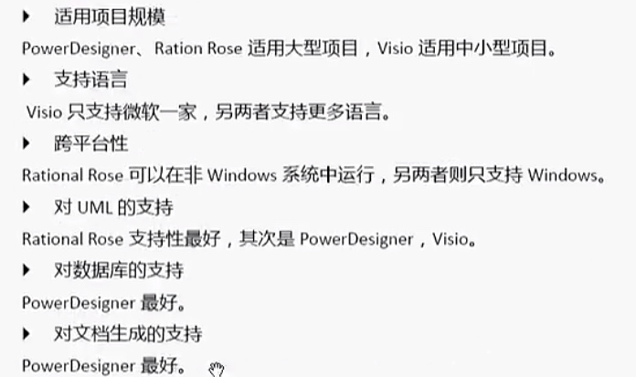

# PowerDesigner
##1、定义
SAP Sybase PowerDesigner 是针对体系结构、信息体系结构和企业体系结构的行业领先的建模和元数据管理解决方案.

通用特性：
1. 需求管理： 可以把需求定义转换为任意数量的分析及设计模型，并记录需求及所有分析设计模型的改动历史，保持对它们的跟踪。
2. 文档生成
3. 影响度分析
4. 数据映射：  数据仓库ETL文件
5. 开放性支持
6. 可自定义
7. 企业知识库

同类软件比较：
&&Rose && Visio

名次解释： 

| 缩写 | 全写         | 中文 |
| ---- | ------------ | ---- |
| CDM  | 概念数据模型 |      |
| LDM  | 逻辑数据模型 |      |
| PDM  | 物理数据模型 |      |